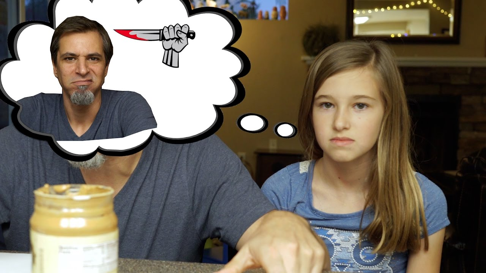

# Raciocínio Lógico Algorítmico: Aula 1
Orientador: Prof. Me Ricardo Carubbi

## Introdução
Os estudos de lógica são bastante antigos. Consultando os livros de lógica matemática, encontramos citações a estudos de Aristóteles, nascido em 384 a.C. Como filosofia, a lógica busca entender por que pensamos de uma maneira e não de outra. Organizar o pensamento e colocar as coisas em ordem são tarefas de lógica de que necessitamos para resolver problemas com o uso do computador.

Para que um computador resolva um problema corretamente, precisamos organizar com cuidado as instruções que serão dadas a ele. Esse cuidado será importante tanto nos exercícios desta disciplina quanto na solução de problemas maiores encontrados na vida profissional. A atividade a seguir apresenta um primeiro exemplo.

## Atividade inicial: o algoritmo do sanduíche

Antes de assistir ao vídeo, formem grupos de três a cinco estudantes.

Para esta atividade, chamaremos de **algoritmo** uma sequência de passos para realizar uma tarefa.

O desafio do grupo é elaborar um algoritmo para preparar um sanduíche de pasta de amendoim com geleia, conhecido nos Estados Unidos como *peanut butter and jelly sandwich*.

Escrevam o algoritmo na forma de **descrição narrativa**: uma lista numerada de passos escritos com as palavras que usamos no dia a dia. Cada passo deve indicar uma ação a ser realizada para preparar o sanduíche.

### Orientações

1. O grupo terá **15 minutos** para concluir a atividade.
2. A produção será apenas escrita; o sanduíche não será preparado em sala.
3. Todos os integrantes deverão participar da elaboração das instruções.
4. O grupo deverá entregar uma única sequência de passos.
5. Não pesquisem receitas nem assistam ao vídeo antes de finalizar o algoritmo.

Ao terminar, releiam as instruções e aguardem a exibição do vídeo. Não alterem o texto durante a exibição.

## Exibição do vídeo

**Figura 1.1** - Desafio de instruções exatas - [É por isso que meus filhos me odeiam](https://youtu.be/cDA3_5982h8?si=rM_h18PoKy4kKRSI).

## Discussão após o vídeo

Compare as situações mostradas no vídeo com a descrição narrativa produzida pelo grupo.

1. Algum passo permite mais de uma interpretação?
2. Alguma ação, algum objeto ou alguma quantidade foi descrita sem precisão?
3. O grupo considerou óbvio algum conhecimento que não aparece nas instruções?
4. Alguma etapa necessária foi omitida?
5. O que poderia acontecer se cada instrução fosse realizada exatamente como está escrita, sem completar informações por conta própria?

A descrição narrativa utiliza a **linguagem natural**, isto é, as palavras e expressões que usamos no dia a dia. Por isso, ela pode ser elaborada sem conhecer as regras próprias de uma linguagem de programação. Entretanto, uma instrução que parece clara para quem a escreveu pode estar incompleta ou ser entendida de outra maneira por quem a realiza. Essa limitação será retomada na Aula 2, quando estudaremos outras formas de representar algoritmos.

### E quando usamos inteligência artificial?

Atualmente, a linguagem natural também é utilizada para pedir que sistemas de inteligência artificial criem programas de computador. Para explorar essa relação, o professor fará uma consulta à inteligência artificial e projetará a resposta para toda a turma.

Primeiro, o professor perguntará:

> Como preparar um sanduíche de pasta de amendoim com geleia? Apresente uma lista numerada de passos.

Compare a resposta da inteligência artificial com os algoritmos dos grupos e com as situações mostradas no vídeo:

1. Quais passos são iguais?
2. Quais passos são diferentes?
3. A inteligência artificial omitiu alguma etapa?
4. Ela considerou alguma ação óbvia?
5. Seria possível realizar suas instruções exatamente como foram escritas?

A resposta de uma inteligência artificial não comprova que um algoritmo está correto: ela também pode omitir etapas, fazer suposições e produzir respostas diferentes.

A inteligência artificial ampliou o uso da linguagem natural na produção de programas, mas não eliminou a necessidade de organizar uma solução em passos. As pessoas continuam responsáveis por avaliar o resultado.
