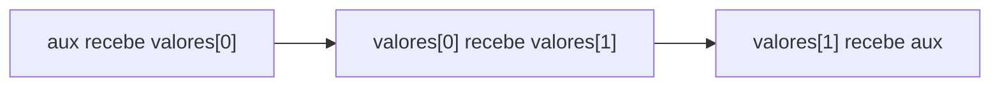
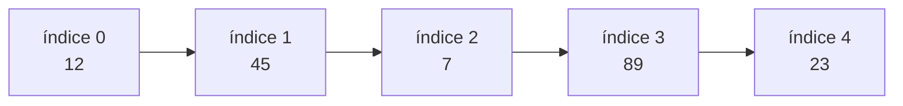
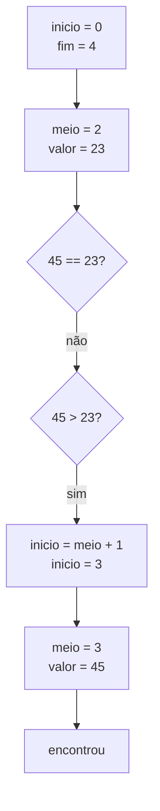
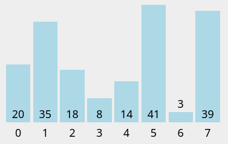
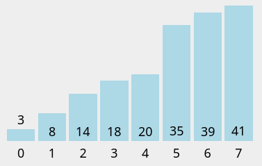

 

# Raciocínio Lógico Algorítmico: Aula 10
Orientador: Prof. Me Ricardo Carubbi

## Técnicas com arrays ou vetores

### Objetivo da aula
Compreender e implementar técnicas clássicas com **vetores** em JavaScript: troca de posições, inversão de vetor, **busca linear**, **busca binária** e **ordenação pelo método da bolha**. Ao final da aula, o aluno deverá ser capaz de manipular posições de um vetor, percorrer uma sequência para localizar valores, entender a condição necessária para usar busca binária e ordenar um vetor usando comparações e trocas entre posições vizinhas.

Esta aula continua o estudo de vetores iniciado na aula anterior. O foco agora não é apenas armazenar dados, mas aplicar **algoritmos** sobre uma sequência de valores.

## 1. Roteiro da aula

Nesta aula, vamos sair do uso básico de vetores e começar a aplicar técnicas clássicas sobre uma sequência de valores.

O tema parece simples porque os exemplos usam vetores pequenos, mas ele introduz ideias importantes:

- diferença entre **dado armazenado** e **algoritmo aplicado ao dado**;
- controle de índices;
- condição de parada;
- comparação entre elementos;
- troca de valores;
- relação entre ordenação e busca binária.

Uma ideia central desta aula é a seguinte:

> Nem toda técnica pode ser usada em qualquer vetor.

Por exemplo, a busca binária só funciona corretamente quando o vetor está **ordenado**.

Nesta aula, vamos trabalhar com as seguintes técnicas:

- troca de valores entre posições prepara os exemplos de inversão e ordenação;
- reversão de vetor usa trocas entre posições opostas;
- a busca linear funciona em vetor ordenado ou desordenado;
- a busca binária exige vetor ordenado, que no primeiro exemplo já será informado nessa condição;
- o método da bolha é uma primeira forma de ordenar um vetor;
- ordenar antes de buscar pode preparar o vetor para a busca binária.

O objetivo principal não é memorizar códigos prontos, mas entender como usar:

- índices;
- variáveis auxiliares;
- vetores;
- comparações;
- trocas de valores.

### Padrão de entrada desta aula

Nos exemplos desta aula, a entrada será feita com dados separados por espaço.

Exemplo:

```text
12 45 7 89 23
```

Depois da leitura, usamos:

```javascript
entrada = prompt("Digite os dados separados por espaco:"); // 12 45 7 89 23
dados = entrada.split(" ");
```

Quando o exemplo envolver busca, usaremos duas entradas:

- uma entrada para os valores do vetor;
- outra entrada para o valor procurado.

Exemplo:

```text
Valores do vetor: 12 45 7 89 23
Valor procurado: 7
```

Nesse caso:

- vetor: `[12, 45, 7, 89, 23]`;
- valor procurado: `7`.

### Convenção de nomes nos exemplos

Para manter os códigos curtos e legíveis, usaremos nomes de variáveis simples. Quando o nome tiver mais de uma palavra, usaremos **camelCase**.

| Variável | Significado |
| --- | --- |
| `entrada` | texto digitado pelo usuário em uma única entrada |
| `dados` | dados separados depois do `split(" ")` |
| `valores` | vetor com os números que serão processados em alguns exemplos gerais |
| `vetor` | vetor principal usado nos exemplos |
| `copia` | cópia simples usada quando queremos preservar o vetor original |
| `vetorOrdenado` | vetor usado para guardar uma versão ordenada |
| `valor` | número convertido a partir de um item textual |
| `valorBusca` | valor procurado nos exemplos de busca linear |
| `alvo` | valor procurado nos exemplos de busca binária |
| `indice` | índice em que o valor foi encontrado |
| `n` | tamanho do vetor em alguns exemplos |
| `meio` | valor usado como limite na inversão ou como índice central na busca binária |
| `flag` | indica se houve troca em uma passagem do Bubble Sort otimizado |
| `comparacoes` | contador de comparações feitas no Bubble Sort |
| `trocas` | contador de trocas feitas no Bubble Sort |
| `aux` | variável auxiliar usada na troca de valores |

## 2. Troca de valores entre posições

Antes de estudar a inversão de vetor e o método da bolha, precisamos revisar a troca de valores.

Suponha o vetor:

```javascript
let valores;

valores = [12, 7];
```

Queremos trocar `valores[0]` com `valores[1]`.

Não podemos simplesmente fazer:

```javascript
valores[0] = valores[1];
valores[1] = valores[0];
```

Esse código perde o valor original de `valores[0]`.

A solução correta usa uma variável auxiliar chamada `aux`:

```javascript
let valores;
let aux;

valores = [12, 7];

aux = valores[0];
valores[0] = valores[1];
valores[1] = aux;

console.log(valores[0]); // 7
console.log(valores[1]); // 12
```

### Troca usando desestruturação

Em JavaScript, também podemos trocar dois valores usando **desestruturação**.

A ideia é colocar os dois valores que serão trocados dos dois lados da atribuição:

```javascript
let valores;

valores = [12, 7];

[valores[0], valores[1]] = [valores[1], valores[0]];

console.log(valores[0]); // 7
console.log(valores[1]); // 12
```

Essa forma será usada nos exemplos de inversão de vetor e de Bubble Sort:

```javascript
[vetor[i], vetor[n - 1 - i]] = [vetor[n - 1 - i], vetor[i]];
```

```javascript
[vetor[j], vetor[j + 1]] = [vetor[j + 1], vetor[j]];
```

A primeira troca aparece na inversão do vetor. A segunda aparece no método da bolha, quando dois elementos vizinhos estão fora de ordem.

### Representação da troca



## 3. Revertendo um vetor

Reverter um vetor significa inverter a ordem dos elementos.

Exemplo:

```text
Antes:  [12, 45, 7, 89, 23]
Depois: [23, 89, 7, 45, 12]
```

Para fazer isso, trocamos:

- o primeiro elemento com o último;
- o segundo elemento com o penúltimo;
- o terceiro elemento com o antepenúltimo;
- e assim por diante.

### Duas abordagens

Podemos inverter um vetor de duas formas didáticas:

1. criar outro vetor e preencher do fim para o começo;
2. trocar os elementos em torno do meio do vetor.

A primeira abordagem é mais simples de visualizar, mas usa outro vetor.

A segunda abordagem altera o próprio vetor. Ela usa o meio do vetor como limite das trocas:

- o primeiro elemento troca com o último;
- o segundo troca com o penúltimo;
- o processo continua até chegar ao meio.

A cada repetição:

1. trocar `vetor[i]` com `vetor[n - 1 - i]`;
2. aumentar `i`;
3. parar quando `i` chegar ao meio do vetor.

### Eficiência das abordagens

As duas abordagens precisam olhar os valores do vetor.

Se o vetor tiver poucos elementos, a diferença entre elas quase não aparece.

Mas existe uma diferença importante na forma de trabalhar.

Na abordagem que cria outro vetor:

- o vetor original continua igual;
- precisamos criar outro vetor para guardar o resultado;
- o código costuma ser mais fácil de entender no início.

Na abordagem que troca os elementos no próprio vetor:

- não precisamos criar outro vetor;
- o próprio vetor original é modificado;
- o código exige mais cuidado com os índices.

Para esta aula, a primeira abordagem ajuda a entender a ideia de inverter. A segunda abordagem ajuda a treinar troca de posições dentro do próprio vetor.

### Vetor com quantidade par de elementos

Quando o vetor tem quantidade ímpar de elementos, existe uma posição central.

Exemplo:

```text
[12, 45, 7, 89, 23]
```

Nesse caso, o valor `7` está no meio e não precisa trocar de lugar.

Quando o vetor tem quantidade par de elementos, não existe um único elemento central.

Exemplo:

```text
[12, 45, 7, 89]
```

Nesse caso, o cálculo:

```javascript
meio = parseInt(n / 2);
```

indica quantas trocas serão feitas. Para `n = 4`, temos `meio = 2`:

- troca o índice `0` com o índice `3`;
- troca o índice `1` com o índice `2`.

Portanto, em vetor par, o `meio` não representa um elemento central. Ele representa o limite até onde as trocas devem acontecer.

### Exemplo de inversão

```javascript
let entrada;
let dados;
let vetor;
let copia;
let valor;
let i;

function inverterComOutroVetor(arr) {
    let invertido;
    let i;
    let j;

    invertido = [];
    j = 0;

    for (i = arr.length - 1; i >= 0; i--) {
        invertido[j] = arr[i];
        j++;
    }

    return invertido;
}

function inverterNoProprioVetor(arr) {
    let n;
    let meio;
    let i;

    n = arr.length;
    meio = parseInt(n / 2);

    for (i = 0; i < meio; i++) {
        [arr[i], arr[n - 1 - i]] = [arr[n - 1 - i], arr[i]];
    }
}

// Entrada de dados
entrada = prompt("Digite os valores separados por espaco:"); // 12 45 7 89 23

// Processamento: separa a entrada em itens textuais
dados = entrada.split(" ");

// Inicialização dos vetores
vetor = [];
copia = [];

// Conversão dos dados textuais e preenchimento dos vetores
for (i = 0; i < dados.length; i++) {
    valor = parseInt(dados[i]);

    vetor[i] = valor;
    copia[i] = valor;
}

console.log(`Vetor original: ${vetor}`);
console.log(`Invertido em outro vetor: ${inverterComOutroVetor(vetor)}`);
inverterNoProprioVetor(copia);
console.log(`Invertido no proprio vetor: ${copia}`);
```

### Observação sobre a troca com `aux`

Na inversão, usamos desestruturação para trocar dois elementos:

```javascript
[vetor[i], vetor[n - 1 - i]] = [vetor[n - 1 - i], vetor[i]];
```

A mesma troca poderia ser escrita com uma variável auxiliar:

```javascript
aux = vetor[i];
vetor[i] = vetor[n - 1 - i];
vetor[n - 1 - i] = aux;
```

Nesse caso, seria necessário declarar `let aux;` no início do código.

As duas formas fazem a mesma troca. A versão com `aux` mostra o passo a passo; a versão com desestruturação deixa o código mais curto.

## 4. O problema da busca

Buscar significa verificar se um valor está presente em uma coleção de dados.

Exemplo:

```javascript
let valores;

valores = [12, 45, 7, 89, 23];
```

Perguntas possíveis:

- o valor `89` existe no vetor?
- em qual índice está o valor `7`?
- quantas comparações foram necessárias até encontrar o valor?
- o valor procurado não existe?

Essas perguntas aparecem em muitos problemas reais:

- procurar o código de um produto em uma lista;
- verificar se uma matrícula existe;
- encontrar uma temperatura específica em uma sequência de medições;
- localizar uma nota dentro de um conjunto de notas;
- verificar se um número já foi sorteado.

## 5. Busca linear

A **busca linear** percorre o vetor do início ao fim, verificando um elemento por vez.

Ela é chamada de linear porque segue a ordem natural dos índices:

```text
0, 1, 2, 3, 4, ...
```

### Ideia principal

Para cada posição do vetor:

1. acessar o elemento;
2. comparar com o valor procurado;
3. marcar que encontrou, caso os valores sejam iguais;
4. continuar ou encerrar a busca.

### Representação visual



Se o valor procurado for `89`, a busca compara:

| Comparação | Índice testado | Valor no vetor | Encontrou? |
| --- | --- | --- | --- |
| 1 | 0 | 12 | não |
| 2 | 1 | 45 | não |
| 3 | 2 | 7 | não |
| 4 | 3 | 89 | sim |

## 6. Exemplo de busca linear

Neste exemplo, a busca linear percorre o vetor até encontrar o valor procurado ou até acabar o vetor.

Quando o valor é encontrado, o algoritmo guarda o índice em que ele apareceu e encerra a busca.

```javascript
let entrada;
let dados;
let valores;
let valorBusca;
let indice;
let i;

// Entrada
entrada = prompt("Digite os valores separados por espaco:"); // 12 45 7 89 23
valorBusca = parseInt(prompt("Digite o valor procurado:")); // 7

// Processamento: separa a entrada em itens textuais
dados = entrada.split(" ");

// Inicialização
valores = [];
indice = -1;

// Conversão dos dados textuais para números
for (i = 0; i < dados.length; i++) {
    valores[i] = parseInt(dados[i]);
}

// Busca linear com parada antecipada
for (i = 0; i < valores.length; i++) {
    if (valores[i] == valorBusca) {
        indice = i;
        break;
    }
}

// Saída
if (indice != -1) {
    console.log("Valor encontrado no indice " + indice);
} else {
    console.log("Valor nao encontrado");
}
```

### Por que usar `-1`?

O índice `-1` não é uma posição válida em um vetor comum percorrido com índices de `0` até `length - 1`.

Por isso, usamos `-1` para representar a ideia de **não encontrado**.

### Observação

O comando:

```javascript
break;
```

significa:

- pare a repetição imediatamente;
- não continue procurando depois que o valor já foi encontrado.

Essa versão é melhor quando queremos encontrar apenas a primeira ocorrência.

### Variação com função

Também podemos separar a busca linear em uma função.

Essa organização deixa o código mais modular: a função recebe o vetor e o valor procurado, realiza a busca e devolve o índice encontrado.

```javascript
function buscaLinear(valores, valorBusca) {
    let i;
    let indice;

    indice = -1;

    for (i = 0; i < valores.length; i++) {
        if (valores[i] == valorBusca) {
            indice = i;
            break;
        }
    }

    return indice;
}
```

Uso da função:

```javascript
indice = buscaLinear(valores, valorBusca);
```

Se a função encontrar o valor, retorna o índice da primeira ocorrência. Se não encontrar, retorna `-1`.

### Ponto de atenção

Se o valor aparecer mais de uma vez, esse algoritmo guarda o primeiro índice encontrado.

Exemplo:

```text
10 20 30 20 40 20
```

Nesse caso, o vetor é `[10, 20, 30, 20, 40]` e o valor procurado é `20`.

O algoritmo terminará com `indice = 1`, porque a primeira ocorrência de `20` está no índice `1`.

## 7. Quando a busca linear é adequada?

A busca linear é adequada quando:

- o vetor está desordenado;
- o vetor é pequeno;
- não vale a pena ordenar antes de buscar;
- a busca será feita poucas vezes;
- queremos uma solução simples e fácil de verificar.

Ela tem uma vantagem importante: funciona mesmo sem nenhuma preparação anterior do vetor.

### Limite da busca linear

No pior caso, a busca linear precisa verificar todos os elementos.

Isso acontece quando:

- o valor procurado está na última posição;
- o valor procurado não existe no vetor.

## 8. Busca binária

A **busca binária** é uma técnica mais eficiente de busca, mas possui uma condição obrigatória:

> O vetor precisa estar ordenado.

Se o vetor não estiver ordenado, a busca binária pode descartar a metade errada e produzir uma resposta incorreta.

### Ideia principal

Em vez de testar um elemento por vez desde o início, a busca binária testa o elemento do meio.

Se o valor procurado for menor que o valor do meio, a busca continua na metade esquerda.

Se o valor procurado for maior que o valor do meio, a busca continua na metade direita.

Se for igual, o valor foi encontrado.

### Exemplo

Vetor ordenado:

```text
[7, 12, 23, 45, 89]
```

Valor procurado:

```text
45
```

| Passo | Início | Fim | Meio | Valor no meio | Decisão |
| --- | --- | --- | --- | --- | --- |
| 1 | 0 | 4 | 2 | 23 | procurar à direita |
| 2 | 3 | 4 | 3 | 45 | encontrou |

### Representação visual



## 9. Implementação da busca binária

Neste exemplo, a busca binária trabalha com um vetor já ordenado.

A cada repetição, o algoritmo calcula o índice do meio da região pesquisada e decide se deve continuar pela metade esquerda ou pela metade direita.

```javascript
let entrada;
let dados;
let vetor;
let alvo;
let inicio;
let fim;
let meio;
let indice;
let i;

// Entrada
entrada = prompt("Digite os valores ordenados separados por espaco:"); // 7 12 23 45 89
alvo = parseInt(prompt("Digite o valor procurado:")); // 45

// Processamento: separa a entrada em itens textuais
dados = entrada.split(" ");

// Inicialização do vetor
vetor = [];

// Conversão dos dados textuais para números
for (i = 0; i < dados.length; i++) {
    vetor[i] = parseInt(dados[i]);
}

// Inicialização da busca binária
inicio = 0;
fim = vetor.length - 1;
indice = -1;

// Busca binária
while (inicio <= fim) {
    meio = parseInt((inicio + fim) / 2);

    if (alvo == vetor[meio]) {
        indice = meio;
        break;
    } else if (alvo > vetor[meio]) {
        inicio = meio + 1;
    } else {
        fim = meio - 1;
    }
}

// Saída
if (indice != -1) {
    console.log("Valor encontrado no indice " + indice);
} else {
    console.log("Valor nao encontrado");
}
```

### Variação com função

Também podemos separar a busca binária em uma função.

Essa organização deixa o código mais modular: a função recebe o vetor ordenado e o valor procurado, realiza a busca e devolve o índice encontrado.

```javascript
function buscaBinaria(vetor, alvo) {
    let inicio;
    let fim;
    let meio;

    inicio = 0;
    fim = vetor.length - 1;

    while (inicio <= fim) {
        meio = parseInt((inicio + fim) / 2);

        if (alvo == vetor[meio]) {
            return meio;
        } else if (alvo > vetor[meio]) {
            inicio = meio + 1;
        } else {
            fim = meio - 1;
        }
    }

    return -1;
}
```

Uso da função:

```javascript
indice = buscaBinaria(vetor, alvo);
```

Se a função encontrar o valor, retorna o índice em que ele aparece no vetor ordenado. Se não encontrar, retorna `-1`.

### Explicação das variáveis

| Variável | Papel no algoritmo |
| --- | --- |
| `vetor` | vetor ordenado em que a busca será realizada |
| `alvo` | valor procurado no vetor |
| `inicio` | primeiro índice da região ainda pesquisada |
| `fim` | último índice da região ainda pesquisada |
| `meio` | índice central entre `inicio` e `fim` |
| `indice` | índice encontrado ou `-1` quando não encontrou |

### Ponto de atenção

A busca binária não deve ser usada em vetor desordenado.

Exemplo problemático:

```text
[12, 45, 7, 89, 23]
```

Esse vetor não possui ordem crescente. Se aplicarmos busca binária nele, o algoritmo pode ignorar exatamente a parte onde o valor procurado está.

### Observação sobre o cálculo do meio

Nesta aula, calculamos o meio usando `parseInt`:

```javascript
meio = parseInt((inicio + fim) / 2);
```

Nesse caso, `parseInt` transforma o resultado da divisão em um número inteiro, permitindo usar esse valor como índice do vetor.

### Visualização da busca binária

Para observar o funcionamento da busca binária passo a passo, acesse:

- Pearson - Binary Search Animation: https://liveexample.pearsoncmg.com/dsanimation13ejava/BinarySearcheBook.html

Use esses recursos para observar como os índices `inicio`, `fim` e `meio` mudam a cada repetição.

## 10. Comparando busca linear e busca binária

| Critério | Busca linear | Busca binária |
| --- | --- | --- |
| Exige vetor ordenado? | não | sim |
| Estratégia | testa um por um | divide a área de busca pela metade |
| Mais simples de implementar? | sim | não |
| Boa para vetor pequeno? | sim | sim |
| Boa para muitas buscas em vetor grande? | menos adequada | mais adequada, se o vetor estiver ordenado |

### Como estudar

No início, a busca linear deve ser dominada primeiro. Ela reforça o percurso de vetor e o uso de índices.

A busca binária deve entrar depois, como exemplo de algoritmo que usa uma ideia mais forte: **reduzir o problema a cada repetição**.

## 11. O problema da ordenação

Ordenar significa reorganizar os elementos de um vetor segundo algum critério.

Nesta aula, usaremos ordem crescente.

Exemplo:

```text
Antes:  [12, 45, 7, 89, 23]
Depois: [7, 12, 23, 45, 89]
```

Ordenar é importante porque:

- facilita a visualização dos dados;
- permite encontrar menores e maiores com mais facilidade;
- prepara o vetor para a busca binária;
- aparece em muitos problemas clássicos de programação.

## 12. Bubble Sort

O **Bubble Sort**, também chamado de **método da bolha**, é um algoritmo de ordenação simples baseado na troca de elementos vizinhos.

Ele percorre o vetor várias vezes. Em cada passagem, compara pares consecutivos:

- se os elementos estão na ordem correta, nada é feito;
- se os elementos estão na ordem incorreta, eles são trocados.

Em ordem crescente, os maiores valores vão sendo levados para o final do vetor a cada passagem, como bolhas subindo em um líquido.

### Observação sobre a troca com `aux`

Nos exemplos de Bubble Sort, a troca entre vizinhos aparece assim:

```javascript
[vetor[j], vetor[j + 1]] = [vetor[j + 1], vetor[j]];
```

Essa mesma troca poderia ser escrita com `aux`:

```javascript
aux = vetor[j];
vetor[j] = vetor[j + 1];
vetor[j + 1] = aux;
```

Nesse caso, também seria necessário declarar `let aux;` no início do código.

Isso acontece quando `vetor[j]` é maior que `vetor[j + 1]` e os dois elementos precisam trocar de posição.

### Características do Bubble Sort

**Vantagens**

- fácil de entender;
- fácil de implementar;
- útil para estudar comparação, troca e repetição aninhada.

**Desvantagens**

- ineficiente para vetores grandes;
- pode realizar muitas comparações;
- pode realizar muitas trocas.

Visualização recomendada:

- Visualgo - Sorting: https://visualgo.net/en/sorting

|  |  |
|:---:|:---:|
| **Vetor não ordenado** | **Vetor ordenado** |

Fonte: https://visualgo.net/en/sorting

## 13. Exemplo manual do Bubble Sort

Vetor inicial:

```text
[12, 45, 7, 89, 23]
```

### Primeira passagem

| Comparação | Par comparado | Precisa trocar? | Vetor após a comparação |
| --- | --- | --- | --- |
| 1 | 12 e 45 | não | `[12, 45, 7, 89, 23]` |
| 2 | 45 e 7 | sim | `[12, 7, 45, 89, 23]` |
| 3 | 45 e 89 | não | `[12, 7, 45, 89, 23]` |
| 4 | 89 e 23 | sim | `[12, 7, 45, 23, 89]` |

Ao final da primeira passagem, o maior valor, `89`, ficou na última posição.

### Segunda passagem

| Comparação | Par comparado | Precisa trocar? | Vetor após a comparação |
| --- | --- | --- | --- |
| 1 | 12 e 7 | sim | `[7, 12, 45, 23, 89]` |
| 2 | 12 e 45 | não | `[7, 12, 45, 23, 89]` |
| 3 | 45 e 23 | sim | `[7, 12, 23, 45, 89]` |

Depois de novas passagens, o vetor permanece ordenado:

```text
[7, 12, 23, 45, 89]
```

## 14. Implementação do Bubble Sort

### Versão não otimizada

```javascript
let entrada;
let dados;
let vetor;
let i;
let j;

// Entrada
entrada = prompt("Digite os valores separados por espaco:"); // 20 35 18 8 14 41 3 39

// Processamento: separa a entrada em itens textuais
dados = entrada.split(" ");

// Inicialização do vetor
vetor = [];

// Conversão dos dados textuais para números
for (i = 0; i < dados.length; i++) {
    vetor[i] = parseInt(dados[i]);
}

console.log("Vetor original:");
console.log(vetor);

// Ordenação por troca - método da bolha
for (i = 0; i < vetor.length - 1; i++) {
    for (j = 0; j < vetor.length - 1 - i; j++) {
        if (vetor[j] > vetor[j + 1]) {
            [vetor[j], vetor[j + 1]] = [vetor[j + 1], vetor[j]];
        }
    }
}

console.log("Vetor ordenado:");
console.log(vetor);
```

### Versão otimizada

A versão otimizada usa uma variável de controle chamada `flag`. Se uma passagem inteira acontece sem nenhuma troca, o vetor já está ordenado e o algoritmo pode parar.

```javascript
let entrada;
let dados;
let vetor;
let i;
let j;
let flag;

// Entrada
entrada = prompt("Digite os valores separados por espaco:"); // 20 35 18 8 14 41 3 39

// Processamento: separa a entrada em itens textuais
dados = entrada.split(" ");

// Inicialização do vetor
vetor = [];

// Conversão dos dados textuais para números
for (i = 0; i < dados.length; i++) {
    vetor[i] = parseInt(dados[i]);
}

console.log("Vetor original:");
console.log(vetor);

// Ordenação por troca - método da bolha otimizado
for (i = 0; i < vetor.length - 1; i++) {
    flag = false;

    for (j = 0; j < vetor.length - 1 - i; j++) {
        if (vetor[j] > vetor[j + 1]) {
            [vetor[j], vetor[j + 1]] = [vetor[j + 1], vetor[j]];
            flag = true;
        }
    }

    if (!flag) {
        break;
    }
}

console.log("Vetor ordenado:");
console.log(vetor);
```

### Versão com função

Esta função ordena o próprio vetor recebido.

Quando chamamos:

```javascript
bubbleSort(vetor);
```

o parâmetro `arr` passa a ser o nome usado dentro da função para trabalhar com esse mesmo vetor.

Isso significa que a função não cria outro vetor automaticamente. Quando alteramos `arr[j]` ou `arr[j + 1]`, estamos alterando posições do vetor recebido.

Por isso, depois da chamada da função, usamos:

```javascript
console.log(vetor);
```

O vetor exibido já estará ordenado.

```javascript
let entrada;
let dados;
let vetor;
let i;

function bubbleSort(arr) {
    let i;
    let j;
    let flag;

    for (i = 0; i < arr.length - 1; i++) {
        flag = false;

        for (j = 0; j < arr.length - 1 - i; j++) {
            if (arr[j] > arr[j + 1]) {
                [arr[j], arr[j + 1]] = [arr[j + 1], arr[j]];
                flag = true;
            }
        }

        if (!flag) {
            break;
        }
    }
}

// Entrada
entrada = prompt("Digite os valores separados por espaco:"); // 20 35 18 8 14 41 3 39

// Processamento: separa a entrada em itens textuais
dados = entrada.split(" ");

// Inicialização do vetor
vetor = [];

// Conversão dos dados textuais para números
for (i = 0; i < dados.length; i++) {
    vetor[i] = parseInt(dados[i]);
}

bubbleSort(vetor);

console.log(vetor);
```

### Explicação dos laços

| Laço | Função |
| --- | --- |
| `for (i = 0; i < vetor.length - 1; i++)` | controla quantas passagens serão feitas |
| `for (j = 0; j < vetor.length - 1 - i; j++)` | compara pares vizinhos dentro de cada passagem |

### Por que usar `vetor.length - 1 - i`?

Após cada passagem, o maior valor daquela região já está no final. Então não precisamos comparar novamente as últimas posições que já estão corretas.

Exemplo:

```text
Passagem 1: maior valor vai para o último índice
Passagem 2: segundo maior valor vai para o penúltimo índice
Passagem 3: terceiro maior valor vai para o antepenúltimo índice
```

Essa pequena melhoria evita comparações desnecessárias, mas mantém a ideia do método da bolha.

## 15. Bubble Sort com exibição das passagens

Para entender melhor o processo, podemos exibir o vetor após cada passagem.

```javascript
let entrada;
let dados;
let vetor;
let i;
let j;
let comparacoes;
let trocas;

// Entrada
entrada = prompt("Digite os valores separados por espaco:"); // 20 35 18 8 14 41 3 39

// Processamento: separa a entrada em itens textuais
dados = entrada.split(" ");

// Inicialização das variáveis de processamento
vetor = [];
comparacoes = 0;
trocas = 0;

// Conversão dos dados textuais para números
for (i = 0; i < dados.length; i++) {
    vetor[i] = parseInt(dados[i]);
}

console.log("Vetor original:");
console.log(vetor);

for (i = 0; i < vetor.length - 1; i++) {
    for (j = 0; j < vetor.length - 1 - i; j++) {
        comparacoes++;

        if (vetor[j] > vetor[j + 1]) {
            [vetor[j], vetor[j + 1]] = [vetor[j + 1], vetor[j]];
            trocas++;
        }
    }

    console.log("Depois da passagem " + (i + 1) + ":");
    console.log(vetor);
}

console.log("Total de comparacoes: " + comparacoes);
console.log("Total de trocas: " + trocas);
```

Essa versão ajuda a enxergar o vetor mudando depois de cada passagem.

Para o vetor de exemplo:

```text
20 35 18 8 14 41 3 39
```

O resultado é:

```text
Total de comparacoes: 28
Total de trocas: 15
```

## 16. Ordenar e depois buscar

Agora podemos conectar as duas ideias:

1. ler um vetor;
2. ordenar o vetor pelo método da bolha;
3. aplicar busca binária no vetor ordenado.

Como os algoritmos já foram explicados anteriormente, aqui o foco é combinar as funções já estudadas:

- `bubbleSort(vetor)`: ordena o vetor em ordem crescente;
- `buscaBinaria(vetor, alvo)`: procura o valor em um vetor ordenado.

Para executar o exemplo abaixo, mantenha essas duas funções declaradas antes deste código.

```javascript
let entrada;
let dados;
let vetor;
let vetorOrdenado;
let valor;
let alvo;
let i;
let indice;

// Entrada
entrada = prompt("Digite os valores separados por espaco:"); // 12 45 7 89 23
alvo = parseInt(prompt("Digite o valor procurado:")); // 45

// Processamento: separa a entrada em itens textuais
dados = entrada.split(" ");

// Inicialização dos vetores
vetor = [];
vetorOrdenado = [];

// Conversão dos dados textuais e preenchimento dos vetores
for (i = 0; i < dados.length; i++) {
    valor = parseInt(dados[i]);

    vetor[i] = valor;
    vetorOrdenado[i] = valor;
}

// Ordena primeiro, depois busca
bubbleSort(vetorOrdenado);
indice = buscaBinaria(vetorOrdenado, alvo);

// Saída do vetor ordenado
console.log("Vetor ordenado:");
console.log(vetorOrdenado);

// Saída da busca
if (indice != -1) {
    console.log("Valor encontrado no indice " + indice + " do vetor ordenado");
} else {
    console.log("Valor nao encontrado");
}
```

### Ponto de atenção

Ao ordenar o vetor, as posições originais dos elementos podem mudar.

Exemplo:

```text
Antes:  [12, 45, 7, 89, 23]
Depois: [7, 12, 23, 45, 89]
```

O valor `45` estava no índice `1` antes da ordenação e passou para o índice `3` depois da ordenação.

Portanto, quando usamos busca binária após ordenar, o índice encontrado se refere ao **vetor ordenado**, não necessariamente à ordem original de entrada.

## 17. Busca linear ou ordenar e fazer busca binária?

Essa é uma decisão importante.

Se o objetivo é buscar apenas uma vez em um vetor pequeno, ordenar antes pode ser excesso de trabalho.

Exemplo:

```text
Vetor com 5 valores, uma única busca
```

Nesse caso, a busca linear é simples e suficiente.

Se o vetor é grande e serão feitas muitas buscas, organizar os dados antes pode compensar.

Exemplo:

```text
Vetor com 1000 valores, muitas buscas diferentes
```

Nesse caso, organizar os dados primeiro pode tornar as buscas posteriores mais eficientes.

Nesta aula, usamos o método da bolha para entender o funcionamento da ordenação. Em sistemas reais com muitos dados, normalmente são usados métodos de ordenação mais eficientes.

### Como decidir nesta aula

Para esta aula:

- use **busca linear** para reforçar percurso de vetor;
- use **busca binária** para entender divisão do problema;
- use o **método da bolha** para aprender comparação e troca;
- não trate o método da bolha como uma solução eficiente para sistemas reais grandes.

## 18. Erros comuns

1. Usar busca binária em vetor desordenado.
2. Esquecer que o primeiro índice do vetor é `0`.
3. Usar `i <= valores.length` e acessar uma posição inexistente.
4. Confundir `length` com último índice.
5. Esquecer a variável auxiliar `aux` na troca de valores.
6. Fazer a inversão percorrer o vetor inteiro e trocar os mesmos pares duas vezes.
7. Confundir o `meio` do vetor com o último índice que deve ser acessado.
8. Comparar `vetor[j]` com `vetor[j + 1]` sem controlar corretamente o limite do laço.
9. Achar que o método da bolha faz apenas uma passagem.
10. Achar que o índice encontrado após ordenar é o índice original de entrada.
11. Usar métodos prontos do JavaScript sem entender o algoritmo.
12. Esquecer de converter os valores de texto para número depois do `split`.
13. Esquecer que, nos exemplos de busca desta aula, o valor procurado é lido em um `prompt` separado e não faz parte do vetor.

## 19. Fechamento

Nesta aula, você estudou técnicas clássicas com vetores:

- troca de valores entre posições;
- reversão de vetor;
- busca linear;
- busca binária;
- ordenação pelo método da bolha;
- contagem de comparações e trocas;
- relação entre vetor ordenado e busca binária.

A ideia mais importante da aula é que algoritmos não são apenas comandos decorados. Cada técnica depende de uma condição:

- reversão troca elementos das extremidades em direção ao centro;
- busca linear funciona mesmo sem ordenação;
- busca binária exige vetor ordenado;
- bolha ordena por comparações e trocas sucessivas.

Dominar essas técnicas ajuda a desenvolver raciocínio algorítmico e prepara o aluno para estruturas de dados e algoritmos mais avançados.

## Saiba mais

- GeeksforGeeks - Linear Search Algorithm: https://www.geeksforgeeks.org/linear-search/
- GeeksforGeeks - Binary Search In JavaScript: https://www.geeksforgeeks.org/binary-search-in-javascript/
- GeeksforGeeks - Bubble Sort Algorithm: https://www.geeksforgeeks.org/bubble-sort-algorithm/
