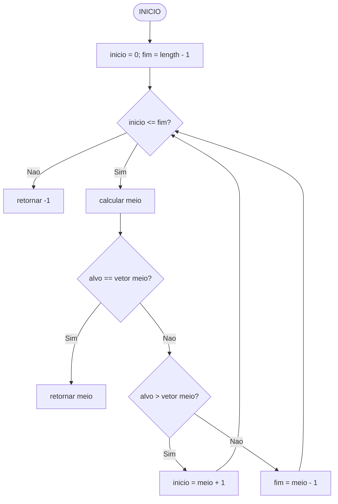

# Raciocínio Lógico Algorítmico: Aula 10
Orientador: Prof. Me Ricardo Carubbi

## Técnicas e algoritmos com vetores

### Objetivo da aula
Implementar em TypeScript técnicas clássicas com vetores: troca de posições,
inversão, busca linear, busca binária e ordenação pelo método da bolha.

Nesta aula, os algoritmos serão escritos manualmente. Métodos prontos de busca,
inversão ou ordenação não substituirão os laços estudados.

## 1. Padrão de entrada
Os exemplos recebem valores separados por espaço, dividem o texto e convertem
cada parte.

```typescript
// Declaracao de variaveis
let entrada: string | null;
let dados: string[];
let vetor: number[];
let i: number;

// Entrada
entrada = prompt("Digite os valores separados por espaco:");

// Processamento
if (entrada !== null) {
  dados = entrada.split(" ");
  vetor = [];

  for (i = 0; i < dados.length; i++) {
    vetor[i] = parseInt(dados[i]);
  }
}
```

## 2. Troca de posições
Para trocar dois elementos, usamos seus índices.

```typescript
function trocarValores(
  vetor: number[],
  indice1: number,
  indice2: number
): void {
  let temporaria: number;

  temporaria = vetor[indice1];
  vetor[indice1] = vetor[indice2];
  vetor[indice2] = temporaria;
}
```

Se o vetor for `[12, 45, 7, 89, 23]`, a troca dos índices `0` e `4` produz
`[23, 45, 7, 89, 12]`.

## 3. Inversão de vetor
Há duas abordagens:

1. criar um novo vetor com a ordem inversa;
2. trocar elementos dentro do próprio vetor.

### 3.1 Novo vetor

```typescript
function criarVetorInvertido(vetor: number[]): number[] {
  let invertido: number[];
  let i: number;
  let j: number;

  invertido = [];
  j = vetor.length - 1;

  for (i = 0; i < vetor.length; i++) {
    invertido[j] = vetor[i];
    j--;
  }

  return invertido;
}
```

### 3.2 Mesmo vetor

```typescript
function inverterNoMesmoVetor(vetor: number[]): void {
  let quantidade: number;
  let meio: number;
  let i: number;
  let temporaria: number;

  quantidade = vetor.length;
  meio = parseInt(String(quantidade / 2));

  for (i = 0; i < meio; i++) {
    temporaria = vetor[i];
    vetor[i] = vetor[quantidade - 1 - i];
    vetor[quantidade - 1 - i] = temporaria;
  }
}
```

Só percorremos até a metade. Depois desse ponto, as posições já foram
trocadas.

## 4. Busca linear
A busca linear examina os elementos do início ao fim e funciona mesmo quando
o vetor não está ordenado.

```typescript
function buscaLinear(valores: number[], procurado: number): number {
  let i: number;

  for (i = 0; i < valores.length; i++) {
    if (valores[i] === procurado) {
      return i;
    }
  }

  return -1;
}
```

O retorno `-1` indica que nenhum índice válido foi encontrado.

| Etapa | Índice | Valor | Procurado = 7 |
| --- | --- | --- | --- |
| 1 | 0 | 12 | diferente |
| 2 | 1 | 45 | diferente |
| 3 | 2 | 7 | encontrado |

## 5. Busca binária
A busca binária elimina metade das posições a cada comparação. Ela exige um
vetor previamente ordenado.

```typescript
function buscaBinaria(valores: number[], procurado: number): number {
  let inicio: number;
  let fim: number;
  let meio: number;

  inicio = 0;
  fim = valores.length - 1;

  while (inicio <= fim) {
    meio = parseInt(String((inicio + fim) / 2));

    if (procurado === valores[meio]) {
      return meio;
    } else if (procurado > valores[meio]) {
      inicio = meio + 1;
    } else {
      fim = meio - 1;
    }
  }

  return -1;
}
```



## 6. Busca linear e busca binária

| Critério | Busca linear | Busca binária |
| --- | --- | --- |
| Exige ordenação | não | sim |
| Estratégia | examina em sequência | elimina metades |
| Implementação | mais simples | mais elaborada |
| Melhor uso | poucos dados ou uma busca | vetor ordenado e buscas repetidas |

Ordenar um vetor apenas para realizar uma única busca nem sempre compensa.

## 7. Bubble Sort
O Bubble Sort compara pares vizinhos e troca os que estiverem fora de ordem.
Ao final de cada passagem, um dos maiores valores chega à sua posição final.

```typescript
function bubbleSort(vetor: number[]): void {
  let i: number;
  let j: number;
  let houveTroca: boolean;
  let temporaria: number;

  for (i = 0; i < vetor.length - 1; i++) {
    houveTroca = false;

    for (j = 0; j < vetor.length - 1 - i; j++) {
      if (vetor[j] > vetor[j + 1]) {
        temporaria = vetor[j];
        vetor[j] = vetor[j + 1];
        vetor[j + 1] = temporaria;
        houveTroca = true;
      }
    }

    if (!houveTroca) {
      break;
    }
  }
}
```

O limite `vetor.length - 1 - i` evita comparar novamente as posições finais
que já estão ordenadas. A variável `houveTroca` permite encerrar quando uma
passagem inteira não realiza nenhuma troca.

Exemplo inicial:

```text
20 35 18 8
```

Após a primeira passagem:

```text
20 18 8 35
```

Resultado:

```text
8 18 20 35
```

## 8. Contagem de comparações e trocas
Para observar o trabalho realizado pelo algoritmo, podemos usar contadores.

```typescript
// Declaracao de variaveis
let comparacoes: number;
let trocas: number;

comparacoes = 0;
trocas = 0;
```

Dentro do laço interno, incrementamos `comparacoes` antes do teste e `trocas`
somente quando dois elementos mudam de posição.

## 9. Ordenar e depois buscar
Uma cópia manual preserva o vetor original.

```typescript
// Declaracao de variaveis
let vetor: number[];
let vetorOrdenado: number[];
let valor: number;
let i: number;

vetor = [12, 45, 7, 89, 23];
vetorOrdenado = [];

for (i = 0; i < vetor.length; i++) {
  valor = vetor[i];
  vetorOrdenado[i] = valor;
}

bubbleSort(vetorOrdenado);
console.log(buscaBinaria(vetorOrdenado, 45));
```

A posição devolvida pertence ao vetor ordenado, não necessariamente ao vetor
original.

## 10. Erros comuns

- usar busca binária em um vetor não ordenado;
- escrever `i <= vetor.length`;
- esquecer o retorno `-1`;
- perder o vetor original ao ordenar sem criar uma cópia;
- percorrer toda a faixa do Bubble Sort em todas as passagens;
- confundir valor com índice;
- omitir os tipos dos parâmetros e retornos;
- usar um método pronto no lugar do algoritmo em estudo.

## 11. Fechamento
Nesta aula, aprendemos a:

1. trocar elementos por índice;
2. inverter um vetor de duas maneiras;
3. implementar busca linear;
4. implementar busca binária;
5. ordenar manualmente com Bubble Sort;
6. combinar ordenação e busca;
7. tipar funções que recebem e modificam `number[]`.

## Saiba mais
- TypeScript Handbook - Arrays: https://www.typescriptlang.org/docs/handbook/2/everyday-types.html#arrays
- VisuAlgo - Sorting: https://visualgo.net/en/sorting
- VisuAlgo - Binary Search: https://visualgo.net/en/bst
