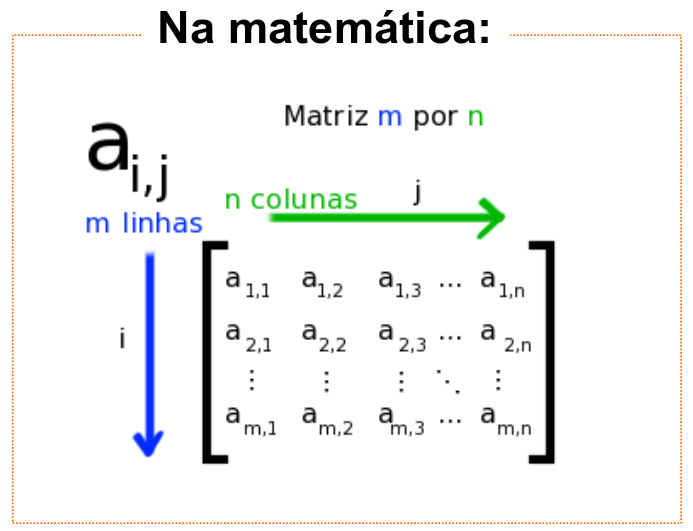
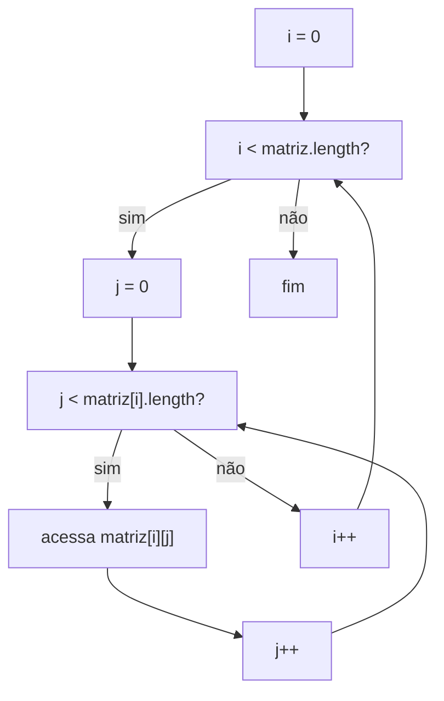
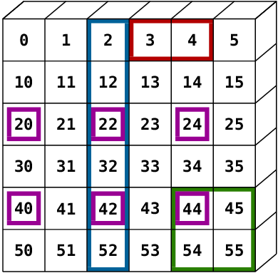
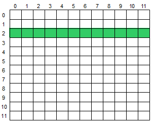

 

# Raciocínio Lógico Algorítmico: Aula 11
Orientador: Prof. Me Ricardo Carubbi

## Matrizes em JavaScript

### Objetivo da aula
Compreender o uso de **matrizes** como arrays bidimensionais em JavaScript, usando linhas e colunas para armazenar dados organizados em formato de tabela. Ao final da aula, o aluno deverá ser capaz de criar matrizes, acessar elementos por `matriz[linha][coluna]`, percorrer uma matriz com laços aninhados, ler todos os elementos de uma matriz em uma única entrada usando `split(" ")` e aplicar algoritmos básicos como soma, média, maior valor e busca.

Esta aula continua o estudo de arrays iniciado nas aulas 9 e 10. Na aula 9, estudamos vetores. Na aula 10, aplicamos técnicas sobre vetores. Agora, vamos estudar arrays com duas dimensões.

## 1. Retomando a ideia de vetor

Um **vetor** é um array de uma dimensão. Podemos imaginá-lo como uma única linha de valores.

```javascript
let vetor;

vetor = [8, 5, 9, 3];
```

Representação:

| Índice | 0 | 1 | 2 | 3 |
| --- | --- | --- | --- | --- |
| Valor | 8 | 5 | 9 | 3 |

Para acessar um elemento do vetor, usamos apenas um índice:

```javascript
console.log(vetor[0]); // 8
console.log(vetor[2]); // 9
```

O vetor responde bem quando os dados estão organizados em uma sequência simples.

Mas alguns problemas precisam representar dados em formato de tabela:

- notas de alunos em várias avaliações;
- assentos de uma sala;
- pixels de uma imagem;
- temperaturas medidas por sensor e por horário;
- tabuleiros de jogos;
- mapas simples;
- planilhas com linhas e colunas.

Nesses casos, uma estrutura com apenas uma dimensão pode ficar limitada.

## 2. O que é uma matriz?

Uma **matriz** é uma estrutura organizada em **linhas** e **colunas**.

Podemos pensar em uma matriz como uma tabela.

Na Matemática, matrizes costumam ser representadas entre parênteses ou colchetes, com seus elementos organizados em linhas e colunas.



**Figura 11.1** - Representação matemática de uma matriz. Fonte: IME-USP.

Na programação, a ideia visual é a mesma: continuamos pensando em linhas e colunas. A diferença é que, em JavaScript, vamos representar essa estrutura usando arrays.

Outro ponto importante é a indexação. Na Matemática, é comum falar em primeira linha e primeira coluna. Em JavaScript, os índices começam em `0`, então a primeira linha é a linha `0` e a primeira coluna é a coluna `0`.

Exemplo:

| | Coluna 0 | Coluna 1 | Coluna 2 |
| --- | --- | --- | --- |
| Linha 0 | 1 | 2 | 3 |
| Linha 1 | 4 | 5 | 6 |

Em JavaScript, uma matriz pode ser representada como um **array de arrays**.

```javascript
let matriz;

matriz = [
    [1, 2, 3],
    [4, 5, 6]
];
```

Nesse exemplo:

- a matriz possui 2 linhas;
- cada linha possui 3 colunas;
- `matriz[0]` é a primeira linha;
- `matriz[1]` é a segunda linha.

### Ideia principal

Um vetor usa um índice:

```javascript
vetor[indice]
```

Uma matriz usa dois índices:

```javascript
matriz[linha][coluna]
```

O primeiro índice indica a **linha**.

O segundo índice indica a **coluna**.

## 3. Acessando elementos de uma matriz

Considere a matriz:

```javascript
let matriz;

matriz = [
    [1, 2, 3],
    [4, 5, 6]
];
```

Podemos acessar os elementos assim:

```javascript
console.log(matriz[0][0]); // 1
console.log(matriz[0][1]); // 2
console.log(matriz[1][2]); // 6
```

### Representação dos índices

| Acesso | Linha | Coluna | Valor |
| --- | --- | --- | --- |
| `matriz[0][0]` | 0 | 0 | 1 |
| `matriz[0][1]` | 0 | 1 | 2 |
| `matriz[0][2]` | 0 | 2 | 3 |
| `matriz[1][0]` | 1 | 0 | 4 |
| `matriz[1][1]` | 1 | 1 | 5 |
| `matriz[1][2]` | 1 | 2 | 6 |

### Ponto de atenção

Assim como nos vetores, os índices começam em `0`.

Em uma matriz, isso vale para as linhas e para as colunas.

Portanto:

- a primeira linha tem índice `0`;
- a primeira coluna tem índice `0`;
- a última linha é `matriz.length - 1`;
- a última coluna de uma linha é `matriz[i].length - 1`.

## 4. Acessando intervalos de elementos de uma matriz

Às vezes, não queremos acessar apenas uma posição da matriz, mas um conjunto de posições.

Por exemplo:

- todos os elementos de uma linha;
- todos os elementos de uma coluna;
- um bloco formado por algumas linhas e algumas colunas.

Nesses casos, usamos `for` para variar o índice que muda e manter fixo o índice que não muda.

### 4.1 Acessando uma linha

Considere a matriz:

```javascript
let matriz;

matriz = [
    [1, 2, 3],
    [4, 5, 6]
];
```

Para acessar todos os elementos da linha `0`, mantemos a linha fixa e variamos a coluna:

```javascript
let j;

for (j = 0; j < matriz[0].length; j++) {
    console.log(matriz[0][j]);
}
```

Saída:

```text
1
2
3
```

### 4.2 Acessando uma coluna

Para acessar todos os elementos da coluna `2`, mantemos a coluna fixa e variamos a linha:

```javascript
let i;

for (i = 0; i < matriz.length; i++) {
    console.log(matriz[i][2]);
}
```

Saída:

```text
3
6
```

### 4.3 Acessando um bloco

Também podemos acessar um bloco usando dois laços.

Por exemplo, para acessar as linhas `0` e `1`, e as colunas `1` e `2`:

```javascript
let i;
let j;

for (i = 0; i <= 1; i++) {
    for (j = 1; j <= 2; j++) {
        console.log(matriz[i][j]);
    }
}
```

Nesse caso, o algoritmo acessa:

```javascript
matriz[0][1]
matriz[0][2]
matriz[1][1]
matriz[1][2]
```

## 5. Alterando elementos de uma matriz

Também podemos alterar uma posição específica.

```javascript
let matriz;

matriz = [
    [1, 2, 3],
    [4, 5, 6]
];

// Altera o valor da linha 1, coluna 2
matriz[1][2] = 9;

console.log(matriz[1][2]); // 9
```

Antes da alteração, `matriz[1][2]` guardava o valor `6`.

Depois da alteração, essa posição passou a guardar o valor `9`.

## 6. Entendendo `length` em matrizes

Em um vetor, `length` indica a quantidade de elementos.

Em uma matriz, precisamos observar duas coisas:

```javascript
let matriz;

matriz = [
    [1, 2, 3],
    [4, 5, 6]
];

console.log(matriz.length);    // 2
console.log(matriz[0].length); // 3
```

Nesse exemplo:

- `matriz.length` indica a quantidade de linhas;
- `matriz[0].length` indica a quantidade de colunas da linha `0`.

### Por que `matriz[0].length`?

Porque cada linha da matriz também é um array.

```javascript
matriz[0] // [1, 2, 3]
matriz[1] // [4, 5, 6]
```

Logo, se `matriz[0]` é um vetor, podemos usar `matriz[0].length` para saber quantos elementos existem nessa linha.

### Ponto de atenção

`matriz.length` não indica a quantidade total de valores da matriz.

Ela indica apenas a quantidade de linhas.

Para percorrer os elementos, normalmente precisamos de dois laços:

- um para as linhas;
- outro para as colunas.

## 7. Percorrendo uma matriz com `for`

Para percorrer uma matriz, usamos laços aninhados.

O laço externo percorre as linhas.

O laço interno percorre as colunas.

```javascript
let matriz;
let i;
let j;

matriz = [
    [1, 2, 3],
    [4, 5, 6]
];

for (i = 0; i < matriz.length; i++) {
    for (j = 0; j < matriz[i].length; j++) {
        console.log(matriz[i][j]);
    }
}
```

### Ordem do percurso

O algoritmo acima percorre a matriz em ordem por linhas.

| Passo | `i` | `j` | Acesso | Valor |
| --- | --- | --- | --- | --- |
| 1 | 0 | 0 | `matriz[0][0]` | 1 |
| 2 | 0 | 1 | `matriz[0][1]` | 2 |
| 3 | 0 | 2 | `matriz[0][2]` | 3 |
| 4 | 1 | 0 | `matriz[1][0]` | 4 |
| 5 | 1 | 1 | `matriz[1][1]` | 5 |
| 6 | 1 | 2 | `matriz[1][2]` | 6 |

### Representação visual



### Observação didática

O uso de `matriz[i].length` no laço interno é importante porque ele usa o tamanho da linha atual.

Nesta aula, vamos trabalhar principalmente com matrizes retangulares, em que todas as linhas possuem a mesma quantidade de colunas. Mesmo assim, usar `matriz[i].length` ajuda a reforçar que cada linha é um vetor.

## 8. Criando uma matriz vazia e preenchendo por índice

Assim como fizemos com vetores, também podemos começar com uma matriz vazia e preencher suas posições.

```javascript
let matriz;
let i;
let j;

matriz = [];

for (i = 0; i < 2; i++) {
    matriz[i] = [];

    for (j = 0; j < 3; j++) {
        matriz[i][j] = i + j;
    }
}
```

Nesse exemplo:

- `matriz = []` cria a matriz vazia;
- `matriz[i] = []` cria uma linha vazia;
- `matriz[i][j] = i + j` preenche uma posição da linha.

### Ponto de atenção

Antes de preencher `matriz[i][j]`, é necessário criar a linha `matriz[i]`.

Este código está incorreto:

```javascript
matriz = [];
matriz[0][0] = 5;
```

O problema é que `matriz[0]` ainda não foi criada.

O correto é:

```javascript
matriz = [];
matriz[0] = [];
matriz[0][0] = 5;
```

## 9. Lendo uma matriz com `prompt`

Existem diferentes formas de ler os valores de uma matriz usando `prompt`.

Nesta aula, vamos começar pela forma mais prática para testar exemplos: uma única entrada com todos os elementos da matriz separados por espaço.

Depois, veremos uma segunda solução usando um `prompt` por linha e uma terceira solução usando uma função para gerar a matriz.

### 9.1 Primeira solução: todos os elementos em uma única entrada

Todos os elementos da matriz serão digitados separados por espaço, na ordem em que aparecem quando percorremos a matriz em ordem por linhas.

Exemplo de entrada para uma matriz 2x3:

```text
1 2 3 4 5 6
```

Essa entrada representa a matriz:

```text
1 2 3
4 5 6
```

Para separar os valores, usamos:

```javascript
entrada = prompt("Digite todos os valores da matriz separados por espaco:");
dados = entrada.split(" ");
```

Depois, convertemos cada parte textual para número.

Como a entrada possui todos os elementos em uma única sequência, não precisamos informar manualmente as duas dimensões.

Nesta aula, vamos informar apenas `nLinhas`.

A quantidade de colunas será deduzida pela quantidade total de elementos:

```javascript
nColunas = parseInt(dados.length / nLinhas);
```

```javascript
let matriz;
let entrada;
let dados;
let nLinhas;
let nColunas;
let i;
let j;
let indice;

nLinhas = 2;
matriz = [];
indice = 0;

entrada = prompt("Digite todos os valores da matriz separados por espaco:"); // 1 2 3 4 5 6
dados = entrada.split(" ");
nColunas = parseInt(dados.length / nLinhas);

for (i = 0; i < nLinhas; i++) {
    matriz[i] = [];

    for (j = 0; j < nColunas; j++) {
        matriz[i][j] = parseInt(dados[indice]);
        indice++;
    }
}

for (i = 0; i < matriz.length; i++) {
    for (j = 0; j < matriz[i].length; j++) {
        console.log(matriz[i][j]);
    }
}
```

### Observação didática

Neste padrão:

1. um único `prompt` recebe todos os elementos da matriz;
2. `split(" ")` separa os valores digitados;
3. `nLinhas` informa quantas linhas a matriz terá;
4. `nColunas` é calculado a partir de `dados.length / nLinhas`;
5. a variável `indice` controla qual posição do vetor `dados` está sendo usada;
6. o laço externo controla a linha da matriz;
7. o laço interno controla a coluna da matriz.

Nesta aula, não vamos misturar separadores. Para separar os valores digitados, usaremos apenas `split(" ")`.

### Ponto de atenção

Se a quantidade de elementos digitados não for compatível com `nLinhas`, a matriz não será preenchida corretamente.

Exemplo:

```text
Entrada: 1 2 3 4 5
nLinhas = 2
```

Nesse caso, existem 5 valores. Como 5 não pode ser dividido igualmente em 2 linhas, a entrada está incoerente para esse formato de matriz.

Também seria possível fazer o raciocínio inverso:

```javascript
nLinhas = parseInt(dados.length / nColunas);
```

Nesse caso, informaríamos apenas `nColunas` e deduziríamos `nLinhas`. Nesta aula, usaremos `nLinhas` como referência principal.

### 9.2 Segunda solução: um `prompt` por linha

Outra forma de ler uma matriz é pedir uma linha por vez.

Essa solução pode ser mais fácil de visualizar no início, porque cada entrada digitada corresponde a uma linha da matriz.

Exemplo para uma matriz 2x3:

```text
Primeiro prompt: 1 2 3
Segundo prompt: 4 5 6
```

Código:

```javascript
let matriz;
let entrada;
let dados;
let nLinhas;
let nColunas;
let i;
let j;

nLinhas = 2;
nColunas = 3;
matriz = [];

for (i = 0; i < nLinhas; i++) {
    entrada = prompt("Digite os valores da linha " + i + " separados por espaco:");
    dados = entrada.split(" ");

    matriz[i] = [];

    for (j = 0; j < nColunas; j++) {
        matriz[i][j] = parseInt(dados[j]);
    }
}

for (i = 0; i < matriz.length; i++) {
    for (j = 0; j < matriz[i].length; j++) {
        console.log(matriz[i][j]);
    }
}
```

### Comparando as duas soluções

| Estratégia | Vantagem | Fragilidade |
| --- | --- | --- |
| Um `prompt` com todos os elementos | Mais rápida para testar exemplos | Exige saber como os valores serão distribuídos em linhas e colunas |
| Um `prompt` por linha | Mais parecida com a visualização da matriz | Exige várias entradas e fica cansativa para matrizes maiores |

Para os exemplos práticos desta aula, a solução com todos os elementos em uma única entrada continua sendo a principal.

### 9.3 Terceira solução: função para gerar matriz

Também podemos criar uma função para transformar uma entrada textual em matriz.

A função abaixo recebe:

- `entrada`: texto com todos os valores separados por espaço;
- `nLinhas`: quantidade de linhas da matriz.

Com esses dois dados, a função deduz a quantidade de colunas:

```javascript
nColunas = parseInt(dados.length / nLinhas);
```

Assinatura da função:

```javascript
function gerarMatriz(entrada, nLinhas)
```

Implementação:

```javascript
function gerarMatriz(entrada, nLinhas) {
    let dados;
    let matriz;
    let nColunas;
    let i;
    let j;
    let indice;

    dados = entrada.split(" ");
    nColunas = parseInt(dados.length / nLinhas);
    matriz = [];
    indice = 0;

    for (i = 0; i < nLinhas; i++) {
        matriz[i] = [];

        for (j = 0; j < nColunas; j++) {
            matriz[i][j] = parseInt(dados[indice]);
            indice++;
        }
    }

    return matriz;
}
```

Uso:

```javascript
let entrada;
let matriz;

entrada = prompt("Digite todos os valores da matriz separados por espaco:"); // 1 2 3 4 5 6
matriz = gerarMatriz(entrada, 2);
```

Nesse caso, a função sabe que a matriz terá 2 linhas. Como a entrada tem 6 valores, ela deduz que cada linha terá 3 colunas.

### Ponto de atenção sobre a função

Essa função assume que a quantidade de valores digitados é compatível com `nLinhas`.

Se a entrada tiver 5 valores e informarmos `nLinhas = 2`, não será possível formar uma matriz retangular completa.

Nesta aula, vamos manter a função simples para destacar o raciocínio de índices. Validações mais completas podem ser estudadas depois.

## 10. Soma e média dos elementos da matriz

Para somar todos os elementos de uma matriz, usamos um acumulador e percorremos todas as posições.

```javascript
let matriz;
let soma;
let media;
let quantidade;
let i;
let j;

matriz = [
    [8, 7, 9],
    [6, 10, 5]
];

soma = 0;
quantidade = 0;

for (i = 0; i < matriz.length; i++) {
    for (j = 0; j < matriz[i].length; j++) {
        soma = soma + matriz[i][j];
        quantidade++;
    }
}

media = soma / quantidade;

console.log("Soma: " + soma);
console.log("Media: " + media);
```

### Ponto de atenção

O acumulador `soma` precisa ser inicializado antes do percurso.

A variável `quantidade` conta quantos valores foram considerados no cálculo da média.

Em uma matriz retangular, também seria possível calcular a quantidade usando:

```javascript
quantidade = matriz.length * matriz[0].length;
```

Mesmo assim, contar durante o percurso ajuda a reforçar a ideia de que cada elemento foi visitado.

## 11. Maior valor e posição na matriz

Para encontrar o maior valor de uma matriz, podemos usar a mesma ideia estudada em vetores.

A diferença é que agora precisamos guardar duas posições:

- a linha do maior valor;
- a coluna do maior valor.

```javascript
let matriz;
let maior;
let linhaMaior;
let colunaMaior;
let i;
let j;

matriz = [
    [12, 45, 7],
    [89, 23, 14],
    [5, 91, 30]
];

maior = matriz[0][0];
linhaMaior = 0;
colunaMaior = 0;

for (i = 0; i < matriz.length; i++) {
    for (j = 0; j < matriz[i].length; j++) {
        if (matriz[i][j] > maior) {
            maior = matriz[i][j];
            linhaMaior = i;
            colunaMaior = j;
        }
    }
}

console.log("Maior valor: " + maior);
console.log("Linha: " + linhaMaior);
console.log("Coluna: " + colunaMaior);
```

### Observação didática

Inicializamos o maior com `matriz[0][0]` porque esse valor certamente pertence à matriz.

Se inicializássemos com `0`, o algoritmo poderia falhar em uma matriz formada apenas por números negativos.

## 12. Busca em matriz

Buscar em uma matriz significa verificar se um valor aparece em alguma posição.

Assim como na busca linear em vetor, verificamos os elementos um por um.

```javascript
let matriz;
let procurado;
let encontrado;
let linhaEncontrada;
let colunaEncontrada;
let i;
let j;

matriz = [
    [12, 45, 7],
    [89, 23, 14],
    [5, 91, 30]
];

procurado = 23;
encontrado = false;
linhaEncontrada = -1;
colunaEncontrada = -1;

for (i = 0; i < matriz.length; i++) {
    for (j = 0; j < matriz[i].length; j++) {
        if (matriz[i][j] == procurado) {
            encontrado = true;
            linhaEncontrada = i;
            colunaEncontrada = j;
        }
    }
}

if (encontrado) {
    console.log("Valor encontrado");
    console.log("Linha: " + linhaEncontrada);
    console.log("Coluna: " + colunaEncontrada);
} else {
    console.log("Valor nao encontrado");
}
```

### Ponto de atenção

Essa busca percorre a matriz inteira, mesmo depois de encontrar o valor.

Em uma versão posterior, poderíamos usar `break` para parar a busca antes do fim. Nesta aula, a versão completa ajuda a reforçar o percurso com dois laços.

## 13. Exercício visual de indexação

A figura abaixo mostra uma matriz 6x6. Cada posição contém um valor que ajuda a enxergar a relação entre linha e coluna.



Podemos representar essa matriz assim:

```javascript
let matriz;

matriz = [
    [0, 1, 2, 3, 4, 5],
    [10, 11, 12, 13, 14, 15],
    [20, 21, 22, 23, 24, 25],
    [30, 31, 32, 33, 34, 35],
    [40, 41, 42, 43, 44, 45],
    [50, 51, 52, 53, 54, 55]
];
```

Também podemos gerar essa matriz usando uma função que recebe suas dimensões.

Nesse padrão visual, o valor de cada posição é calculado assim:

```javascript
valor = i * 10 + j;
```

Em que:

- `i` representa a linha;
- `j` representa a coluna.

Exemplo:

```javascript
let matriz;
let i;
let j;

function gerarMatrizPorDimensoes(nLinhas, nColunas) {
    let matriz;
    let i;
    let j;

    matriz = [];

    for (i = 0; i < nLinhas; i++) {
        matriz[i] = [];

        for (j = 0; j < nColunas; j++) {
            matriz[i][j] = i * 10 + j;
        }
    }

    return matriz;
}

matriz = gerarMatrizPorDimensoes(6, 6);

for (i = 0; i < matriz.length; i++) {
    for (j = 0; j < matriz[i].length; j++) {
        console.log(matriz[i][j]);
    }
}
```

O objetivo do exercício é retornar os valores destacados por cor.

| Cor | Valores destacados |
| --- | --- |
| Azul | `2, 12, 22, 32, 42, 52` |
| Vermelho | `3, 4` |
| Roxo | `20, 22, 24, 40, 42, 44` |
| Verde | `44, 45, 54, 55` |

### Interpretação por índices

Para retornar os elementos azuis, observamos que todos estão na coluna `2`.

Para retornar uma coluna da matriz, percorremos as linhas com `for` e mantemos a coluna fixa:

```javascript
let i;

for (i = 0; i < matriz.length; i++) {
    console.log(matriz[i][2]);
}
```

Para retornar os elementos vermelhos, observamos a linha `0` e as colunas `3` e `4`.

```javascript
let j;

for (j = 3; j <= 4; j++) {
    console.log(matriz[0][j]);
}
```

Para retornar os elementos roxos, observamos as linhas `2` e `4`, e as colunas `0`, `2` e `4`.

```javascript
let i;
let j;

for (i = 2; i <= 4; i = i + 2) {
    for (j = 0; j <= 4; j = j + 2) {
        console.log(matriz[i][j]);
    }
}
```

Para retornar os elementos verdes, observamos as linhas `4` e `5`, e as colunas `4` e `5`.

```javascript
let i;
let j;

for (i = 4; i <= 5; i++) {
    for (j = 4; j <= 5; j++) {
        console.log(matriz[i][j]);
    }
}
```

O valor `44` aparece nas seleções roxa e verde. Isso não é erro: a mesma posição pode fazer parte de mais de uma seleção visual.

Se os valores da matriz forem lidos em uma única entrada com `prompt`, use a função `gerarMatriz(entrada, nLinhas)` antes de acessar os elementos por cor.

Para a figura, use:

```javascript
nLinhas = 6;
matriz = gerarMatriz(entrada, nLinhas);
```

## 14. Beecrowd 1181 - Linha na Matriz

O problema `1181 - Linha na Matriz` é adequado para praticar matrizes porque pede uma operação sobre uma linha específica de uma matriz.



**Figura 11.2** - Enunciado do Beecrowd 1181 - Linha na Matriz.

Na adaptação didática desta aula, os valores da matriz podem ser lidos em uma única entrada, todos separados por espaço.

A ideia principal é:

1. ler o índice da linha desejada;
2. ler a operação desejada, soma ou média;
3. ler todos os valores da matriz;
4. percorrer apenas a linha escolhida;
5. calcular a soma ou a média dos valores dessa linha.

Esse problema reforça um ponto importante:

```javascript
matriz[linhaEscolhida][j]
```

Nesse caso, a linha fica fixa e a coluna varia.

### Solução

```javascript
function gerarMatriz(entrada, nLinhas) {
    let dados;
    let matriz;
    let nColunas;
    let i;
    let j;
    let indice;

    dados = entrada.split(" ");
    nColunas = parseInt(dados.length / nLinhas);
    matriz = [];
    indice = 0;

    for (i = 0; i < nLinhas; i++) {
        matriz[i] = [];

        for (j = 0; j < nColunas; j++) {
            matriz[i][j] = parseFloat(dados[indice]);
            indice++;
        }
    }

    return matriz;
}

let linhaEscolhida;
let operacao;
let entrada;
let matriz;
let nLinhas;
let soma;
let media;
let j;

linhaEscolhida = parseInt(prompt("Digite a linha escolhida:"));
operacao = prompt("Digite a operacao S ou M:");
entrada = prompt("Digite todos os valores da matriz separados por espaco:");

nLinhas = 12;
matriz = gerarMatriz(entrada, nLinhas);
soma = 0;

for (j = 0; j < matriz[linhaEscolhida].length; j++) {
    soma = soma + matriz[linhaEscolhida][j];
}

if (operacao == "S") {
    console.log(soma.toFixed(1));
} else {
    media = soma / matriz[linhaEscolhida].length;
    console.log(media.toFixed(1));
}
```

## 15. Beecrowd 1187 - Área Superior

O problema `1187 - Área Superior` é mais difícil que o `1181`.


**Figura 11.3** - Enunciado do Beecrowd 1187 - Área Superior.

Ele exige selecionar uma região específica da matriz usando condições sobre os índices.

Por isso, ele deve ser tratado como desafio posterior, não como primeiro exercício de matriz.

Na adaptação didática desta aula, os valores da matriz podem ser lidos em uma única entrada, todos separados por espaço.

A ideia principal é:

1. ler a operação desejada, soma ou média;
2. ler todos os valores da matriz;
3. percorrer todas as posições;
4. considerar apenas os elementos da área superior;
5. calcular soma ou média desses elementos.

Esse problema exige mais atenção porque nem todos os elementos da matriz entram no cálculo.

### Solução

```javascript
function gerarMatriz(entrada, nLinhas) {
    let dados;
    let matriz;
    let nColunas;
    let i;
    let j;
    let indice;

    dados = entrada.split(" ");
    nColunas = parseInt(dados.length / nLinhas);
    matriz = [];
    indice = 0;

    for (i = 0; i < nLinhas; i++) {
        matriz[i] = [];

        for (j = 0; j < nColunas; j++) {
            matriz[i][j] = parseFloat(dados[indice]);
            indice++;
        }
    }

    return matriz;
}

let operacao;
let entrada;
let matriz;
let nLinhas;
let soma;
let media;
let quantidade;
let i;
let j;

operacao = prompt("Digite a operacao S ou M:");
entrada = prompt("Digite todos os valores da matriz separados por espaco:");

nLinhas = 12;
matriz = gerarMatriz(entrada, nLinhas);
soma = 0;
quantidade = 0;

for (i = 0; i < matriz.length; i++) {
    for (j = 0; j < matriz[i].length; j++) {
        if (j > i && j < matriz[i].length - 1 - i) {
            soma = soma + matriz[i][j];
            quantidade++;
        }
    }
}

if (operacao == "S") {
    console.log(soma.toFixed(1));
} else {
    media = soma / quantidade;
    console.log(media.toFixed(1));
}
```

## 16. Exercícios complementares resolvidos

Os exercícios desta seção são complementares. Eles exigem mais atenção aos índices e devem ser estudados depois que o percurso básico de matriz estiver consolidado.

### 16.1 Função para calcular a transposta

A **transposta** de uma matriz troca linhas por colunas.

Exemplo:

```text
Matriz original:
1 2 3
4 5 6

Matriz transposta:
1 4
2 5
3 6
```

Se o elemento original está em:

```javascript
matriz[i][j]
```

Na transposta, ele passa para:

```javascript
transposta[j][i]
```

Solução:

```javascript
function calcularTransposta(matriz) {
    let transposta;
    let i;
    let j;

    transposta = [];

    for (j = 0; j < matriz[0].length; j++) {
        transposta[j] = [];

        for (i = 0; i < matriz.length; i++) {
            transposta[j][i] = matriz[i][j];
        }
    }

    return transposta;
}
```

### 16.2 Função para multiplicar matrizes

A multiplicação de matrizes só é possível quando:

```text
número de colunas da primeira matriz = número de linhas da segunda matriz
```

Exemplo:

```text
A = 2x3
B = 3x2
Resultado = 2x2
```

Cada elemento do resultado é calculado pela soma dos produtos entre uma linha da primeira matriz e uma coluna da segunda.

Solução:

```javascript
function multiplicarMatrizes(a, b) {
    let resultado;
    let i;
    let j;
    let k;
    let soma;

    resultado = [];

    for (i = 0; i < a.length; i++) {
        resultado[i] = [];

        for (j = 0; j < b[0].length; j++) {
            soma = 0;

            for (k = 0; k < a[i].length; k++) {
                soma = soma + a[i][k] * b[k][j];
            }

            resultado[i][j] = soma;
        }
    }

    return resultado;
}
```

### Ponto de atenção

Essas funções não usam métodos prontos de JavaScript. O objetivo é mostrar explicitamente:

- como os índices mudam na transposta;
- como linha, coluna e acumulador se combinam na multiplicação.

## 17. Erros comuns

1. Achar que a primeira linha ou a primeira coluna começa em `1`.
2. Trocar linha por coluna ao acessar `matriz[i][j]`.
3. Usar `i <= matriz.length` em vez de `i < matriz.length`.
4. Usar `j <= matriz[i].length` em vez de `j < matriz[i].length`.
5. Usar `matriz.length` como se fosse a quantidade de colunas.
6. Esquecer que cada linha da matriz também é um array.
7. Tentar preencher `matriz[i][j]` antes de criar `matriz[i]`.
8. Esquecer que `split(" ")` gera textos, não números.
9. Somar valores antes de converter com `parseInt` ou `parseFloat`.
10. Criar linhas com quantidades diferentes de colunas sem perceber.

## 18. Fechamento

Nesta aula, você estudou **matrizes**, que são arrays organizados em duas dimensões.

Os pontos principais foram:

- matriz é um array de arrays;
- cada elemento é acessado por linha e coluna;
- `matriz.length` indica a quantidade de linhas;
- `matriz[i].length` indica a quantidade de colunas da linha `i`;
- o percurso de matriz normalmente usa dois laços `for`;
- o laço externo percorre linhas;
- o laço interno percorre colunas;
- a leitura pode ser feita em uma única entrada com `split(" ")`;
- os algoritmos de soma, média, maior valor e busca seguem a mesma lógica dos vetores, mas com dois índices.

Técnicas como diagonal principal e diagonal secundária exigem mais cuidado com padrões de índices. Elas podem ser estudadas depois que o percurso básico de matriz estiver consolidado.

## Saiba mais

- MDN - Array: https://developer.mozilla.org/pt-BR/docs/Web/JavaScript/Reference/Global_Objects/Array
- Beecrowd - Categoria Iniciante: https://judge.beecrowd.com/pt/problems/index/1
