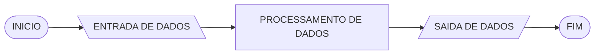
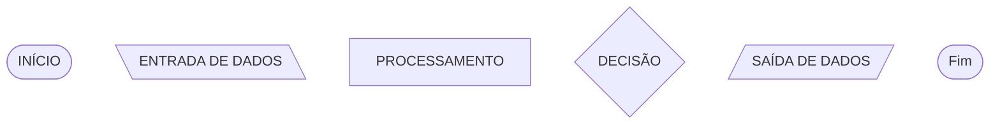
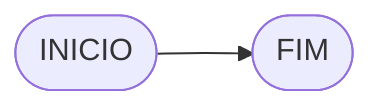
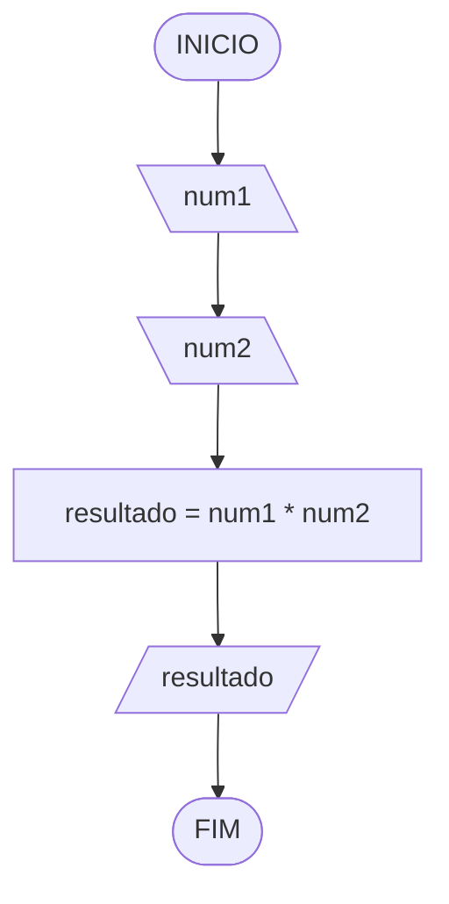
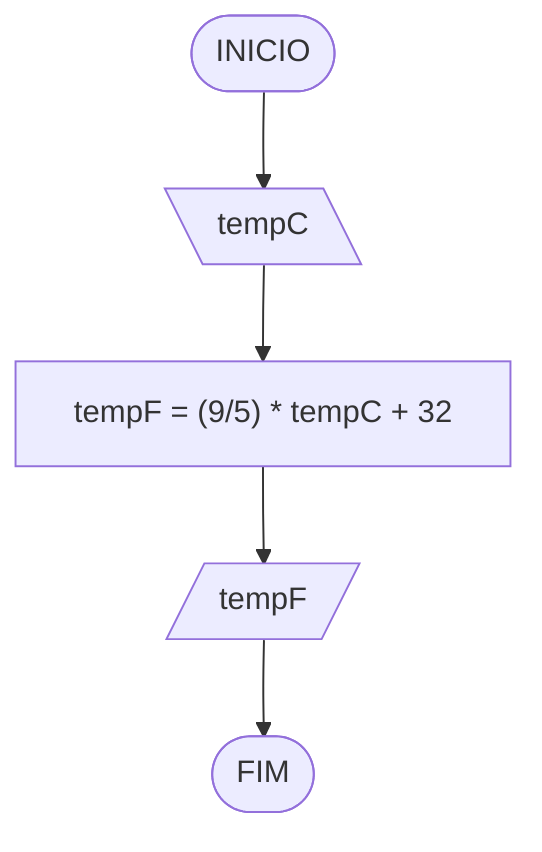
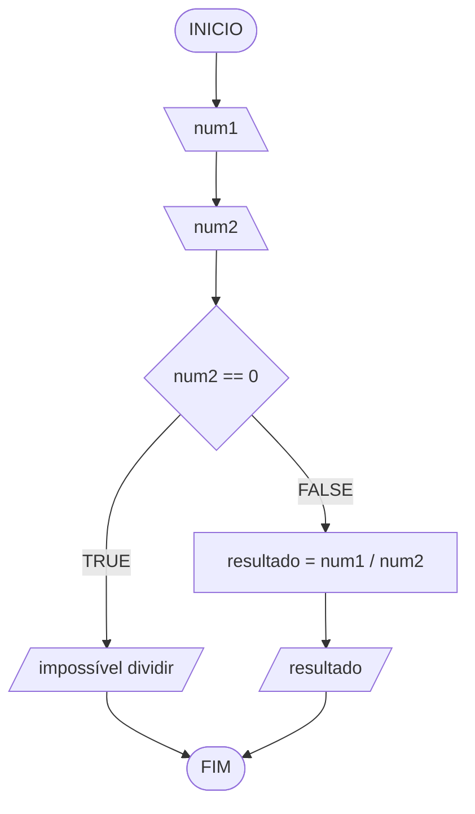
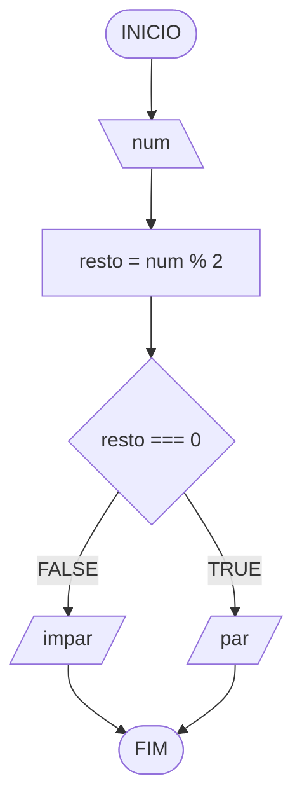

# Raciocínio Lógico Algorítmico: Aula 2
## O que é lógica?

> Lógica é a análise de métodos de raciocínio (Mendelson, 1987)

> Lógica é essencialmente o estudo da natureza do raciocínio e as formas de incrementar sua utilização.” (Andrews, 1996).

## O que é um algoritmo?

Um algoritmo pode ser definido como uma sequência de passos que visam a atingir um objetivo bem definido (Forbellone, 1999).
Algoritmo é a descrição de uma sequência de passos que deve ser seguida para a realização de uma tarefa (Ascencio, 1999).
Portanto, nada mais que “um conjunto de etapas para executar uma tarefa”.

## Estrutura básica de um algoritmo
Em lógica de programação, o roteiro para resolver a maioria dos programas iniciais é:


**Figura 2.1** - Estrutura básica de um algoritmo

## Tipos de representação de algoritmo

### Descrição narrativa
A descrição narrativa consiste em analisar o enunciado do problema e escrever, utilizando uma lingua-gem natural (por exemplo, a língua portuguesa), os passos a serem seguidos para sua resolução.

* **Vantagem**: Não é necessário aprender nenhum conceito novo.
* **Desvantagem**: Língua natural abre espaço para várias interpretações.

### Fluxograma
O fluxograma consiste em analisar o enunciado do problema e escrever, utilizando símbolos gráficos predefinidos (Figura 2.2), os passos a serem seguidos para sua resolução.

* **Vantagem**: Simples entendimento de elementos gráficos.
* **Desvantagem**: Necessário aprender a simbologia dos fluxogramas.

| Símbolo       | Descrição                                                    |
|---------------|--------------------------------------------------------------|
| Oval          | Indica o início e o fim do algoritmo                         |
| Seta          | Indica o sentido do fluxo de execução do algoritmo           |
| Retângulo     | Representa cálculos, processamentos e atribuições de valores |
| Paralelogramo | Representa a entrada de dados                                |
| Documento     | Representa a saída de dados                                  |
| Losango       | Indica um ponto de decisão, podendo gerar desvios no fluxo   |

**Tabela 2.1** – Conjunto de símbolos utilizados no fluxograma


**Figura 2.2** - Conjunto de símbolos utilizados no fluxograma. Fonte: ASCENCIO, Ana Fernanda Gomes et al. Fundamentos da programação de computadores. Pearson Educación, 2012.

### Pseudocódigo
O pseudocódigo ou portugol consiste em analisar o enunciado do problema e escrever, por meio de regras predefinidas, os passos a serem seguidos para sua resolução.

* **Vantagem**: Regras de sintaxe próxima à linguagem de programação.
* **Desvantagem**: Necessário aprender as regras do pseudocódigo.

## Teste de mesa
Teste de mesa é uma forma de simular manualmente a execução de um algoritmo. Você escolhe valores de entrada, acompanha o valor das variáveis passo a passo e registra a saída esperada. Isso ajuda a entender o algoritmo e a verificar se o resultado faz sentido.

Exemplo: Soma de dois números com entrada `2` e `3`:

| num1 | num2 | soma | saída |
| --   | --   | --   | --    |
| 2    | 3    | 5    | 5     |
| -4   | 5    | 1    | 1     |
| 0    | 7    | 7    | 7     |

> “O teste de mesa é semelhante a tirar a prova dos nove.” (MANZANO, 2019)

Em resumo, o teste de mesa é uma verificação manual do raciocínio do programador, feita em papel, para conferir se a lógica está correta.

## Observações importantes

### JavaScript
Nesta disciplina, alguns exemplos de algoritmos serão mostrados também em JavaScript (JS). JS é uma linguagem de programação muito usada na Web e serve aqui como referência prática de como um algoritmo pode ser traduzido para código executável.

> Nesta aula, vamos usar `var` por simplicidade. `var` é uma palavra usada para criar variáveis. Nas próximas aulas, vamos ver os riscos de usar `var` e passaremos a usar apenas `let` e `const`.

### Compilador
Um compilador é um programa que traduz um código escrito em uma linguagem (por exemplo, C ou Java) para outra forma que o computador entende diretamente. Em linguagens interpretadas (como JS), essa tradução acontece de forma diferente: o código é executado por um motor de execução, sem uma etapa explícita de compilação como em C.

> Se quiser testar códigos rapidamente no navegador, você pode usar um compilador online, como o [Programiz Online Compiler](https://www.programiz.com/).

### Markdown
Markdown é uma linguagem simples de marcação de texto usada para formatar documentos (títulos, listas, tabelas, código). As aulas e materiais em `.md` usam Markdown para facilitar a leitura e a organização do conteúdo.

> Para editar Markdown com suporte a diagramas, você pode usar o [merMDitor](https://www.mermditor.dev/), que renderiza Markdown e Mermaid no navegador.

> Para inserir um bloco de código em Markdown, use três crases ``` antes e depois do trecho.
No teclado ABNT2, o acento grave (\`) fica na tecla entre `P` e `[`; use `Shift` + essa tecla e depois `Espaço`. Segue abaixo dois exemplos de blocos de código:

```javascript
// Código em JS
```



### Mermaid
Mermaid é uma linguagem de marcação para criar diagramas por texto. Aqui, usamos Mermaid para desenhar fluxogramas diretamente no arquivo Markdown, dentro de blocos de código marcados como `mermaid`.
Para testar diagramas rapidamente, você pode usar o [Mermaid Live Editor](https://mermaid.live/).

## Exercícios

### Questão 1
Represente, em descrição narrativa, fluxograma, pseudocódigo e tabela de testes, um algoritmo para multiplicar dois números e exibir o resultado.

#### Descrição narrativa
1. Receber dois números.
2. Calcular a multiplicação.
3. Mostrar o resultado.

#### Fluxograma



#### Teste de mesa

| num1 | num2 | resultado | saída |
| --   | --   | --        | --    |
| 2    | 3    | 6         | 6     |
| -4   | 5    | -20       | -20   |
| 0    | 7    | 0         | 0     |

#### Código JavaScript (Programiz)

```javascript
// Entrada
var num1 = 2;
var num2 = 3;
// Processamento
var resultado = num1 * num2;
// Saída
console.log(resultado);
```

### Questão 2
Represente, em descrição narrativa, fluxograma, pseudocódigo e tabela de testes, um algoritmo para converter temperatura de Celsius (tempC) para Fahrenheit (tempF). (Fórmula: tempF = (9/5) * tempC + 32)

#### Descrição narrativa
1. Ler a temperatura em Celsius.
2. Calcular a temperatura em Fahrenheit.
3. Mostrar o resultado.

#### Fluxograma



#### Teste de mesa

| tempC  | tempF | saída                 | 
| --     | --    | --                    |
| 0      | 32    | 32 graus Fahrenheit   |
| 10     | 50    | 50 graus Fahrenheit   |
| -17.78 | 0.00  | 0.00 graus Fahrenheit |

#### Código JavaScript (Programiz)

```javascript
// Entrada
var tempC = 25;
// Processamento
var tempF = (9 / 5) * tempC + 32;
// Saída
console.log(tempF);
```

### Questão 3
Represente, em descrição narrativa, fluxograma, pseudocódigo e tabela de testes, um algoritmo para dividir dois números.

#### Descrição narrativa
1. Receber dois números.
2. Verificar se o segundo número é zero.
3. Se for zero, mostrar "impossível dividir".
4. Caso contrário, calcular a divisão do primeiro pelo segundo.
5. Mostrar o resultado.

#### Fluxograma



#### Teste de mesa

| num1 | num2 | resultado | saída               |
| --   | --   | --        | --                  |
| 10   | 2    | 5         | 5                   |
| 9    | 4.5  | 2         | 2                   |
| 7    | 0    | -         | "impossível dividir" |

#### Código JavaScript (Programiz)

```javascript
// Entrada
var num1 = 10;
var num2 = 2;

// Processamento e saída
if (num2 === 0) {
  console.log("impossível dividir");
} else {
  var resultado = num1 / num2;
  console.log(resultado);
}
```

### Questão 4
Represente, em descrição narrativa, fluxograma, pseudocódigo e tabela de testes, um algoritmo para dizer se um número é par ou impar.

> Observação: o símbolo `%` (módulo) calcula o resto da divisão inteira. Vamos detalhar os operadores na próxima aula.

#### Descrição narrativa
1. Ler um número.
2. Calcular o resto da divisão por 2.
3. Se o resto for 0, mostrar "par"; caso contrário, mostrar "impar".

#### Fluxograma



#### Teste de mesa

| numero | resto | resto == 0 | saída   |
| --     | --    | --         | --      | 
| 0      | 0     | V          | "par"   |
| 13     | 1     | F          | "impar" |
| 30     | 0     | V          | "par"   |

#### Código JavaScript (Programiz)

```javascript
// Entrada
var num = 13;
// Processamento
var resto = num % 2;

// Saída
if (resto === 0) {
  console.log("par");
} else {
  console.log("impar");
}
```

### Questão 5
Represente, em descrição narrativa, fluxograma, pseudocódigo e tabela de testes, um algoritmo para calcular a média de duas notas e mostrar se o aluno foi aprovado ou reprovado.

#### Descrição narrativa
1. Ler duas notas.
2. Calcular a média.
3. Se a média for maior ou igual a 7, mostrar "Aprovado"; caso contrário, "Reprovado".

#### Fluxograma

```mermaid
flowchart TD
A([INICIO]) --> B[\nota1\]
B --> C[\nota2\]
C --> D[media = (nota1 + nota2) / 2]
D --> E{media >= 7}
E --TRUE--> F[/"Aprovado"/]
E --FALSE--> G[/"Reprovado"/]
F --> H([FIM])
G --> H
```

#### Teste de mesa

| nota1 | nota2 | media | media >= 7 | saída       |
| --    | --    | --    | --         | --          |
| 8     | 6     | 7     | V          | "Aprovado"  |
| 5     | 4     | 4.5   | F          | "Reprovado" |
| 10    | 9     | 9.5   | V          | "Aprovado"  |

#### Código JavaScript (Programiz)

```javascript
// Entrada
var nota1 = 8;
var nota2 = 6;
// Processamento
var media = (nota1 + nota2) / 2;

// Saída
if (media >= 7) {
  console.log("Aprovado");
} else {
  console.log("Reprovado");
}
```

## Referências Bbibliográficas
1. FORBELLONE, A. L. V. Lógica de Programação: A construção de algoritmos e estruturas de dados. Editora (s) Pearson Prentice Hall, 2005. CAPÍTULOS 1 e 2.
2. ASCENCIO, Ana Fernanda Gomes; DE CAMPOS, Edilene Aparecida Veneruchi. Fundamentos da programação de computadores. Pearson Educación, 2008. CAPÍTULO 1, 2 e 3
3. MANZANO, José Augusto NG; DE OLIVEIRA, Jayr Figueiredo. Lógica para Desenvolvimento de Programação de Computadores. São Paulo: Érica, 2019. CAPÍTULO 1, 2 e 3

## Para rir um pouco ...
Se você entender a seguinte piada, você já está entendendo algo sobre algoritmos:

    Você sabe a do(a) estudante de raciocínio lógico que ficou preso(a) no chuveiro?

    Ele(a) estava lavando os cabelos e seguindo as instruções na embalagem do xampu.

    Ele(a) leu: “Faça espuma. Enxágue. Repita.”

Bons estudos!
