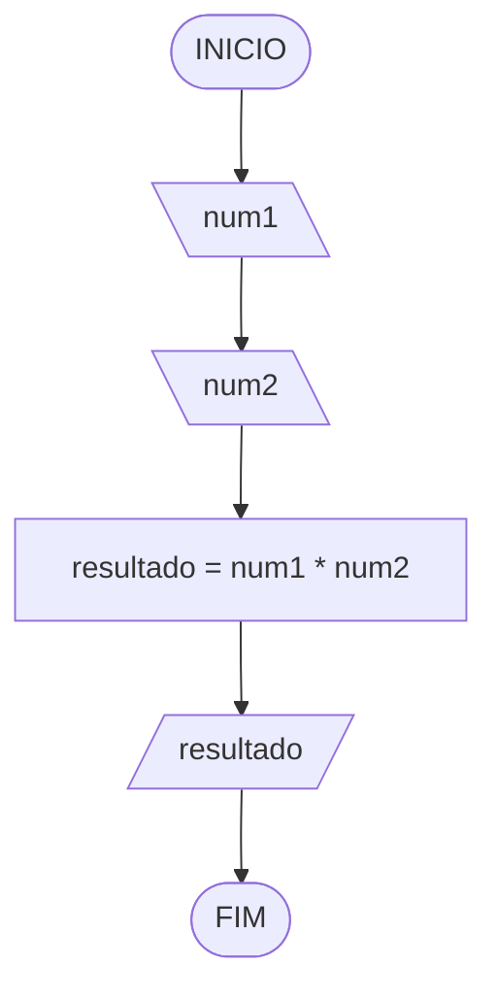

# Aula 2 - Exercício 1

## Descrição narrativa

1. Receber dois números.
2. Calcular a multiplicação.
3. Mostrar o resultado.

## Fluxograma

## Teste de mesa

| num1 | num2 | resultado | saída |
| --   | --   | --        | --    |
| 2    | 3    | 6         | 6     |
| -4   | 5    | -20       | -20   |
| 0    | 7    | 0         | 0     |
