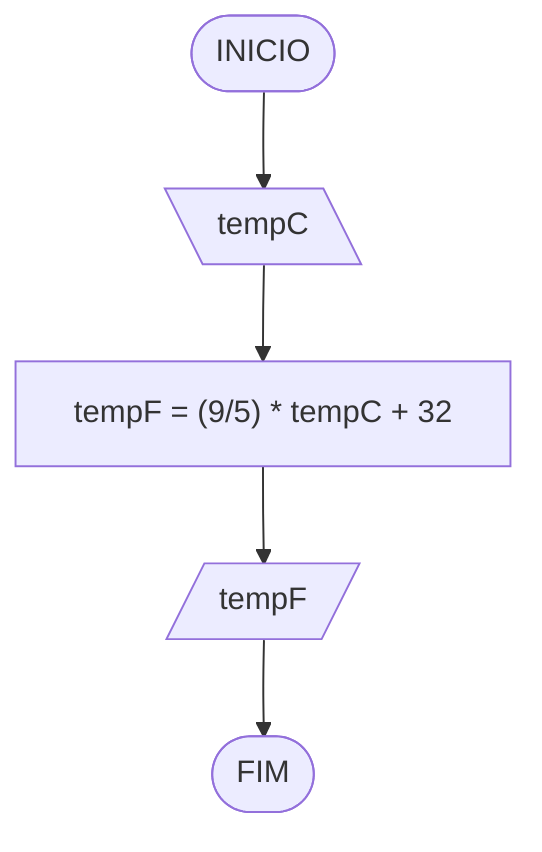

# Aula 2 - Exercício 2

## Descrição narrativa
1. Ler a temperatura em Celsius.
2. Calcular a temperatura em Fahrenheit.
3. Mostrar o resultado.

## Fluxograma

## Teste de mesa

| tempC  | tempF | saída                 | 
| --     | --    | --                    |
| 0      | 32    | 32 graus Fahrenheit   |
| 10     | 50    | 50 graus Fahrenheit   |
| -17.78 | 0.00  | 0.00 graus Fahrenheit |

