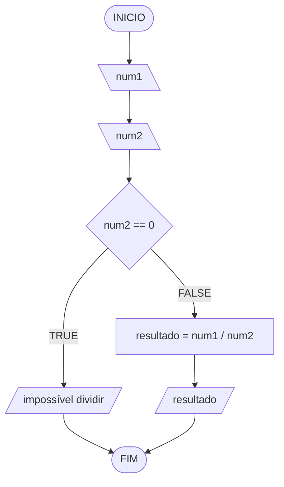

# Aula 2 - Exercício 3

## Descrição narrativa
1. Receber dois números.
2. Verificar se o segundo número é zero.
3. Se for zero, mostrar "impossível dividir".
4. Caso contrário, calcular a divisão do primeiro pelo segundo.
5. Mostrar o resultado.

## Fluxograma

## Teste de mesa

| num1 | num2 | resultado | saída               |
| --   | --   | --        | --                  |
| 10   | 2    | 5         | 5                   |
| 9    | 4.5  | 2         | 2                   |
| 7    | 0    | -         | "impossível dividir" |
