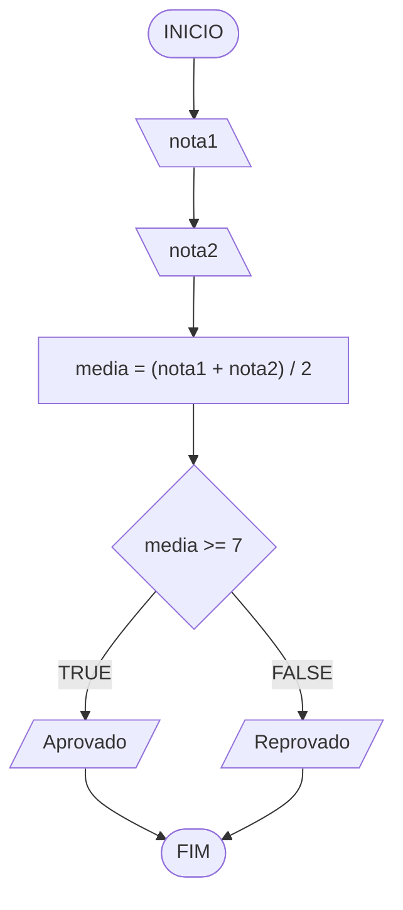

# Aula 2 - Exercício 5

## Descrição narrativa
1. Ler duas notas.
2. Calcular a média.
3. Se a média for maior ou igual a 7, mostrar "Aprovado"; caso contrário, "Reprovado".

## Fluxograma

## Teste de mesa

| nota1 | nota2 | media | media >= 7 | saída       |
| --    | --    | --    | --         | --          |
| 8     | 6     | 7     | V          | "Aprovado"  |
| 5     | 4     | 4.5   | F          | "Reprovado" |
| 10    | 9     | 9.5   | V          | "Aprovado"  |

