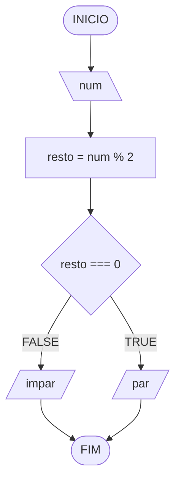

# Aula 3 - Exercício 4

## Descrição narrativa
1. Ler um número.
2. Calcular o resto da divisão por 2.
3. Se o resto for 0, mostrar "par"; caso contrário, mostrar "impar".

## Fluxograma

## Teste de mesa

| numero | resto | resto == 0 | saída   |
| --     | --    | --         | --      | 
| 0      | 0     | V          | "par"   |
| 13     | 1     | F          | "impar" |
| 30     | 0     | V          | "par"   |

