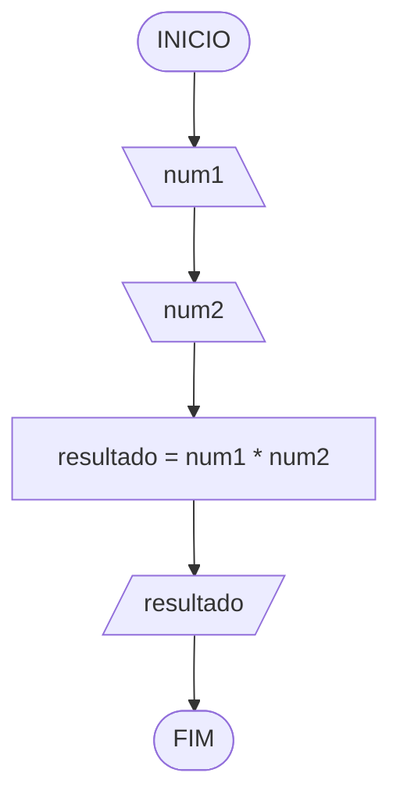
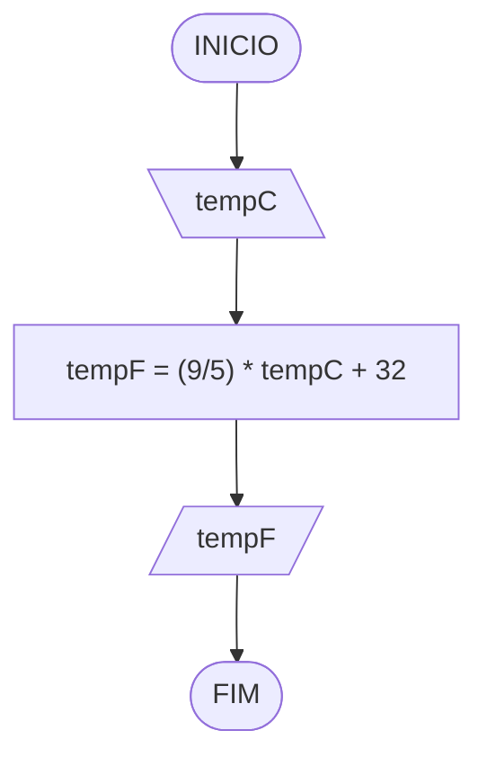
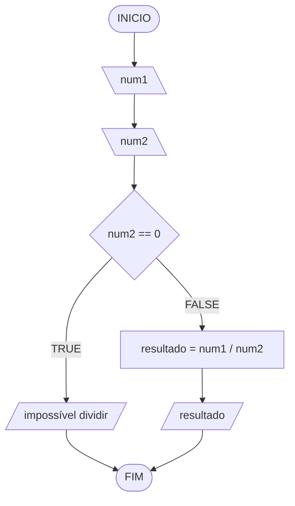
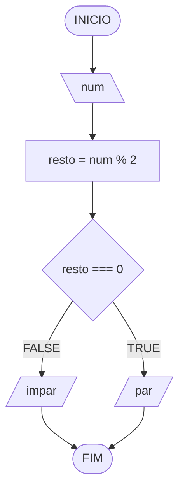

## Exercícios reslvidos

### Questão 1
Represente, em descrição narrativa, fluxograma, pseudocódigo e tabela de testes, um algoritmo para multiplicar dois números e exibir o resultado.

#### Descrição narrativa
1. Receber dois números.
2. Calcular a multiplicação.
3. Mostrar o resultado.

#### Fluxograma



#### Teste de mesa

| num1 | num2 | resultado | saída |
| --   | --   | --        | --    |
| 2    | 3    | 6         | 6     |
| -4   | 5    | -20       | -20   |
| 0    | 7    | 0         | 0     |

#### Código JavaScript (Programiz)

```javascript
// Entrada
const num1 = 2;
const num2 = 3;
// Processamento
const resultado = num1 * num2;
// Saída
console.log(resultado);
```

### Questão 2
Represente, em descrição narrativa, fluxograma, pseudocódigo e tabela de testes, um algoritmo para converter temperatura de Celsius (tempC) para Fahrenheit (tempF). (Fórmula: tempF = (9/5) * tempC + 32)

#### Descrição narrativa
1. Ler a temperatura em Celsius.
2. Calcular a temperatura em Fahrenheit.
3. Mostrar o resultado.

#### Fluxograma



#### Teste de mesa

| tempC  | tempF | saída                 | 
| --     | --    | --                    |
| 0      | 32    | 32 graus Fahrenheit   |
| 10     | 50    | 50 graus Fahrenheit   |
| -17.78 | 0.00  | 0.00 graus Fahrenheit |

#### Código JavaScript (Programiz)

```javascript
// Entrada
const tempC = 25;
// Processamento
const tempF = (9 / 5) * tempC + 32;
// Saída
console.log(tempF);
```

### Questão 3
Represente, em descrição narrativa, fluxograma, pseudocódigo e tabela de testes, um algoritmo para dividir dois números.

#### Descrição narrativa
1. Receber dois números.
2. Verificar se o segundo número é zero.
3. Se for zero, mostrar "impossível dividir".
4. Caso contrário, calcular a divisão do primeiro pelo segundo.
5. Mostrar o resultado.

#### Fluxograma



#### Teste de mesa

| num1 | num2 | resultado | saída               |
| --   | --   | --        | --                  |
| 10   | 2    | 5         | 5                   |
| 9    | 4.5  | 2         | 2                   |
| 7    | 0    | -         | "impossível dividir" |

#### Código JavaScript (Programiz)

```javascript
// Entrada
const num1 = 10;
const num2 = 2;

// Processamento e saída
if (num2 === 0) {
  console.log("impossível dividir");
} else {
  const resultado = num1 / num2;
  console.log(resultado);
}
```

### Questão 4
Represente, em descrição narrativa, fluxograma, pseudocódigo e tabela de testes, um algoritmo para dizer se um número é par ou impar.

> Observação: o símbolo `%` (módulo) calcula o resto da divisão inteira. Vamos detalhar os operadores na próxima aula.

#### Descrição narrativa
1. Ler um número.
2. Calcular o resto da divisão por 2.
3. Se o resto for 0, mostrar "par"; caso contrário, mostrar "impar".

#### Fluxograma



#### Teste de mesa

| numero | resto | resto == 0 | saída   |
| --     | --    | --         | --      | 
| 0      | 0     | V          | "par"   |
| 13     | 1     | F          | "impar" |
| 30     | 0     | V          | "par"   |

#### Código JavaScript (Programiz)

```javascript
// Entrada
const num = 13;
// Processamento
const resto = num % 2;

// Saída
if (resto === 0) {
  console.log("par");
} else {
  console.log("impar");
}
```

### Questão 5
Represente, em descrição narrativa, fluxograma, pseudocódigo e tabela de testes, um algoritmo para calcular a média de duas notas e mostrar se o aluno foi aprovado ou reprovado.

#### Descrição narrativa
1. Ler duas notas.
2. Calcular a média.
3. Se a média for maior ou igual a 7, mostrar "Aprovado"; caso contrário, "Reprovado".

#### Fluxograma

```mermaid
flowchart TD
A([INICIO]) --> B[\nota1\]
B --> C[\nota2\]
C --> D[media = (nota1 + nota2) / 2]
D --> E{media >= 7}
E --TRUE--> F[/"Aprovado"/]
E --FALSE--> G[/"Reprovado"/]
F --> H([FIM])
G --> H
```

#### Teste de mesa

| nota1 | nota2 | media | media >= 7 | saída       |
| --    | --    | --    | --         | --          |
| 8     | 6     | 7     | V          | "Aprovado"  |
| 5     | 4     | 4.5   | F          | "Reprovado" |
| 10    | 9     | 9.5   | V          | "Aprovado"  |

#### Código JavaScript (Programiz)

```javascript
// Entrada
const nota1 = 8;
const nota2 = 6;
// Processamento
const media = (nota1 + nota2) / 2;

// Saída
if (media >= 7) {
  console.log("Aprovado");
} else {
  console.log("Reprovado");
}
```
