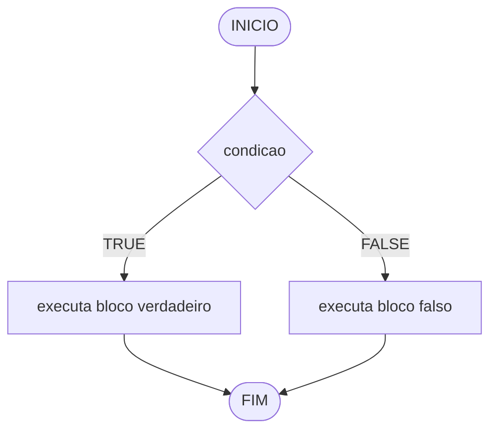
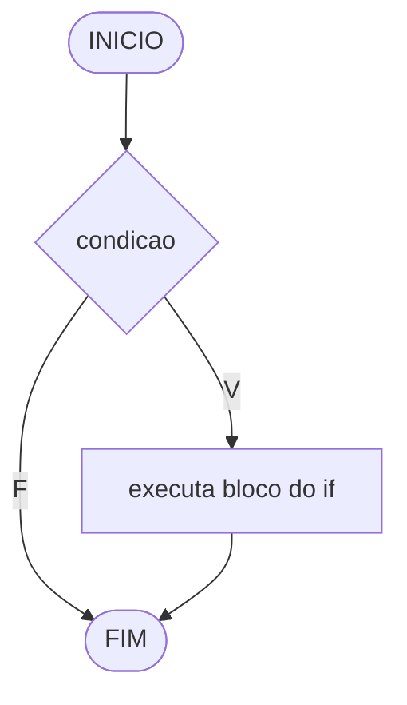
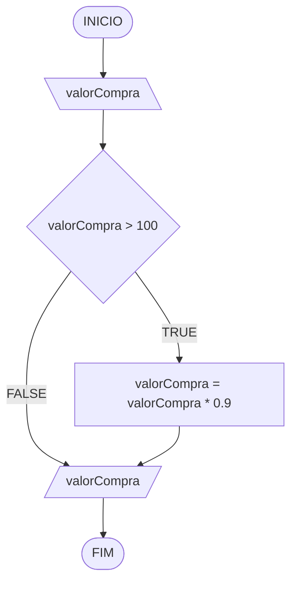
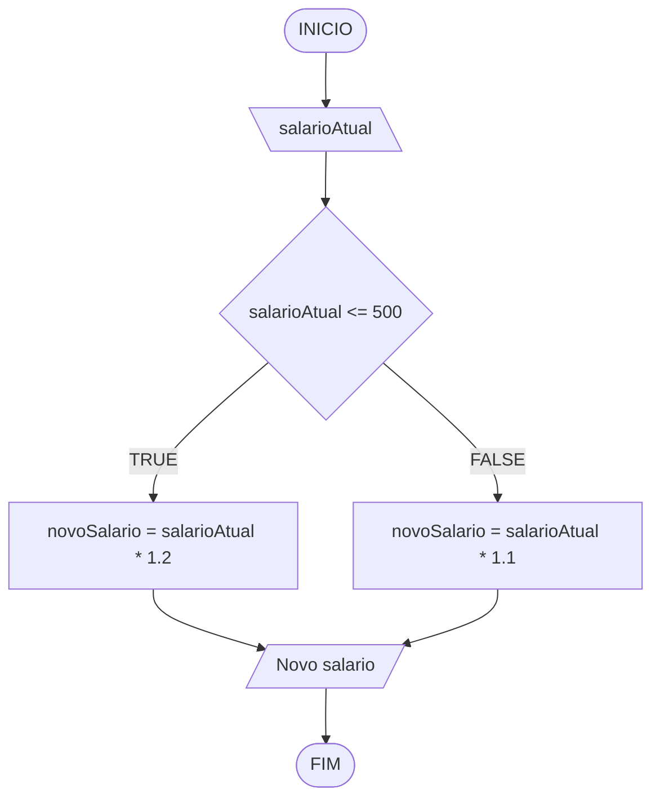
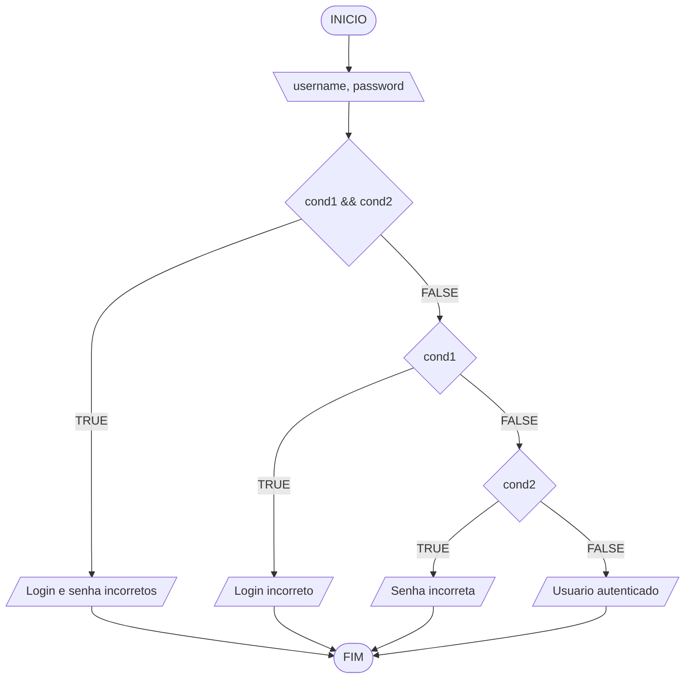

 

# Raciocínio Lógico Algorítmico
Orientador: Prof. Me Ricardo Carubbi

## Aula 4: Estruturas Condicionais

### Objetivo da aula
Compreender como controlar o fluxo de execução de algoritmos com decisões em JavaScript, usando `if`, `if...else` e operador ternário.

### 1. Controle de fluxo
Em algoritmos, o fluxo de execução pode seguir três formas principais:
- **sequencial**: executa instruções em ordem, sem desvios;
- **condicional**: escolhe caminhos diferentes conforme uma condição;
- **repetição**: repete um bloco de instruções enquanto uma condição for atendida.



### 2. Condição lógica
Uma condição é uma expressão que resulta em:
- `true` (verdadeiro), ou
- `false` (falso).

Exemplos:
- `idade >= 18`
- `nota >= 6`
- `(media >= 5) && (frequencia >= 75)`

### 3. Estrutura condicional simples (`if`)
Usada quando existe ação apenas para o caso verdadeiro.

Sintaxe:
```js
if (condicao) {
  // executa se condicao for true
}
```

Fluxograma (Mermaid):


Exemplo prático 1:
```js
// Entrada (sempre chega como texto)
let valorCompra = prompt("Digite o valor da compra:");

// Conversao para numero decimal
valorCompra = parseFloat(valorCompra);

// Regra: aplica desconto apenas acima de 100
if (valorCompra > 100) {
  valorCompra = valorCompra * 0.9; // desconto de 10%
}

// Saida final
console.log(`Valor final: ${valorCompra}`);
```

Fluxograma (Mermaid):


Teste de mesa:

| valorCompra | valorCompra > 100 | Saida |
| ---         | ---               | ---   |
| 150         | V                 | 135   |
| 100         | F                 | 100   |
| -80         | F                 | -80?  |

### 4. Estrutura condicional composta (`if...else`)
Usada quando há ação para o caso verdadeiro e para o caso falso.

Sintaxe:
```js
if (condicao) {
  // bloco verdadeiro
} else {
  // bloco falso
}
```

Fluxograma (Mermaid):


Exemplo prático 2:
```js
// Entrada
let salarioAtual = prompt("Digite o salario atual:");

// Conversao para numero decimal
salarioAtual = parseFloat(salarioAtual);
let novoSalario;

// Regra de negocio por faixa salarial
if (salarioAtual <= 500) {
  novoSalario = salarioAtual * 1.2;
} else {
  novoSalario = salarioAtual * 1.1;
}

// Saida formatada com 2 casas decimais
console.log(`Novo salario: R$ ${novoSalario.toFixed(2)}`);
```

Fluxograma (Mermaid):


Teste de mesa:

| salarioAtual | salarioAtual <= 500 | Saida |
| ---          | ---                 | ---   |
| 450          | V                   | 540   |
| 500          | V                   | 600   |
| 800          | F                   | 880   |

### 5. Estrutura condicional encadeada (`if...else if...else`)
Usada quando existem mais de duas possibilidades de decisao.

Sintaxe:
```js
if (condicao1) {
  // bloco 1
} else if (condicao2) {
  // bloco 2
} else {
  // bloco final (caso nenhuma condicao anterior seja verdadeira)
}
```

Exemplo prático: autenticacao de usuario

```js
// Entrada de credenciais
const username = prompt("Digite o usuario:");
let password = prompt("Digite a senha numerica:");

// Conversao da senha para inteiro
password = parseInt(password);

// Regras de autenticacao
if (username != "usuario123" && password != 123456) {
    console.log("Login e senha incorretos");
} else if (username != "usuario123") {
    console.log("Login incorreto");
} else if (password != 123456) {
    console.log("Senha incorreta");
} else {
    console.log("Usuario autenticado");
}
```

Fluxograma (Mermaid):

`cond1 = username != "usuario123"`  
`cond2 = password != 123456`



Teste de mesa:

| username   | password | cond1 && cond2 | cond1 | cond2 | Saida |
| ---        | ---      | ---            | ---   | ---   | ---   |
| usuario123 | 123456   | F              | F     | F     | Usuario autenticado |
| usuario123 | 999999   | F              | F     | V     | Senha incorreta |
| admin      | 123456   | F              | V     | F     | Login incorreto |
| admin      | 999999   | V              | V     | V     | Login e senha incorretos |

### 6. Operador ternário
Forma resumida para decisões simples em uma linha.

Sintaxe:
```js
condicao ? valorSeVerdadeiro : valorSeFalso;
```

Exemplo prático 3:
```js
// Entrada
let numero = prompt("Digite um numero inteiro:");

// Conversao para inteiro
numero = parseInt(numero);
/
/ Regra: resto 0 na divisao por 2 indica numero par
const resultado = (numero % 2 === 0) ? "Par" : "Impar";

// Saida
console.log(`O numero e ${resultado}`);
```

### 7. Fechamento
Nesta aula, vimos como:
1. usar condicoes logicas para controlar o fluxo de execucao;
2. aplicar `if` em decisoes simples;
3. aplicar `if...else` quando ha dois caminhos possiveis;
4. aplicar `if...else if...else` em regras com varias faixas;
5. organizar condicoes com `cond1`, `cond2` (e outras) para facilitar fluxograma e teste de mesa;
6. resolver casos praticos de autenticacao e classificacao por intervalo de valores;
7. usar operador ternario em situacoes curtas e objetivas.

Esses conceitos formam a base para modelar regras de negocio em algoritmos e implementar validacoes com clareza antes de programar.

### Saiba mais
- MDN - `console.log()`: https://developer.mozilla.org/pt-BR/docs/Web/API/console/log_static
- MDN - `Number.prototype.toFixed()`: https://developer.mozilla.org/pt-BR/docs/Web/JavaScript/Reference/Global_Objects/Number/toFixed
- MDN - `prompt()`: https://developer.mozilla.org/pt-BR/docs/Web/API/Window/prompt
- MDN - `parseInt()`: https://developer.mozilla.org/pt-BR/docs/Web/JavaScript/Reference/Global_Objects/parseInt
- MDN - `parseFloat()`: https://developer.mozilla.org/pt-BR/docs/Web/JavaScript/Reference/Global_Objects/parseFloat
- MDN - if...else: https://developer.mozilla.org/pt-BR/docs/Web/JavaScript/Reference/Statements/if...else
- MDN - else if: https://developer.mozilla.org/pt-BR/docs/Web/JavaScript/Reference/Statements/if...else#usando_else_if
- MDN - Operador condicional (ternario): https://developer.mozilla.org/pt-BR/docs/Web/JavaScript/Reference/Operators/Conditional_operator
