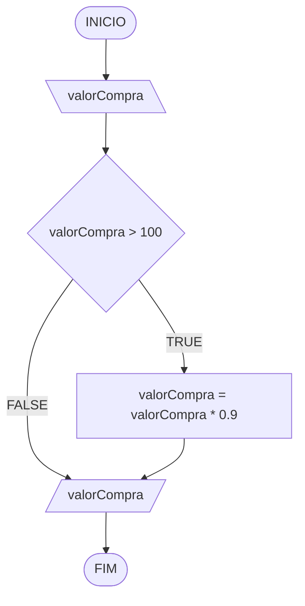

# Aula 4 - Exercício 1

## Descrição narrativa
1. Ler o valor da compra.
2. Verificar se o valor da compra é maior que 100.
3. Se for maior que 100, aplicar desconto de 10%.
4. Mostrar o valor final.

## Fluxograma

## Teste de mesa

| valorCompra | valorCompra > 100 | Saida |
| ---         | ---               | ---   |
| 150         | V                 | 135   |
| 100         | F                 | 100   |
| -80         | F                 | -80?  |
