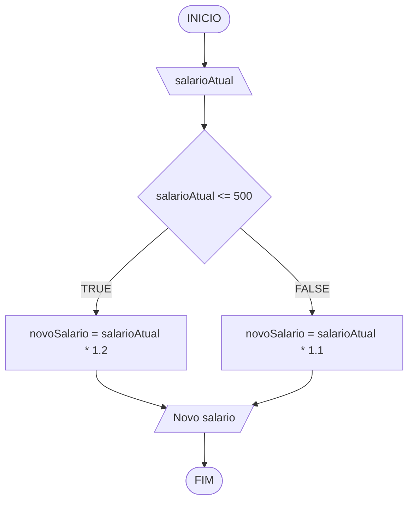

# Aula 4 - Exercício 2

## Descrição narrativa
1. Ler o salário atual.
2. Verificar se o salário atual é menor ou igual a 500.
3. Se for menor ou igual a 500, aplicar aumento de 20%.
4. Caso contrário, aplicar aumento de 10%.
5. Mostrar o novo salário.

## Fluxograma

## Teste de mesa

| salarioAtual | salarioAtual <= 500 | Saida |
| ---          | ---                 | ---   |
| 450          | V                   | 540   |
| 500          | V                   | 600   |
| 800          | F                   | 880   |
