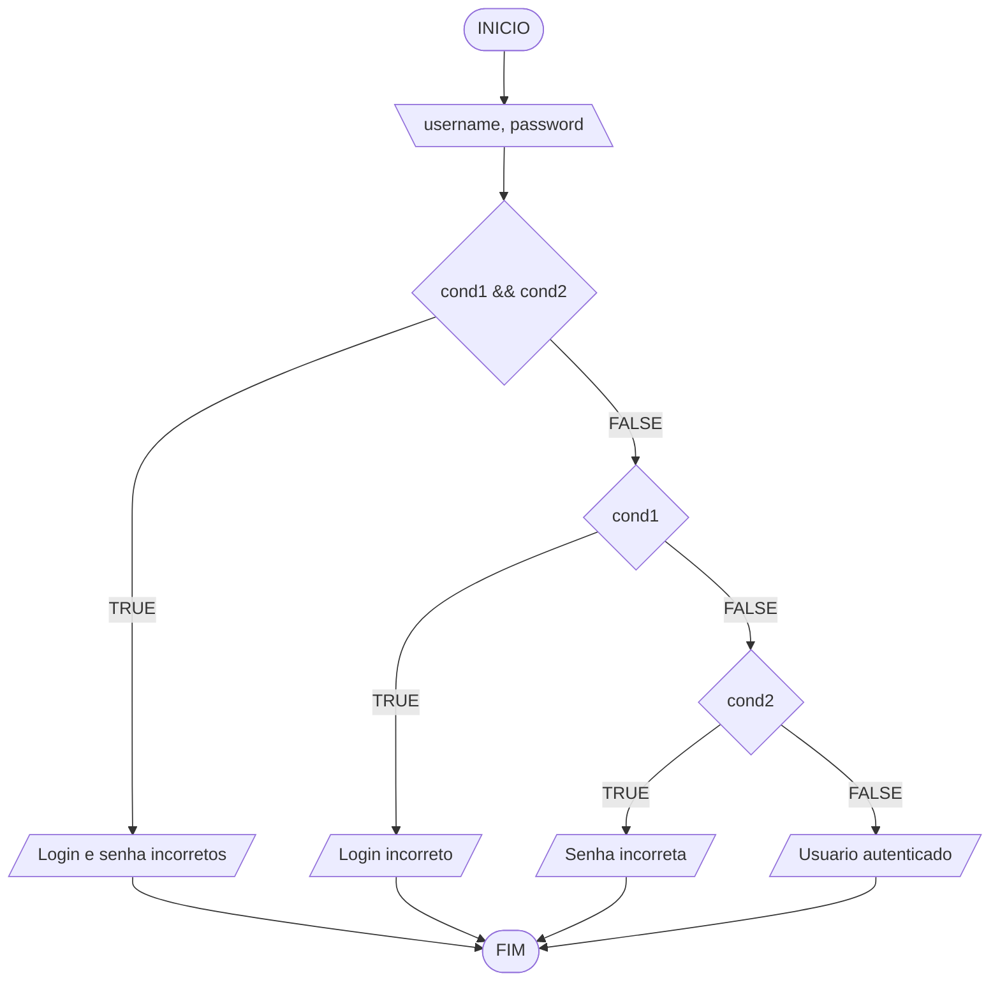

# Aula 4 - Exercício 3

## Descrição narrativa
1. Ler o nome de usuário e a senha.
2. Verificar se usuário e senha estão incorretos.
3. Se ambos estiverem incorretos, informar "Login e senha incorretos".
4. Senão, verificar se apenas o usuário está incorreto.
5. Senão, verificar se apenas a senha está incorreta.
6. Caso nenhum erro exista, informar "Usuario autenticado".

## Fluxograma

## Teste de mesa

| username   | password | cond1 && cond2 | cond1 | cond2 | Saida |
| ---        | ---      | ---            | ---   | ---   | ---   |
| usuario123 | 123456   | F              | F     | F     | Usuario autenticado |
| usuario123 | 999999   | F              | F     | V     | Senha incorreta |
| admin      | 123456   | F              | V     | F     | Login incorreto |
| admin      | 999999   | V              | V     | V     | Login e senha incorretos |
