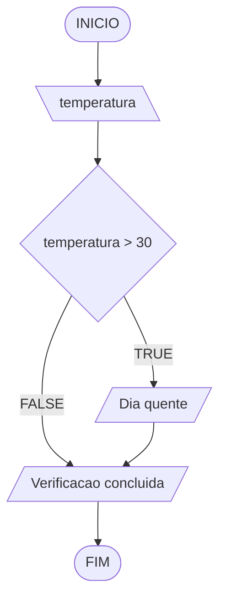

# Aula 5 - Exercício 1

## Descrição narrativa
1. Ler a temperatura.
2. Verificar se a temperatura é maior que 30.
3. Se for maior que 30, mostrar "Dia quente".
4. Mostrar "Verificacao concluida".

## Fluxograma

## Teste de mesa

| temperatura | temperatura > 30 | saída |
| --- | --- | --- |
| 32 | V | Dia quente / Verificacao concluida |
| 30 | F | Verificacao concluida |
| 18 | F | Verificacao concluida |
