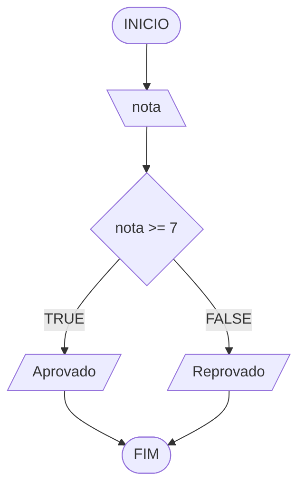

# Aula 5 - Exercício 2

## Descrição narrativa
1. Ler a nota do aluno.
2. Verificar se a nota é maior ou igual a 7.
3. Se for, mostrar "Aprovado".
4. Caso contrário, mostrar "Reprovado".

## Fluxograma

## Teste de mesa

| nota | nota >= 7 | saída |
| --- | --- | --- |
| 8.0 | V | Aprovado |
| 7.0 | V | Aprovado |
| 6.5 | F | Reprovado |
