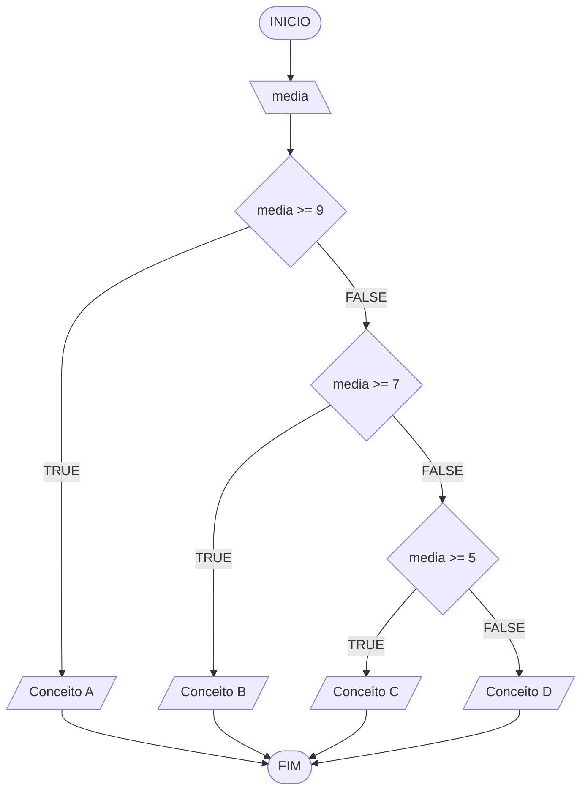

# Aula 5 - Exercício 3

## Descrição narrativa
1. Ler a média final.
2. Se média >= 9, mostrar "Conceito A".
3. Senão, se média >= 7, mostrar "Conceito B".
4. Senão, se média >= 5, mostrar "Conceito C".
5. Caso contrário, mostrar "Conceito D".

## Fluxograma

## Teste de mesa

| media | saída |
| --- | --- |
| 9.2 | Conceito A |
| 8.2 | Conceito B |
| 5.5 | Conceito C |
| 3.9 | Conceito D |
