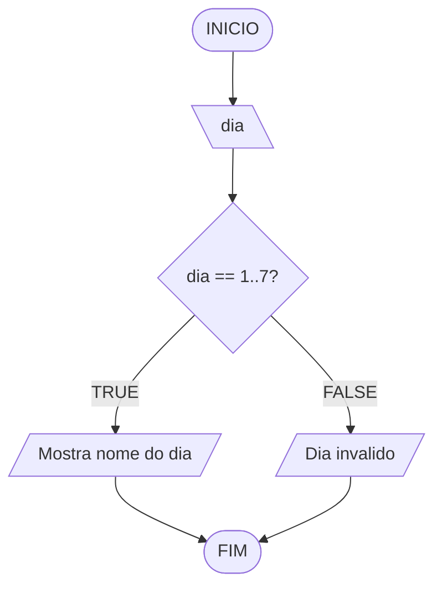

# Aula 5 - Exercício 4

## Descrição narrativa
1. Ler o valor numérico do dia da semana.
2. Comparar o valor com os casos de 1 a 7.
3. Mostrar o nome correspondente ao dia.
4. Se não estiver entre 1 e 7, mostrar "Dia invalido".

## Fluxograma

## Teste de mesa

| dia | saída |
| --- | --- |
| 1 | Domingo |
| 3 | Terca-feira |
| 7 | Sabado |
| 9 | Dia invalido |
