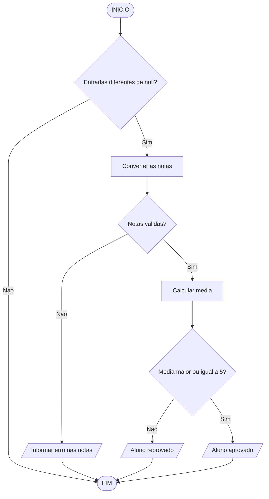

# Raciocínio Lógico Algorítmico: Aula 6
Orientador: Prof. Me Ricardo Carubbi

## Estruturas Condicionais Aninhadas

### Objetivo da aula
Compreender como organizar decisões dependentes em TypeScript por meio de
estruturas condicionais aninhadas e tratar com segurança o possível
cancelamento de uma entrada realizada com `prompt()`.

### 1. Fundamentação teórica
Em muitos problemas computacionais, uma única decisão não é suficiente.
Primeiro é preciso validar uma condição geral e, somente depois, avaliar uma
condição mais específica.

Uma estrutura condicional aninhada ocorre quando um bloco `if` ou `else`
contém outra estrutura condicional em seu interior. Essa organização cria uma
hierarquia de decisões, em que a segunda verificação depende do resultado da
primeira.

Esse recurso é importante quando:

- existe uma validação inicial antes do processamento;
- uma decisão só faz sentido após outra já ter sido confirmada;
- o algoritmo precisa tratar exceções antes de chegar ao caso principal;
- há regras compostas com mais de um nível de análise.

### 2. Entrada com `prompt()` em TypeScript
O retorno de `prompt()` pode ser:

- uma `string`, quando o usuário informa um valor;
- `null`, quando o usuário cancela a entrada.

Por isso, o tipo correto da variável que recebe o resultado é
`string | null`. O símbolo `|` indica que a variável pode guardar um valor de
um tipo **ou** de outro.

Nas aulas anteriores, usamos `!` logo após a chamada de `prompt()` para afirmar
ao compilador que a entrada não seria cancelada. A partir desta aula, não
faremos mais essa afirmação. Verificaremos explicitamente se o valor é
diferente de `null`.

```typescript
// Declaracao de variaveis
let entrada: string | null;
let idade: number;

// Entrada
entrada = prompt("Digite a idade:");

// Processamento
if (entrada !== null) {
  idade = parseInt(entrada);

  if (idade >= 18) {
    console.log("Maior de idade");
  } else {
    console.log("Menor de idade");
  }
}
```

O `if` externo valida a entrada. Somente dentro dele o TypeScript reconhece que
`entrada` é uma `string` e permite sua conversão. O `if` interno aplica a regra
do problema.

Quando há várias entradas, todas devem ser verificadas antes das conversões:

```typescript
// Declaracao de variaveis
let entradaNota1: string | null;
let entradaNota2: string | null;
let nota1: number;
let nota2: number;
let media: number;

// Entrada
entradaNota1 = prompt("Digite a primeira nota:");
entradaNota2 = prompt("Digite a segunda nota:");

// Processamento
if (entradaNota1 !== null && entradaNota2 !== null) {
  nota1 = parseFloat(entradaNota1);
  nota2 = parseFloat(entradaNota2);
  media = (nota1 + nota2) / 2;

  // Saida
  console.log(media);
}
```

### 3. Como pensar em condicionais aninhadas
Uma condicional aninhada pode ser lida como uma sequência de perguntas:

1. A entrada necessária foi fornecida?
2. Se foi fornecida, ela atende à validação inicial?
3. Se atende, qual decisão específica deve ser tomada?

Essa abordagem evita cálculos indevidos e separa a validação da entrada da
regra principal.

#### 3.1 Estrutura geral

```typescript
// Declaracao de variaveis
let condicao1: string | null;
let condicao2: string | null;
let mensagem: string;

// Entrada
condicao1 = prompt("Digite a condicao 1 (true/false):");
condicao2 = prompt("Digite a condicao 2 (true/false):");

// Processamento
if (condicao1 !== null && condicao2 !== null) {
  if (condicao1 === "true") {
    if (condicao2 === "true") {
      mensagem = "As duas condicoes sao verdadeiras";
    } else {
      mensagem = "A primeira e verdadeira, mas a segunda e falsa";
    }
  } else {
    mensagem = "A primeira condicao e falsa";
  }

  // Saida
  console.log(mensagem);
}
```

#### 3.2 Forma com `if` dentro de `else`

```typescript
// Declaracao de variaveis
let condicao1: string | null;
let condicao2: string | null;
let mensagem: string;

// Entrada
condicao1 = prompt("Digite a condicao 1 (true/false):");
condicao2 = prompt("Digite a condicao 2 (true/false):");

// Processamento
if (condicao1 !== null && condicao2 !== null) {
  if (condicao1 === "true") {
    mensagem = "Acao 1";
  } else {
    if (condicao2 === "true") {
      mensagem = "Acao 2";
    } else {
      mensagem = "Acao 3";
    }
  }

  // Saida
  console.log(mensagem);
}
```

As duas formas representam decisões em níveis. O ponto principal não é a
aparência, mas a dependência lógica entre as verificações.

### 4. Diferença entre condicional composta e aninhada
Na estrutura composta, existe apenas uma decisão principal com dois caminhos:

```typescript
if (condicao) {
  console.log("Caminho verdadeiro");
} else {
  console.log("Caminho falso");
}
```

Na estrutura aninhada, um dos caminhos contém uma nova decisão:

```typescript
if (condicao1) {
  if (condicao2) {
    console.log("Caminho mais especifico");
  } else {
    console.log("Outro resultado especifico");
  }
} else {
  console.log("Tratamento alternativo");
}
```

A estrutura aninhada é indicada quando há dependência entre decisões, e não
apenas uma escolha binária simples.

### 5. Exemplo prático 1: média do aluno com validação
A primeira decisão verifica se as entradas foram fornecidas. Depois, as notas
são convertidas e validadas. Somente então a média e a situação são calculadas.

```typescript
// Declaracao de variaveis
let entradaNota1: string | null;
let entradaNota2: string | null;
let alunoNota1: number;
let alunoNota2: number;
let alunoMedia: number;
let situacaoAluno: string;
let mensagem: string;

// Entrada
entradaNota1 = prompt("Digite a nota 1 do aluno:");
entradaNota2 = prompt("Digite a nota 2 do aluno:");

// Processamento
if (entradaNota1 !== null && entradaNota2 !== null) {
  alunoNota1 = parseFloat(entradaNota1);
  alunoNota2 = parseFloat(entradaNota2);

  if (alunoNota1 >= 0 && alunoNota2 >= 0) {
    alunoMedia = (alunoNota1 + alunoNota2) / 2;

    if (alunoMedia >= 5) {
      situacaoAluno = "aprovado!";
    } else {
      situacaoAluno = "reprovado!";
    }

    mensagem = `Media: ${alunoMedia}. O aluno esta ${situacaoAluno}`;
  } else {
    mensagem = "A nota deve ser maior ou igual a zero!";
  }

  // Saida
  console.log(mensagem);
}
```

Nesse exemplo:

- o primeiro nível verifica se as entradas não são `null`;
- o segundo nível valida os valores numéricos;
- o terceiro nível decide a situação acadêmica;
- o cálculo da média só ocorre depois das validações necessárias.

Esse padrão é frequente em algoritmos: primeiro validar, depois decidir.



### 6. Exemplo prático 2: aptidão para tirar CNH
A idade é analisada em níveis: primeiro verificamos se houve entrada; depois,
se o número é válido; por fim, se a pessoa atingiu a idade mínima.

```typescript
// Declaracao de variaveis
let entradaIdade: string | null;
let idade: number;
let anosApto: number;
let mensagem: string;

// Entrada
entradaIdade = prompt("Digite a idade do candidato:");

// Processamento
if (entradaIdade !== null) {
  idade = parseInt(entradaIdade);

  if (idade < 0) {
    mensagem = "A idade deve ser maior ou igual a zero!";
  } else {
    if (idade >= 18) {
      mensagem = "O candidato esta apto a tirar a CNH!";
    } else {
      anosApto = 18 - idade;
      mensagem = `Faltam ${anosApto} ano(s) para o candidato estar apto!`;
    }
  }

  // Saida
  console.log(mensagem);
}
```

### 7. Exemplo prático 3: faixa de desempenho
Uma vantagem das estruturas aninhadas é permitir decisões progressivas.

```typescript
// Declaracao de variaveis
let entradaNota1: string | null;
let entradaNota2: string | null;
let nota1: number;
let nota2: number;
let media: number;
let resultado: string;

// Entrada
entradaNota1 = prompt("Digite a nota 1:");
entradaNota2 = prompt("Digite a nota 2:");

// Processamento
if (entradaNota1 !== null && entradaNota2 !== null) {
  nota1 = parseFloat(entradaNota1);
  nota2 = parseFloat(entradaNota2);

  if (nota1 >= 0 && nota2 >= 0) {
    media = (nota1 + nota2) / 2;

    if (media >= 7) {
      resultado = "Aluno aprovado com bom desempenho.";
    } else {
      if (media >= 5) {
        resultado = "Aluno aprovado.";
      } else {
        resultado = "Aluno reprovado.";
      }
    }
  } else {
    resultado = "Notas invalidas.";
  }

  // Saida
  console.log(resultado);
}
```

### 8. Uso de `switch...case` em casos aninhados
Também é possível combinar `switch...case` e `if` quando o problema possui
níveis diferentes de decisão.

#### 8.1 `if` dentro de `switch`

```typescript
// Declaracao de variaveis
let perfil: string | null;
let matriculaAtiva: string | null;
let entradaValorCurso: string | null;
let valorCurso: number;
let valorFinal: number;

// Entrada
perfil = prompt("Digite o perfil do usuario:");
matriculaAtiva = prompt("A matricula esta ativa? (true/false):");
entradaValorCurso = prompt("Digite o valor do curso:");

// Processamento
if (perfil !== null && matriculaAtiva !== null && entradaValorCurso !== null) {
  valorCurso = parseFloat(entradaValorCurso);

  switch (perfil) {
    case "aluno":
      if (matriculaAtiva === "true") {
        valorFinal = valorCurso * 0.8;
      } else {
        valorFinal = valorCurso;
      }
      break;
    case "professor":
      valorFinal = valorCurso * 0.7;
      break;
    case "visitante":
      valorFinal = valorCurso;
      break;
    default:
      valorFinal = -1;
  }

  // Saida
  if (valorFinal === -1) {
    console.log("Perfil invalido.");
  } else {
    console.log(`R$ ${valorFinal.toFixed(2)}`);
  }
}
```

#### 8.2 `switch` dentro de `if`

```typescript
// Declaracao de variaveis
let usuarioAutenticado: string | null;
let entradaOpcaoMenu: string | null;
let opcaoMenu: number;
let mensagem: string;

// Entrada
usuarioAutenticado = prompt("Usuario autenticado? (true/false):");
entradaOpcaoMenu = prompt("Digite a opcao do menu:");

// Processamento
if (usuarioAutenticado !== null && entradaOpcaoMenu !== null) {
  opcaoMenu = parseInt(entradaOpcaoMenu);

  if (usuarioAutenticado === "true") {
    switch (opcaoMenu) {
      case 1:
        mensagem = "Consultar notas";
        break;
      case 2:
        mensagem = "Calcular media";
        break;
      default:
        mensagem = "Opcao invalida";
    }
  } else {
    mensagem = "Usuario nao autenticado";
  }

  // Saida
  console.log(mensagem);
}
```

#### 8.3 Lanche com adicional no X-Bacon
Este exemplo é inspirado no problema `Lanche` do Beecrowd. Se o item escolhido
for `X-Bacon`, uma decisão interna verifica a inclusão de cheddar.

```typescript
// Declaracao de variaveis
let entradaCodigo: string | null;
let entradaQuantidade: string | null;
let comCheddar: string | null;
let codigo: number;
let quantidade: number;
let precoUnitario: number;
let valorTotal: number;
let mensagem: string;

// Entrada
entradaCodigo = prompt("Digite o codigo do item:");
entradaQuantidade = prompt("Digite a quantidade:");
comCheddar = prompt("Deseja adicionar cheddar? (s/n):");

// Processamento
if (entradaCodigo !== null && entradaQuantidade !== null && comCheddar !== null) {
  codigo = parseInt(entradaCodigo);
  quantidade = parseInt(entradaQuantidade);

  if (codigo >= 1 && codigo <= 4) {
    precoUnitario = 0;

    switch (codigo) {
      case 1:
        precoUnitario = 4.0;
        break;
      case 2:
        precoUnitario = 4.5;
        break;
      case 3:
        precoUnitario = 5.0;
        if (comCheddar === "s") {
          precoUnitario = precoUnitario + 0.5;
        }
        break;
      case 4:
        precoUnitario = 2.0;
        break;
    }

    valorTotal = precoUnitario * quantidade;
    mensagem = `Total: R$ ${valorTotal.toFixed(2)}`;
  } else {
    mensagem = "Codigo invalido";
  }

  // Saida
  console.log(mensagem);
}
```

### 9. Quando não aninhar
Nem todo problema precisa de aninhamento. Quando as verificações podem ser
feitas ao mesmo tempo, uma expressão lógica única costuma ser mais clara.

```typescript
// Declaracao de variaveis
let entradaNota: string | null;
let nota: number;
let mensagem: string;

// Entrada
entradaNota = prompt("Digite a nota:");

// Processamento
if (entradaNota !== null) {
  nota = parseFloat(entradaNota);

  if (nota >= 0 && nota <= 10) {
    mensagem = "Nota valida";
  } else {
    mensagem = "Nota invalida";
  }

  // Saida
  console.log(mensagem);
}
```

Use o aninhamento quando uma decisão realmente depender da etapa anterior.

### 10. Boas práticas e erros comuns

- verificar `null` antes de converter ou comparar uma entrada;
- manter a indentação correta para evidenciar os níveis da decisão;
- declarar as variáveis e seus tipos antes da entrada;
- usar `===` e `!==` nas comparações;
- evitar cálculos antes da validação dos dados;
- evitar aninhamentos excessivos quando uma expressão lógica simples resolver;
- testar valores negativos, zero e limites exatos.

### 11. Fechamento
Nesta aula, vimos:

1. o conceito de estrutura condicional aninhada;
2. o tipo união `string | null`;
3. o retorno de `prompt()` e a verificação explícita de `null`;
4. a diferença entre condicional composta e aninhada;
5. exemplos práticos com notas e idade;
6. a combinação de `switch...case` e `if`.

A verificação de `null` apresentada nesta aula será mantida nos próximos
conteúdos sempre que houver entrada interativa.

### Referências bibliográficas
1. FORBELLONE, A. L. V. Lógica de Programação: a construção de algoritmos e estruturas de dados. Pearson Prentice Hall, 2005. Capítulo 3.

2. ASCENCIO, Ana Fernanda Gomes; CAMPOS, Edilene Aparecida Veneruchi de. Fundamentos da programação de computadores. Pearson Educación, 2008. Capítulo 4.

3. MANZANO, José Augusto N. G.; OLIVEIRA, Jayr Figueiredo de. Lógica para Desenvolvimento de Programação de Computadores. São Paulo: Érica, 2019. Capítulo 4.

4. TYPESCRIPT. TypeScript for the New Programmer. Disponível em: https://www.typescriptlang.org/docs/handbook/typescript-from-scratch.html. Acesso em: 31 jul. 2026.

5. MOZILLA DEVELOPER NETWORK. `prompt()`. Disponível em: https://developer.mozilla.org/pt-BR/docs/Web/API/Window/prompt. Acesso em: 31 jul. 2026.

6. MOZILLA DEVELOPER NETWORK. `if...else`. Disponível em: https://developer.mozilla.org/pt-BR/docs/Web/JavaScript/Reference/Statements/if...else. Acesso em: 13 mar. 2026.
