 

# Raciocínio Lógico Algorítmico: Aula 7
Orientador: Prof. Me Ricardo Carubbi

## Estruturas de repetição em JavaScript

### Objetivo da aula
Compreender quando usar `while`, `do...while` e `for`, representando algoritmos com descrição narrativa, fluxograma, teste de mesa e código JavaScript no Programiz.

## 1. Fundamentação teórica
Estruturas de repetição, também chamadas de laços ou loops, permitem executar um bloco de código várias vezes. Elas são usadas quando o algoritmo precisa repetir uma ação até que uma condição seja satisfeita ou durante uma quantidade conhecida de iterações.

Em JavaScript, os laços mais usados são:

- `while`: repete enquanto a condição for verdadeira. A verificação acontece antes da execução do bloco.
- `do...while`: executa o bloco pelo menos uma vez e só depois verifica a condição.
- `for`: é mais adequado quando a quantidade de repetições já é conhecida.

## 2. Como escolher o laço adequado
- Use `while` quando o número de repetições não é conhecido previamente.
- Use `do...while` quando o algoritmo precisa executar ao menos uma vez antes de decidir se repete.
- Use `for` quando existe contador, faixa de valores ou quantidade fixa de repetições.

## 3. Sintaxe básica

### 3.1 Laço `while`
```javascript
while (condicao) {
    // bloco de repeticao
}
```

### 3.2 Laço `do...while`
```javascript
do {
    // bloco de repeticao
} while (condicao);
```

### 3.3 Laço `for`
```javascript
for (inicializacao; condicao; incremento) {
    // bloco de repeticao
}
```

## 4. Exemplos práticos

### Exemplo 1: `while` básico com contador

#### Descrição narrativa
1. Ler a quantidade de iteracoes.
2. Declarar um contador com valor inicial zero.
3. Enquanto o contador for menor que a quantidade informada, mostrar seu valor.
4. Incrementar o contador.
5. Encerrar quando a condição for falsa.

#### Fluxograma
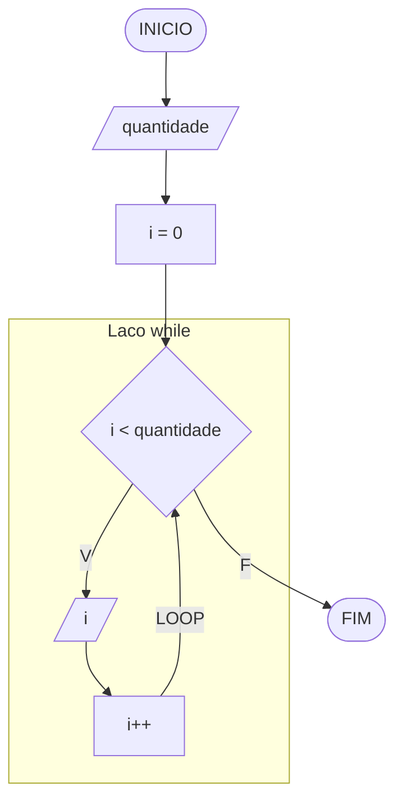

#### Teste de mesa

Entrada escolhida: `quantidade = 3`

| passo | i | i < quantidade | saída |
| --- | --- | --- | --- |
| 1 | 0 | V | 0 |
| 2 | 1 | V | 1 |
| 3 | 2 | V | 2 |
| 4 | 3 | F | - |

#### Código JavaScript (Programiz)
```javascript
// Declaracao de variaveis
let i;
let quantidade;

// Entrada
quantidade = prompt("Digite a quantidade de iteracoes:"); // 3

// Processamento
i = 0;
quantidade = parseInt(quantidade);

while (i < quantidade) {
    console.log(i);
    i++;
}
```

### Exemplo 2: `while` para pedir um número positivo

#### Descrição narrativa
1. Ler um número.
2. Enquanto o número for menor ou igual a zero, pedir outro número.
3. Quando o número for positivo, mostrar a mensagem de valor válido.

#### Fluxograma


#### Teste de mesa

| passo | num | num <= 0 | mensagem | saída |
| --- | --- | --- | --- | --- |
| 1 | -3 | V | Numero invalido | Numero invalido |
| 2 | 0 | V | Numero invalido\nNumero invalido | Numero invalido / Numero invalido |
| 3 | 7 | F | Numero invalido\nNumero invalido\nNumero valido | Numero invalido / Numero invalido / Numero valido |

#### Código JavaScript (Programiz)
```javascript
// Declaracao de variaveis
let num;

// Entrada
num = prompt("Digite um numero positivo:"); // -3

// Processamento
num = parseInt(num);

while (num <= 0) {
    console.log("Numero invalido");
    num = prompt("Digite um numero positivo:"); // 0, 7
    num = parseInt(num);
}

// Saida
console.log("Numero valido");
```

### Exemplo 3: `while` para pedir senha até acertar

#### Descrição narrativa
1. Ler a senha digitada.
2. Enquanto a senha for diferente da senha correta, informar erro e pedir nova tentativa.
3. Quando a senha correta for informada, mostrar mensagem de acesso liberado.

#### Fluxograma
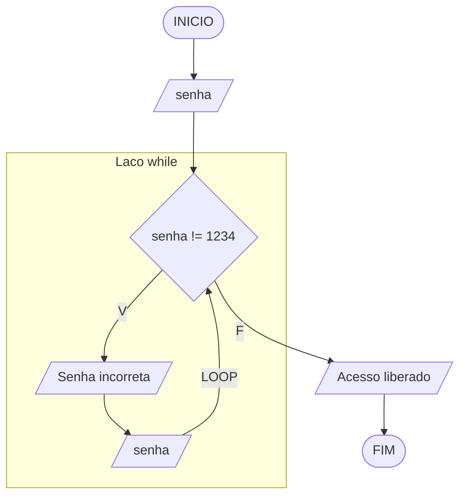

#### Teste de mesa

| passo | senha | senha != 1234 | mensagem | saída |
| --- | --- | --- | --- | --- |
| 1 | 1111 | V | Senha incorreta | Senha incorreta |
| 2 | 9999 | V | Senha incorreta\nSenha incorreta | Senha incorreta / Senha incorreta |
| 3 | 1234 | F | Senha incorreta\nSenha incorreta\nAcesso liberado | Senha incorreta / Senha incorreta / Acesso liberado |

#### Código JavaScript (Programiz)
```javascript
// Declaracao de variaveis
let senha;
let mensagem;

// Entrada
senha = prompt("Digite a senha:"); // 1111

// Processamento
mensagem = "";

while (senha != "1234") {
    mensagem += "Senha incorreta\n";
    senha = prompt("Digite a senha:"); // 9999, 1234
}

mensagem += "Acesso liberado";

// Saida
console.log(mensagem);
```

#### Opção equivalente com `console.log()` dentro do `while`
```javascript
// Declaracao de variaveis
let senha;

// Entrada
senha = prompt("Digite a senha:"); // 1111

// Processamento
while (senha != "1234") {
    console.log("Senha incorreta");
    senha = prompt("Digite a senha:"); // 9999, 1234
}

// Saida
console.log("Acesso liberado");
```

### Exemplo 4: `while` para pedir números até digitar 0

#### Descrição narrativa
1. Ler um número.
2. Enquanto o número for diferente de zero, somá-lo ao acumulador.
3. Pedir um novo número.
4. Quando o usuário digitar zero, mostrar a soma final.

#### Fluxograma
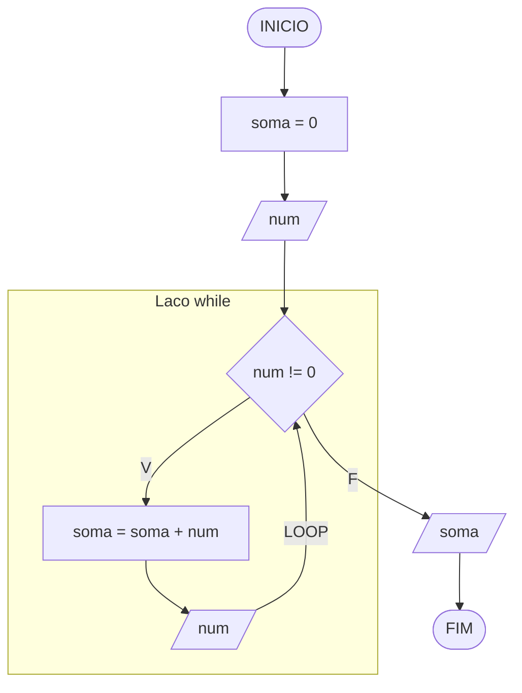

#### Teste de mesa

| passo | num | num != 0 | soma antes | soma depois | saída |
| --- | --- | --- | --- | --- | --- |
| 1 | 5 | V | 0 | 5 | - |
| 2 | 3 | V | 5 | 8 | - |
| 3 | 2 | V | 8 | 10 | - |
| 4 | 0 | F | 10 | 10 | 10 |

#### Código JavaScript (Programiz)
```javascript
// Declaracao de variaveis
let num;
let soma;

// Entrada
num = prompt("Digite um numero (0 para encerrar):"); // 5

// Processamento
num = parseInt(num);
soma = 0;

while (num != 0) {
    soma += num;
    num = prompt("Digite um numero (0 para encerrar):"); // 3, 2, 0
    num = parseInt(num);
}

// Saida
console.log(soma);
```

### Exemplo 5: `do...while` básico com contador

#### Descrição narrativa
1. Declarar um contador com valor inicial zero.
2. Executar o bloco ao menos uma vez.
3. Mostrar o contador e incrementá-lo.
4. Repetir enquanto o contador for menor que 3.

#### Fluxograma
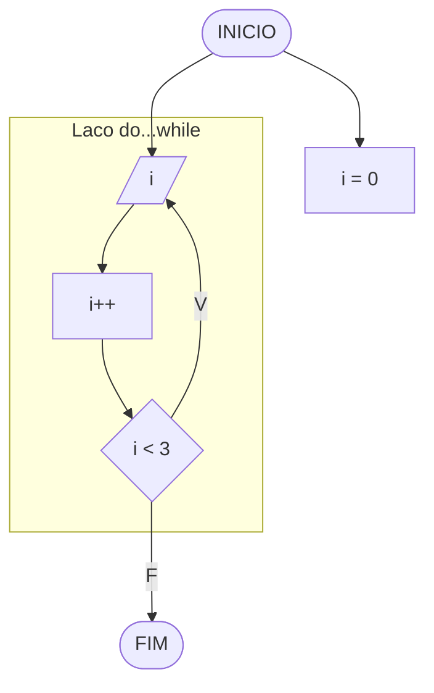

#### Teste de mesa

| passo | i | i < 3 após incremento | saída |
| --- | --- | --- | --- |
| 1 | 0 | V | 0 |
| 2 | 1 | V | 1 |
| 3 | 2 | F | 2 |

#### Código JavaScript (Programiz)
```javascript
// Declaracao de variaveis
let i;

// Processamento
i = 0;

do {
    console.log(i);
    i++;
} while (i < 3);
```

### Exemplo 6: `do...while` para pedir uma senha

#### Descrição narrativa
1. Ler uma senha.
2. Executar o teste ao menos uma vez.
3. Se a senha estiver incorreta, informar erro.
4. Repetir até que a senha correta seja digitada.
5. Mostrar a mensagem de acesso liberado.

#### Fluxograma
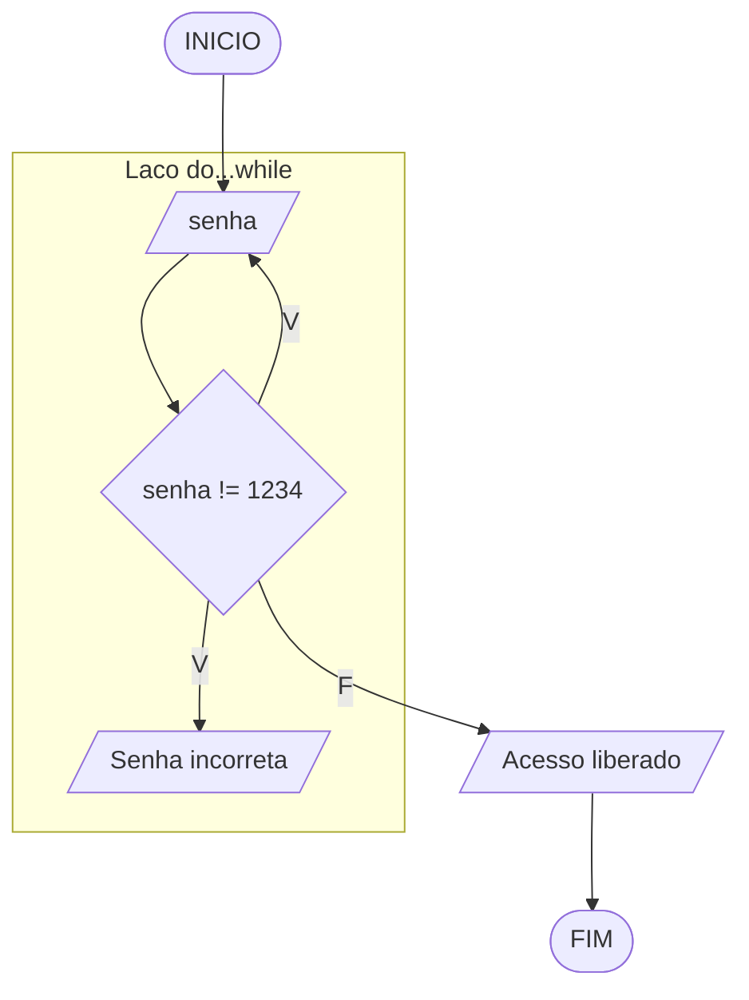

#### Teste de mesa

| passo | senha | senha != 1234 | saída |
| --- | --- | --- | --- |
| 1 | 1111 | V | Senha incorreta |
| 2 | 9999 | V | Senha incorreta |
| 3 | 1234 | F | Acesso liberado |

#### Código JavaScript (Programiz)
```javascript
// Declaracao de variaveis
let senha;

// Processamento e saida
do {
    senha = prompt("Digite a senha:"); // 1111, 9999, 1234

    if (senha != "1234") {
        console.log("Senha incorreta");
    }
} while (senha != "1234");

console.log("Acesso liberado");
```


### Exemplo 7: `do...while` para pedir um número positivo

#### Descrição narrativa
1. Ler um número.
2. Verificar se o número é positivo.
3. Se não for, pedir novamente.
4. Repetir até receber um número positivo.

#### Fluxograma
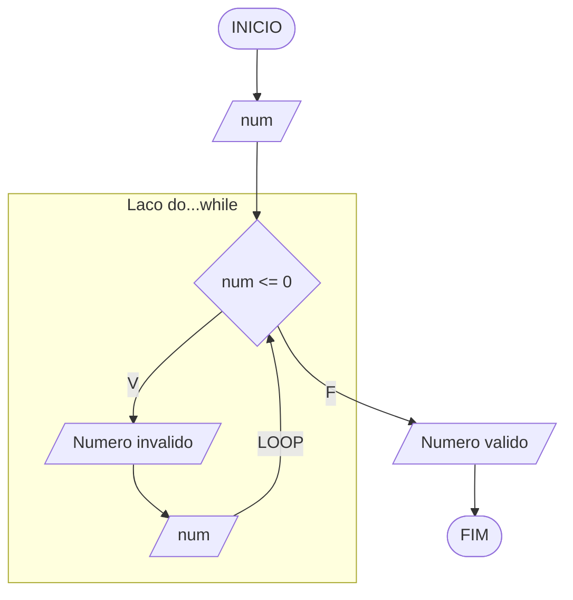

#### Teste de mesa

| passo | num | num <= 0 | mensagem | saída |
| --- | --- | --- | --- | --- |
| 1 | -2 | V | Numero invalido | Numero invalido |
| 2 | 0 | V | Numero invalido\nNumero invalido | Numero invalido / Numero invalido |
| 3 | 5 | F | Numero invalido\nNumero invalido\nNumero valido | Numero invalido / Numero invalido / Numero valido |

#### Código JavaScript (Programiz)
```javascript
// Declaracao de variaveis
let num;

// Entrada
num = prompt("Digite um numero positivo:"); // -2

// Processamento
num = parseInt(num);

do {
    if (num <= 0) {
        console.log("Numero invalido");
        num = prompt("Digite um numero positivo:"); // 0, 5
        num = parseInt(num);
    }
} while (num <= 0);

// Saida
console.log("Numero valido");
```

### Exemplo 8: `do...while` para pedir nota até ela estar válida

#### Descrição narrativa
1. Ler uma nota.
2. Se a nota for inválida, pedir novamente.
3. Repetir enquanto a nota estiver fora do intervalo de 0 a 10.
4. Mostrar a nota válida.

#### Fluxograma
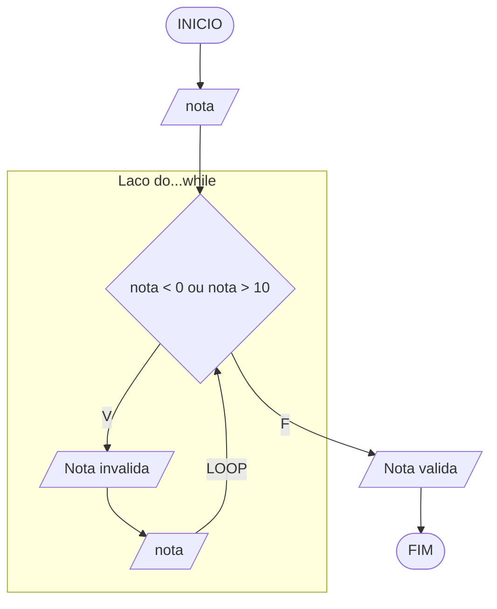

#### Teste de mesa

| passo | nota | nota < 0 ou nota > 10 | mensagem | saída |
| --- | --- | --- | --- | --- |
| 1 | 12 | V | Nota invalida | Nota invalida |
| 2 | -1 | V | Nota invalida\nNota invalida | Nota invalida / Nota invalida |
| 3 | 8 | F | Nota invalida\nNota invalida\nNota valida: 8 | Nota invalida / Nota invalida / Nota valida: 8 |

#### Código JavaScript (Programiz)
```javascript
// Declaracao de variaveis
let nota;

// Entrada
nota = prompt("Digite uma nota de 0 a 10:"); // 12

// Processamento
nota = parseFloat(nota);

do {
    if (nota < 0 || nota > 10) {
        console.log("Nota invalida");
        nota = prompt("Nota invalida. Digite uma nota de 0 a 10:"); // -1, 8
        nota = parseFloat(nota);
    }
} while (nota < 0 || nota > 10);

// Saida
console.log(`Nota valida: ${nota}`);
```

### Exemplo 9: `do...while` para mostrar menu até escolher sair

#### Descrição narrativa
1. Ler uma opção do menu.
2. Executar a ação correspondente.
3. Repetir enquanto a opção for diferente de zero.
4. Encerrar quando o usuário escolher sair.

#### Fluxograma
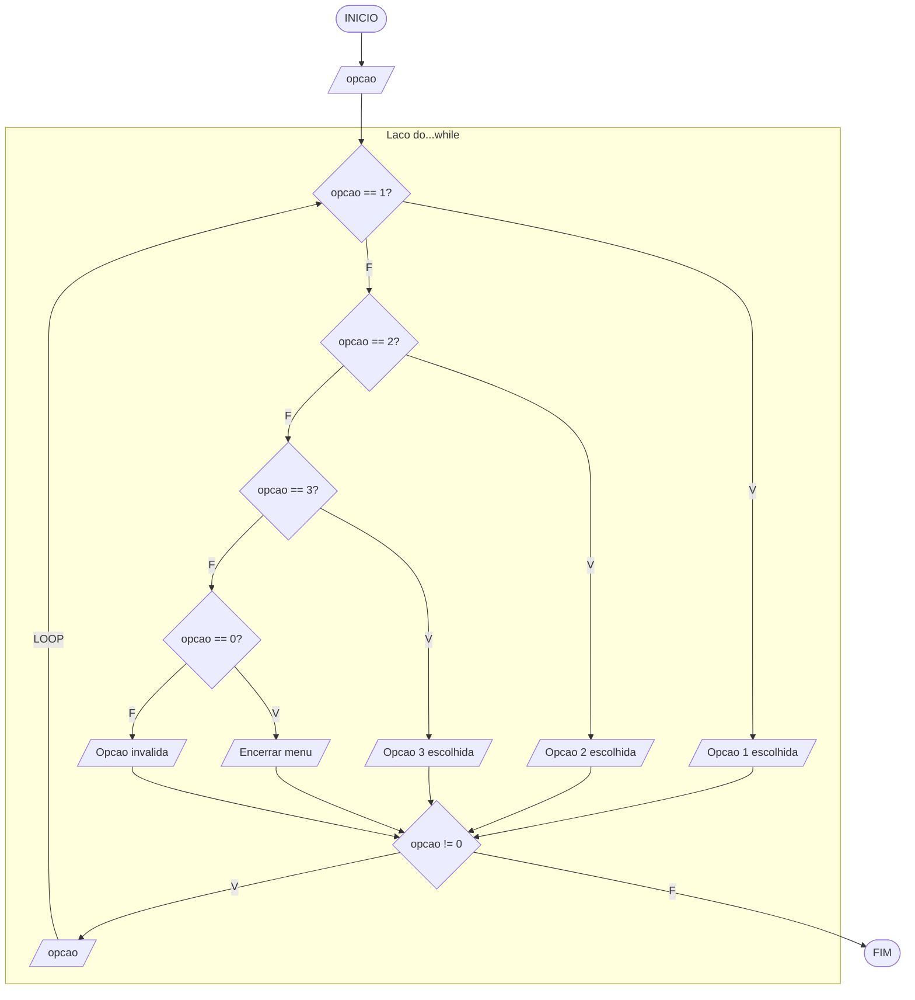

#### Teste de mesa

| passo | opcao | opcao != 0 | mensagem | saída |
| --- | --- | --- | --- | --- |
| 1 | 2 | V | Opcao 2 escolhida | Opcao 2 escolhida |
| 2 | 5 | V | Opcao 2 escolhida\nOpcao invalida | Opcao 2 escolhida / Opcao invalida |
| 3 | 0 | F | Opcao 2 escolhida\nOpcao invalida\nEncerrar menu | Opcao 2 escolhida / Opcao invalida / Encerrar menu |

#### Código JavaScript (Programiz)
```javascript
// Declaracao de variaveis
let opcao;
let mensagem;

// Entrada
opcao = prompt("Digite uma opcao de 1 a 3 (0 para sair):"); // 2

// Processamento
mensagem = "";

do {
    if (opcao == "1") {
        mensagem += "Opcao 1 escolhida\n";
    } else if (opcao == "2") {
        mensagem += "Opcao 2 escolhida\n";
    } else if (opcao == "3") {
        mensagem += "Opcao 3 escolhida\n";
    } else if (opcao == "0") {
        mensagem += "Encerrar menu\n";
    } else {
        mensagem += "Opcao invalida\n";
    }

    if (opcao != "0") {
        opcao = prompt("Digite uma opcao de 1 a 3 (0 para sair):"); // 5, 0
    }
} while (opcao != "0");

// Saida
console.log(mensagem);
```

### Exemplo 9: `for` básico com contador

#### Descrição narrativa
1. Ler a quantidade de iteracoes.
2. Declarar um contador iniciando em zero.
3. Repetir enquanto o contador for menor que a quantidade informada.
4. Mostrar o valor do contador.
5. Incrementar o contador a cada repetição.

#### Fluxograma


#### Teste de mesa

Entrada escolhida: `quantidade = 3`

| passo | i | i < quantidade | saída |
| --- | --- | --- | --- |
| 1 | 0 | V | 0 |
| 2 | 1 | V | 1 |
| 3 | 2 | V | 2 |
| 4 | 3 | F | - |

#### Código JavaScript (Programiz)
```javascript
// Declaracao de variaveis
let i;
let quantidade;

// Entrada
quantidade = prompt("Digite a quantidade de iteracoes:"); // 3

// Processamento
quantidade = parseInt(quantidade);

for (i = 0; i < quantidade; i++) {
    console.log(i);
}
```

### Exemplo 10: `for` para contar de 0 até um limite

#### Descrição narrativa
1. Ler o limite da contagem.
2. Iniciar um contador em zero.
3. Repetir enquanto o contador for menor ou igual ao limite.
4. Mostrar cada valor do contador.

#### Fluxograma
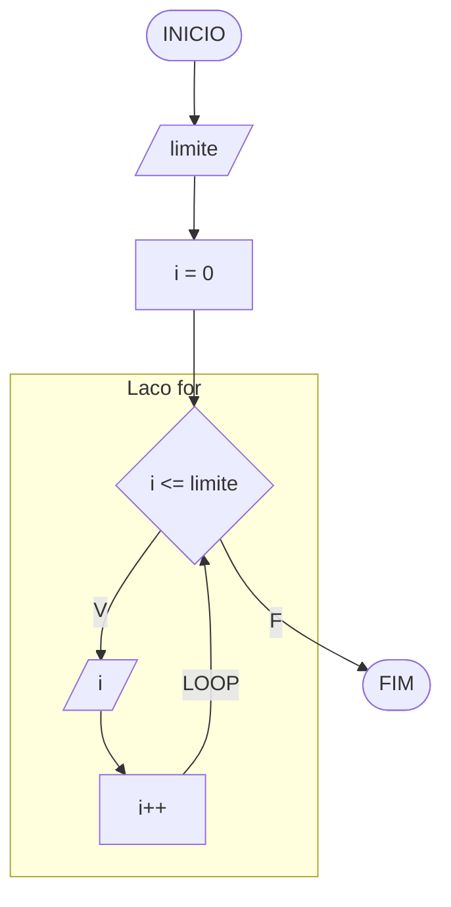

#### Teste de mesa

Entrada escolhida: `limite = 3`

| passo | i | i <= limite | saída |
| --- | --- | --- | --- |
| 1 | 0 | V | 0 |
| 2 | 1 | V | 0 / 1 |
| 3 | 2 | V | 0 / 1 / 2 |
| 4 | 3 | V | 0 / 1 / 2 / 3 |
| 5 | 4 | F | 0 / 1 / 2 / 3 |

#### Código JavaScript (Programiz)
```javascript
// Declaracao de variaveis
let limite;
let i;
let mensagem;

// Entrada
limite = prompt("Digite o limite da contagem:"); // 3

// Processamento
limite = parseInt(limite);
mensagem = "";

for (i = 0; i <= limite; i++) {
    mensagem += `${i}\n`;
}

// Saida
console.log(mensagem);
```

### Exemplo 11: `for` para gerar a tabuada

#### Descrição narrativa
1. Ler um número.
2. Repetir de 1 até 10.
3. Calcular o produto do número pelo fator atual.
4. Mostrar a tabuada completa.

#### Fluxograma
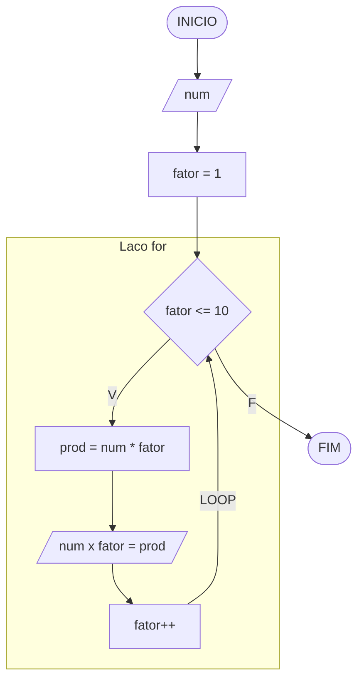

#### Teste de mesa

Entrada escolhida: `num = 4`

| passo | fator | fator <= 10 | prod | saída |
| --- | --- | --- | --- | --- |
| 1 | 1 | V | 4 | 4 x 1 = 4 |
| 2 | 2 | V | 8 | 4 x 1 = 4 / 4 x 2 = 8 |
| 3 | 3 | V | 12 | 4 x 1 = 4 / 4 x 2 = 8 / 4 x 3 = 12 |
| ... | ... | ... | ... | ... |
| 10 | 10 | V | 40 | ... / 4 x 10 = 40 |
| 11 | 11 | F | - | tabuada completa |

#### Código JavaScript (Programiz)
```javascript
// Declaracao de variaveis
let num;
let fator;
let prod;
let tabuada;

// Entrada
num = prompt("Digite o numero da tabuada:"); // 4

// Processamento
num = parseInt(num);
tabuada = "";

for (fator = 1; fator <= 10; fator++) {
    prod = num * fator;
    tabuada += `${num} x ${fator} = ${prod}\n`;
}

// Saida
console.log(tabuada);
```

### Exemplo 12: `for` para somar n números

#### Descrição narrativa
1. Ler quantos números serão somados.
2. Repetir a leitura dessa quantidade de números.
3. Somar cada valor ao acumulador.
4. Mostrar a soma final.

#### Fluxograma
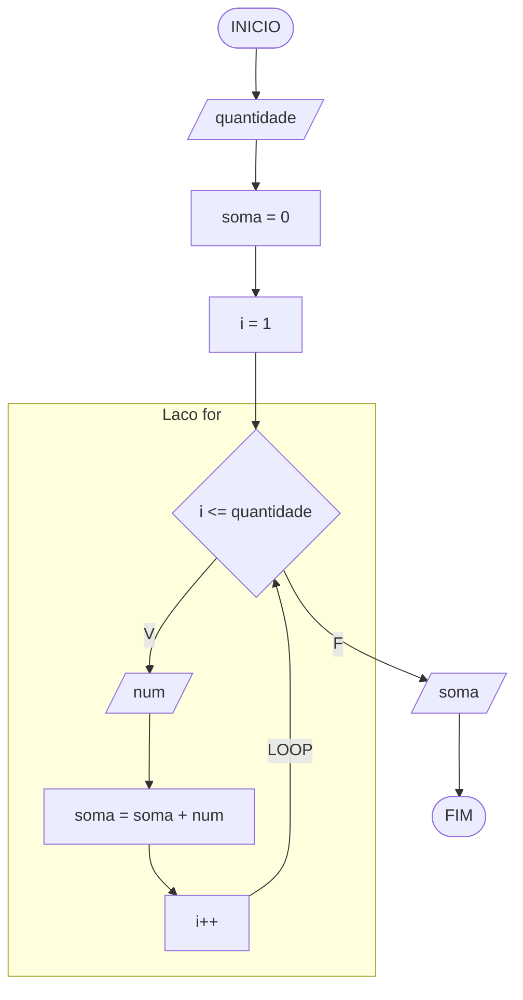

#### Teste de mesa

Entrada escolhida: `quantidade = 3`

| passo | i | i <= quantidade | num | soma antes | soma depois | saída |
| --- | --- | --- | --- | --- | --- | --- |
| 1 | 1 | V | 10 | 0 | 10 | - |
| 2 | 2 | V | 20 | 10 | 30 | - |
| 3 | 3 | V | 5 | 30 | 35 | - |
| 4 | 4 | F | - | 35 | 35 | 35 |

#### Código JavaScript (Programiz)
```javascript
// Declaracao de variaveis
let quantidade;
let i;
let num;
let soma;

// Entrada
quantidade = prompt("Digite quantos numeros deseja somar:"); // 3

// Processamento
quantidade = parseInt(quantidade);
soma = 0;

for (i = 1; i <= quantidade; i++) {
    num = prompt(`Digite o ${i}o numero:`); // 10, 20, 5
    num = parseInt(num);
    soma += num;
}

// Saida
console.log(soma);
```

## 5. Comparativo final

| Estrutura | Quando usar | Exemplo desta aula |
| --- | --- | --- |
| `while` | quando nao sabemos quantas repeticoes vao acontecer | numero positivo, senha, soma ate digitar 0 |
| `do...while` | quando o bloco precisa executar ao menos uma vez | contador basico, numero positivo, nota valida, menu |
| `for` | quando existe contagem conhecida | contador basico, contagem, tabuada, soma de n numeros |

## 6. Fechamento
Nesta aula, vimos que a escolha da estrutura de repetição depende do problema. O mais importante não é decorar sintaxe, mas perceber se o algoritmo depende de uma condição aberta, de uma execução mínima obrigatória ou de uma quantidade conhecida de repetições.

## Referências bibliográficas
1. MOZILLA DEVELOPER NETWORK. `while`. Disponível em: https://developer.mozilla.org/pt-BR/docs/Web/JavaScript/Reference/Statements/while.
2. MOZILLA DEVELOPER NETWORK. `do...while`. Disponível em: https://developer.mozilla.org/pt-BR/docs/Web/JavaScript/Reference/Statements/do...while.
3. MOZILLA DEVELOPER NETWORK. `for`. Disponível em: https://developer.mozilla.org/pt-BR/docs/Web/JavaScript/Reference/Statements/for.
