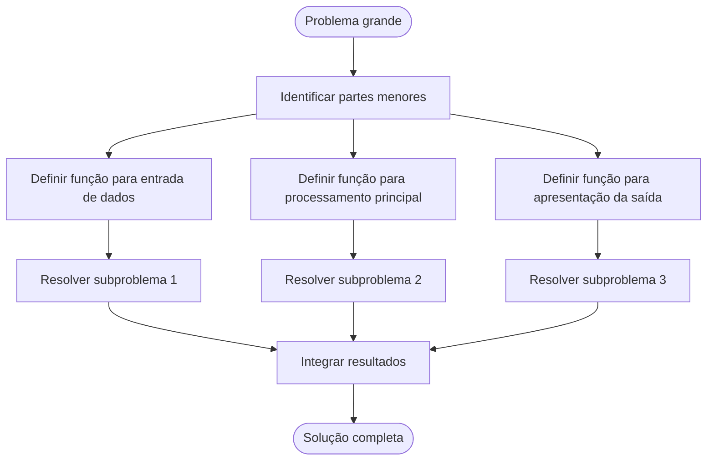

 

# Raciocínio Lógico Algorítmico: Aula 8
Orientador: Prof. Me Ricardo Carubbi

## Funções e algoritmos clássicos

### Objetivo da aula
Compreender como **reutilizar código com funções** e como implementar **algoritmos clássicos** de **troca de valores**, **maior valor e posição**, **loop infinito com `break`**, **fatorial**, **Fibonacci**, **conversão de base** e **geração dos primeiros números primos** em JavaScript.

## 1. Fundamentação teórica
Em algoritmos maiores, repetir o mesmo bloco de código em vários pontos dificulta a **manutenção**, aumenta a **chance de erro** e torna a leitura mais cansativa. Para evitar isso, usamos **funções**.

Uma **função** é um bloco de código que:

- recebe valores de entrada, chamados **parâmetros**;
- executa uma **tarefa específica**;
- pode devolver um resultado por meio de `return`, quando a intenção for produzir um **valor** para uso posterior;
- também pode apenas executar uma **ação**, como exibir uma mensagem, sem retornar valor.

O uso de funções ajuda a:

- **dividir problemas grandes** em partes menores;
- **reaproveitar a mesma lógica** em vários pontos;
- **testar trechos de código** separadamente;
- deixar o algoritmo mais **organizado**.

Nesta aula, as funções serão aplicadas a algoritmos clássicos muito usados em exercícios introdutórios.

### Decomposição de problemas como estratégia computacional
Uma estratégia importante em programação é **dividir um problema grande em partes menores** e mais fáceis de resolver. Cada parte pode ser transformada em uma **função com responsabilidade bem definida**.

Esse processo melhora:

- a **organização** da solução;
- a **leitura** do algoritmo;
- a **reutilização de código**;
- a **identificação de erros**.

#### Fluxograma


## 2. Sintaxe básica de função

```javascript
function nomeDaFuncao(parametro1, parametro2) {
    let resultado;

    resultado = parametro1 + parametro2;

    return resultado;
}
```

Exemplo de uso:

```javascript
function somar(a, b) {
    a = parseFloat(a);
    b = parseFloat(b);

    return a + b;
}

let num1;
let num2;
let total;

num1 = prompt("Digite o primeiro número:"); // 4
num2 = prompt("Digite o segundo número:"); // 7

total = somar(num1, num2);
console.log(total); // 11
```

 

**Figura 8.1** - Uso de funções e comparação entre a sintaxe tradicional de função com `function nome() {}` e a sintaxe moderna com **arrow function**, como em `const nome = () => {}`.

### Comentário sobre a Figura 8.1
A figura destaca duas ideias importantes. A primeira é o **conceito de função**: um bloco de código criado para executar uma tarefa específica, podendo ou não **retornar um valor**. A segunda é a existência de **duas formas comuns de escrever funções em JavaScript**: a forma tradicional e a forma moderna com **arrow function**.

Na prática, as duas sintaxes servem ao mesmo propósito fundamental: **organizar o algoritmo**, **evitar repetição de código** e **facilitar a reutilização da lógica**. Em cursos introdutórios, a forma tradicional com `function nome() {}` costuma ser a melhor para começar, porque sua estrutura é mais explícita e facilita a leitura.

A sintaxe com **arrow function**, como em `const nome = () => {}`, aparece com muita frequência em JavaScript moderno. Por isso, é importante que o aluno reconheça essa forma desde cedo, mesmo que os exemplos principais da aula continuem usando a sintaxe tradicional para priorizar a clareza didática.

O mais importante, neste momento, não é memorizar apenas a diferença visual entre as duas escritas, mas entender a **aplicação das funções**: separar partes do problema, dar nome a cada etapa do raciocínio e construir soluções mais **claras**, **modulares** e **fáceis de manter**.

## 3. Escopo de variáveis em funções

### Ideia principal
**Escopo** é a região do algoritmo em que uma variável pode ser usada. Ao trabalhar com funções, é importante distinguir **variáveis locais** das **variáveis declaradas fora da função**.

### Escopo local
Chamamos de **escopo local** o conjunto de variáveis que existem apenas dentro de uma função.

- variáveis declaradas dentro da função existem apenas dentro dela;
- **parâmetros** também pertencem ao escopo da função;
- essas variáveis deixam de fazer sentido fora da função.

### Escopo global
Chamamos de **escopo global** o conjunto de variáveis declaradas fora das funções, em uma região mais ampla do algoritmo.

- essas variáveis podem ser usadas em outras partes do programa;
- seu uso exige **cuidado**, para evitar confusão e alterações indevidas;
- em algoritmos bem organizados, prefere-se usar **funções com parâmetros e retornos claros**, reduzindo a dependência de variáveis globais.

### Exemplo básico

```javascript
function mostrarMensagem(nome) {
    let saudacao;

    saudacao = "Olá, " + nome;
    console.log(saudacao);
}

let aluno;
let disciplina;

// Entrada de dados
aluno = prompt("Digite o nome do aluno:"); // Ana
disciplina = prompt("Digite o nome da disciplina:"); // Logica

// Chamada da funcao
mostrarMensagem(aluno);

// Saida de dados
console.log("Disciplina atual: " + disciplina);
```

### Observação didática
No exemplo, `nome` e `saudacao` pertencem ao **escopo local** da função `mostrarMensagem`. Já as variáveis `aluno` e `disciplina` foram declaradas fora da função e pertencem ao **escopo global**.

Observe também que `mostrarMensagem` **não usa `return`**. Isso acontece porque seu objetivo não é **devolver um valor**, mas realizar uma **saída** com `console.log()`. Esse tipo de função também é válido e útil quando a responsabilidade principal é **executar uma ação** dentro de um problema maior.

Entender escopo é importante para:

- evitar confusão entre variáveis com funções diferentes;
- impedir **alterações indevidas** em dados do algoritmo;
- organizar melhor a **responsabilidade de cada função**.

## 4. Reutilização de código com o uso de funções

### Ideia principal
Quando um mesmo cálculo ou processo aparece várias vezes, ele deve ser colocado em uma **função**.

### Exemplo básico: calcular o dobro de vários valores

#### Descrição narrativa
1. Criar uma função que receba um número.
2. Multiplicar esse número por 2.
3. Retornar o resultado.
4. Repetir a leitura de valores.
5. Chamar a função a cada repetição.
6. Exibir o resultado calculado.

#### Código JavaScript
```javascript
function calcularDobro(numero) {
    numero = parseFloat(numero);

    return numero * 2;
}

let valor;
let i;

for (i = 1; i <= 3; i++) {
    // Entrada de dados
    valor = prompt("Digite um valor:"); // 5, 8, 12

    // Chamada da funcao
    valor = calcularDobro(valor);

    // Saida de dados
    console.log(valor);
}
```

### Observação didática
Sem função, o cálculo `numero * 2` seria repetido várias vezes. Com função, o algoritmo fica **menor**, mais **organizado** e mais **fácil de alterar**. A estrutura de repetição também ajuda a evitar a duplicação de comandos quando queremos aplicar a mesma função a vários valores.

### Exemplo com mais de um `return`

#### Descrição narrativa
1. Criar uma função que receba a média do aluno.
2. Verificar a situação do aluno com base nessa média.
3. Devolver `"Aprovado"`, `"Final"` ou `"Reprovado"`.
4. Ler a média no programa principal.
5. Chamar a função e exibir a classificação obtida.

#### Código JavaScript
```javascript
function situacaoAluno(media) {
    if (media >= 7) {
        return "Aprovado";
    } else if (media >= 4) {
        return "Final";
    } else {
        return "Reprovado";
    }
}

let entradaMedia;
let mediaAluno;
let mensagem;

// Entrada de dados
entradaMedia = prompt("Digite a media do aluno:"); // 6.5

// Processamento dos dados
mediaAluno = parseFloat(entradaMedia);

// Chamada da funcao
mensagem = situacaoAluno(mediaAluno);

// Saida de dados
console.log(mensagem); // Final
```

### Observação didática
Esse exemplo mostra que uma função pode ter **mais de um `return`**. Em cada caso, a função devolve um valor diferente e encerra sua execução naquele ponto. Isso é útil quando o resultado depende de **condições diferentes**.

### Exemplo de modularização

#### Descrição narrativa
1. Criar uma função para converter o texto digitado em número.
2. Criar uma função para verificar se a nota está no intervalo válido.
3. Criar uma função para calcular a média entre duas notas.
4. Ler as duas notas no escopo global.
5. Converter as entradas.
6. Validar os valores antes de calcular a média.
7. Exibir a média ou uma mensagem de erro.

#### Código JavaScript
```javascript
// Funções
function converteNum(texto) {
    let num;

    num = parseFloat(texto);

    if (num % 1 === 0) {
        num = parseInt(texto);
    }

    return num;
}

function validaNota(nota) {
    return nota >= 0 && nota <= 10;
}

function media(nota1, nota2) {
    return (nota1 + nota2) / 2;
}

// Escopo global
let AV1;
let AV2;
let MP;

AV1 = prompt('Digite a nota da AV1: ');
AV2 = prompt('Digite a nota da AV2: ');

AV1 = converteNum(AV1);
AV2 = converteNum(AV2);

if (validaNota(AV1) && validaNota(AV2)) {
    MP = media(AV1, AV2);
} else {
    MP = 'Verifique as notas!';
}

console.log(MP);
```

### Observação didática
Esse exemplo mostra uma forma simples de **modularizar** o problema. Em vez de concentrar toda a lógica no bloco principal, o algoritmo separa três responsabilidades: **converter**, **validar** e **calcular**. Essa organização melhora a leitura e facilita alterações futuras.

## 5. Algoritmo de troca de valores

### Ideia principal
**Trocar valores** significa fazer com que o valor de `a` passe para `b` e o valor de `b` passe para `a`.

Para isso, normalmente usamos uma **variável auxiliar**.

### Exemplo básico

#### Descrição narrativa
1. Guardar o valor de `a` em uma variável auxiliar.
2. Copiar o valor de `b` para `a`.
3. Copiar o valor auxiliar para `b`.
4. Obter os valores trocados.

#### Código JavaScript com variável temporária
```javascript
let a;
let b;
let temp;

a = prompt("Digite o valor de a:"); // 10
b = prompt("Digite o valor de b:"); // 25

a = parseFloat(a);
b = parseFloat(b);

temp = a;
a = b;
b = temp;

console.log(a); // 25
console.log(b); // 10
```

#### Variação com função
```javascript
let a;
let b;
function trocarValores(a, b) {
    let aux;

    a = parseFloat(a);
    b = parseFloat(b);

    aux = a;
    a = b;
    b = aux;

    return [a, b];
}

let resultado;
let novoA;
let novoB;

novoA = prompt("Digite o valor de a:"); // 10
novoB = prompt("Digite o valor de b:"); // 25

resultado = trocarValores(novoA, novoB);
[novoA, novoB] = resultado;

console.log(novoA); // 25
console.log(novoB); // 10
```

### Observação didática
Esse algoritmo é importante porque aparece em **ordenação**, **reorganização de dados** e vários problemas de **comparação**. Na opção mais direta, a troca foi mostrada usando apenas uma **variável temporária**. No segundo exemplo, os colchetes foram usados apenas como uma forma prática de devolver dois valores ao mesmo tempo. Neste momento, o objetivo não é aprofundar estruturas de dados, mas apenas mostrar uma maneira simples de fazer uma função devolver mais de um resultado.

### Exemplo de uso em um problema maior
No problema [BEE1046.js](/Users/carubbi/Documents/aulas/T160_T998/beecrowd/BEE1046.js), a solução mais direta calcula a duração do jogo comparando `inicio` e `fim`, sem necessidade de troca. Mesmo assim, o contexto do problema ajuda a visualizar onde o algoritmo de troca pode aparecer como estratégia auxiliar de organização.

#### Ideia ilustrativa
Se quisermos apenas garantir que o menor horário fique em `inicio` e o maior em `fim`, podemos reutilizar a função `trocarValores` antes de continuar o raciocínio.

```javascript
let inicio;
let fim;

function trocarValores() {
    let aux;

    aux = inicio;
    inicio = fim;
    fim = aux;
}

inicio = parseInt(prompt("Digite a hora inicial:"));
fim = parseInt(prompt("Digite a hora final:"));

if (inicio > fim) {
    trocarValores();
}

console.log("Menor horario: " + inicio);
console.log("Maior horario: " + fim);
```

### Ponto de atenção
Nesse caso, a troca é apenas um **exemplo de aplicação** do algoritmo dentro de um problema maior. Ela **não substitui** a solução principal do `BEE1046`, que continua sendo mais bem resolvida pela comparação direta entre horário inicial e final.

## 6. Algoritmo de maior valor e posição

### Ideia principal
Em alguns problemas, não precisamos guardar todos os valores lidos. Basta acompanhar, ao longo da repetição:

- o **maior valor encontrado até o momento**;
- a **posição** em que esse valor apareceu.

Esse padrão aparece no problema **1080 - Maior e Posição** do Beecrowd. Mesmo sem usar vetor, é possível resolver o problema com repetição, comparação e atualização de variáveis.

### Exemplo básico: encontrar o maior valor e sua posição

#### Descrição narrativa
1. Criar uma função para converter o texto digitado em número.
2. Criar uma função para ler os valores e identificar o maior valor e sua posição.
3. Ler o primeiro valor para inicializar `maior` e `posicao`.
4. Repetir a leitura dos demais valores.
5. Comparar cada novo valor com o maior atual.
6. Atualizar `maior` e `posicao` quando necessário.
7. Devolver os dois resultados ao final.

#### Código JavaScript
```javascript
function converteNum(texto) {
    let num;

    num = parseFloat(texto);

    if (num % 1 === 0) {
        num = parseInt(texto);
    }

    return num;
}

function buscarMaiorPosicao() {
    let numero;
    let maior;
    let posicao;
    let i;

    // Entrada de dados
    numero = converteNum(prompt("Digite um valor:"));
    maior = numero;
    posicao = 1;

    for (i = 2; i <= 100; i++) {
        // Entrada de dados
        numero = converteNum(prompt("Digite um valor:"));

        if (numero > maior) {
            maior = numero;
            posicao = i;
        }
    }

    return [maior, posicao];
}

let resultado;
let maiorValor;
let posicaoMaior;

// Chamada da funcao
resultado = buscarMaiorPosicao();
[maiorValor, posicaoMaior] = resultado;

// Saida de dados
console.log(maiorValor);
console.log(posicaoMaior);
```

### Observação didática
Esse exemplo mostra uma forma de modularizar um problema de repetição e comparação. A função `buscarMaiorPosicao` concentra a responsabilidade de ler os valores e atualizar o maior valor encontrado. Ao final, os colchetes são usados apenas como uma forma prática de devolver dois resultados ao mesmo tempo: o maior valor e sua posição.

## 7. Loop infinito com uso de `break`

### Exemplo básico em um problema maior

Em alguns problemas, não sabemos com antecedência **quantas repetições** serão necessárias. Nesses casos, pode ser útil usar um **loop infinito** e interrompê-lo quando uma condição de parada for satisfeita.

#### Código JavaScript
```javascript
function somarAteZero() {
    let numero;
    let soma;

    soma = 0;

    while (true) {
        // Entrada de dados
        numero = parseInt(prompt("Digite um numero (0 para sair):"));

        if (numero === 0) {
            break;
        }

        soma = soma + numero;
    }

    // Saida de dados
    console.log("Soma: " + soma);
}

// Chamada da funcao
somarAteZero();
```

### Observação didática
O laço `while (true)` cria uma repetição que, em princípio, nunca termina sozinha. Por isso, ele só deve ser usado quando existe uma **condição de parada clara** dentro do bloco. Neste exemplo, a função `somarAteZero` organiza esse comportamento em uma responsabilidade específica, e o comando `break` encerra o laço quando o usuário digita `0`. O problema maior, aqui, é acumular a soma dos valores informados antes do encerramento.

Antes de avançar para o fatorial, observe uma diferença importante: no exemplo com `break`, a repetição termina por uma **condição interna**. Já no fatorial, a quantidade de repetições é definida pelo valor de `n`.

## 8. Algoritmo de fatorial

### Ideia principal
O **fatorial** de um número natural `n` é o produto de todos os inteiros de `1` até `n`.

Exemplos:

- `3! = 3 x 2 x 1 = 6`
- `5! = 5 x 4 x 3 x 2 x 1 = 120`

Por convenção:

- **`0! = 1`**

### Exemplo básico

#### Descrição narrativa
1. Receber `n`.
2. Começar com `fatorial = 1`.
3. Multiplicar `fatorial` pelos números de 1 até `n`.
4. Retornar o resultado.

#### Código JavaScript
```javascript
function calcularFatorial(n) {
    let fatorial;
    let i;

    n = parseInt(n);
    fatorial = 1;

    for (i = 1; i <= n; i++) {
        fatorial = fatorial * i;
    }

    return fatorial;
}

let numero;

numero = prompt("Digite um número para calcular o fatorial:"); // 5
console.log(calcularFatorial(numero)); // 120
```

### Ponto de atenção
O algoritmo iterativo de fatorial usa **multiplicação acumulada**. Mesmo sem uma seção específica sobre acumuladores nesta aula, vale observar que o valor de `fatorial` vai sendo atualizado a cada repetição até formar o resultado final.

## 9. Algoritmo de sequência de Fibonacci

### Ideia principal
Na **sequência de Fibonacci**, cada termo a partir do terceiro é a **soma dos dois anteriores**.

Sequência inicial:

`0, 1, 1, 2, 3, 5, 8, 13, ...`

### Exemplo básico

#### Descrição narrativa
1. Definir os dois primeiros termos.
2. Mostrar os termos iniciais.
3. Calcular o próximo como soma dos dois anteriores.
4. Atualizar as variáveis.
5. Repetir até gerar a quantidade desejada.

#### Código JavaScript
```javascript
function gerarFibonacci(quantidade) {
    let a;
    let b;
    let proximo;
    let i;
    let sequencia;

    quantidade = parseInt(quantidade);
    a = 0;
    b = 1;
    sequencia = "";

    for (i = 1; i <= quantidade; i++) {
        sequencia += a;

        if (i < quantidade) {
            sequencia += ", ";
        }

        proximo = a + b;
        a = b;
        b = proximo;
    }

    return sequencia;
}

let quantidade;

quantidade = prompt("Digite a quantidade de termos:"); // 7
console.log(gerarFibonacci(quantidade)); // 0, 1, 1, 2, 3, 5, 8
```

### Ponto de atenção
Neste algoritmo, a **ordem das atualizações importa**. Se as variáveis forem atualizadas na ordem errada, a sequência fica incorreta.

## 10. Algoritmo de conversão de base

### Ideia principal
**Conversão de base** é a mudança de representação de um número. Um caso clássico em aulas introdutórias é converter um **número decimal para binário**.

O processo funciona com divisões sucessivas por 2:

1. **dividir** o número por 2;
2. **guardar o resto**;
3. repetir com o **quociente**;
4. ler os restos de **trás para frente**.

### Exemplo básico: decimal para binário

#### Descrição narrativa
1. Receber um número decimal inteiro positivo.
2. Enquanto o número for maior que zero, calcular o resto da divisão por 2.
3. Colocar esse resto no início da resposta.
4. Substituir o número pelo quociente inteiro da divisão por 2.
5. Ao final, retornar o binário obtido.

#### Código JavaScript
```javascript
function decimalParaBinario(numero) {
    let binario;
    let resto;

    numero = parseInt(numero);

    if (numero == 0) {
        return "0";
    }

    binario = "";

    while (numero > 0) {
        resto = numero % 2;
        binario = resto + binario;
        numero = parseInt(numero / 2);
    }

    return binario;
}

let numero;

numero = prompt("Digite um número decimal inteiro:"); // 13
console.log(decimalParaBinario(numero)); // 1101
```

### Observação didática
Esse algoritmo combina:

- **repetição**;
- operador de **resto `%`**;
- **divisão inteira**;
- construção gradual de uma resposta.

## 11. Algoritmo de geração dos n-primeiros números primos

### Ideia principal
Um **número primo** é divisível apenas por `1` e por ele mesmo.

Para gerar os `n` primeiros primos, precisamos:

1. testar vários candidatos;
2. verificar se cada candidato é primo;
3. contar quantos primos já foram encontrados;
4. parar quando a quantidade desejada for atingida.

### Exemplo básico

#### Descrição narrativa
1. Criar uma função para verificar se um número é primo.
2. Começar com o candidato igual a 2.
3. Enquanto ainda faltarem primos, testar o candidato.
4. Se for primo, adicionar à resposta e aumentar a contagem.
5. Passar para o próximo candidato.

#### Código JavaScript
```javascript
function ehPrimo(numero) {
    let divisor;

    numero = parseInt(numero);

    // Elimina o caso-base: números menores que 2 não são primos
    if (numero < 2) {
        return false;
    }

    // Procura algum divisor além de 1 e do próprio número
    for (divisor = 2; divisor < numero; divisor++) {
        if (numero % divisor == 0) {
            return false;
        }
    }

    // Se nenhum divisor exato apareceu, o número é primo
    return true;
}

function gerarNPrimeirosPrimos(quantidade) {
    let encontrados;
    let candidato;
    let resposta;

    quantidade = parseInt(quantidade);

    // Começa sem nenhum primo encontrado e testa os candidatos a partir de 2
    encontrados = 0;
    candidato = 2;
    resposta = "";

    // Continua testando números até encontrar a quantidade desejada de primos
    while (encontrados < quantidade) {
        if (ehPrimo(candidato)) {
            // A vírgula só é adicionada a partir do segundo primo encontrado
            if (encontrados > 0) {
                resposta += ", ";
            }

            resposta += candidato;
            
            // Atualiza a quantidade de primos já adicionados à resposta
            encontrados++;
        }

        candidato++;
    }

    return resposta;
}

let quantidade;

quantidade = prompt("Digite quantos números primos deseja gerar:"); // 5
console.log(gerarNPrimeirosPrimos(quantidade)); // 2, 3, 5, 7, 11
```

#### Teste de mesa
Considerando `quantidade = 5`, o comportamento das variáveis em `gerarNPrimeirosPrimos` será:

| Iteração | `quantidade` | `candidato` | `ehPrimo(candidato)` | `encontrados` | `resposta` |
| --- | --- | --- | --- | --- | --- |
| 1ª | 5 | 2 | `true` | 1 | `"2"` |
| 2ª | 5 | 3 | `true` | 2 | `"2, 3"` |
| 3ª | 5 | 4 | `false` | 2 | `"2, 3"` |
| 4ª | 5 | 5 | `true` | 3 | `"2, 3, 5"` |
| 5ª | 5 | 6 | `false` | 3 | `"2, 3, 5"` |
| 6ª | 5 | 7 | `true` | 4 | `"2, 3, 5, 7"` |
| 7ª | 5 | 8 | `false` | 4 | `"2, 3, 5, 7"` |
| 8ª | 5 | 9 | `false` | 4 | `"2, 3, 5, 7"` |
| 9ª | 5 | 10 | `false` | 4 | `"2, 3, 5, 7"` |
| 10ª | 5 | 11 | `true` | 5 | `"2, 3, 5, 7, 11"` |

### Ponto de atenção
Esse algoritmo usa decomposição em funções:

- uma função decide se um número é **primo**;
- outra função usa esse teste para gerar **vários primos**.

Esse é um bom exemplo de **reutilização de código**.

### Observação sobre eficiência
O algoritmo apresentado é adequado para fins **didáticos**, mas **não é otimizado**. Isso acontece porque, para cada candidato, a função `ehPrimo` testa vários divisores possíveis, o que aumenta o custo da solução quando queremos gerar muitos números primos.

Quando o objetivo é **melhor desempenho**, uma melhoria simples é testar divisores apenas até a raiz quadrada do número (`numero ** 0.5`). Se um número tiver divisor, então ele aparece em um par de fatores, e pelo menos um deles será menor ou igual à raiz quadrada do número. Por exemplo, em `12`, os pares de fatores podem ser `2 x 6` e `3 x 4`. Assim, não é necessário continuar a busca além da raiz quadrada do número.

## 12. Comparativo rápido dos algoritmos estudados

| Tema | Ideia central | Estrutura mais usada |
| --- | --- | --- |
| Reutilização com funções | evitar repetição de código | função com parâmetros e `return` |
| Troca de valores | inverter conteúdos de duas variáveis | variável auxiliar |
| Maior valor e posição | comparar valores e atualizar posição | `for` |
| Loop infinito com `break` | repetir até uma condição interna de parada | `while (true)` |
| Fatorial | produto acumulado de 1 até `n` | `for` |
| Fibonacci | soma dos dois termos anteriores | `for` |
| Conversão de base | divisões sucessivas e restos | `while` |
| Números primos | teste de divisibilidade | funções + repetição |

## 13. Erros comuns

1. Criar funções sem objetivo claro.
2. Esquecer de usar `return` quando a função precisa devolver resultado.
3. Trocar valores sem variável auxiliar e perder um dos dados.
4. Iniciar produto com `0` em vez de `1`.
5. Atualizar as variáveis da sequência de Fibonacci em ordem incorreta.
6. Ler os restos da conversão de base na ordem errada.
7. Considerar `1` como número primo.
8. Confundir variáveis locais da função com variáveis declaradas fora dela.

## 14. Fechamento
Nesta aula, você estudou como usar **funções** para organizar algoritmos e **reaproveitar lógica**. Também viu padrões clássicos muito frequentes em programação introdutória: **troca de valores**, **maior valor e posição**, **loop infinito com `break`**, **fatorial**, **Fibonacci**, **conversão de base** e **números primos**.

O ponto central não é apenas memorizar cada algoritmo, mas perceber que muitos problemas podem ser construídos a partir de poucos **padrões**:

- **repetição**;
- **comparação**;
- **acumulação**;
- **teste de divisibilidade**;
- **decomposição em funções**.

## 15. Padrão de estilo a ser adotado
Segue um guia simples e coerente para essa transição de JavaScript para Java.

### 15.1. Declarar variáveis no início do bloco

Declare as variáveis no começo da função ou do bloco principal.

```javascript
let encontrados;
let candidato;
let resposta;
```

### 15.2. Inicializar depois

Após a declaração, faça as atribuições iniciais.

```javascript
encontrados = 0;
candidato = 2;
resposta = "";
```

### 15.3. Usar nomes claros

Prefira nomes que indiquem o papel da variável.

* `contador` ou `cont`
* `numero` ou `num`
* `candidato` ou `cand`
* `resposta` ou `resp`
* `soma`

Evite nomes pouco descritivos como:

* `x`
* `y`
* `a`

### 15.4. Uma instrução por linha

Não juntar muitas ações na mesma linha.

Correto:

```javascript
soma += numero;
contador++;
```

Evitar:

```javascript
soma += numero; contador++;
```

### 15.5. Indentação consistente

Usar sempre a mesma indentação dentro de blocos.

```javascript
if (numero % 2 == 0) {
    console.log("Par");
}
```

### 15.6. Blocos sempre com chaves

Mesmo quando houver apenas um comando, usar chaves.

```javascript
if (numero > 0) {
    contador++;
}
```

### 15.7. Separar declaração, processamento e saída

Organizar o código em partes bem visíveis.

```javascript
let numero;
let dobro;

numero = parseInt(prompt("Digite um número:"));
dobro = numero * 2;
console.log(dobro);
```

### 15.8. Comentários curtos e úteis

Comentar apenas quando ajudar a entender a lógica.

```javascript
// Conta quantos primos já foram encontrados
encontrados++;
```

### 15.9. Funções com objetivo bem definido

Cada função deve ter uma responsabilidade clara.

* `ehPrimo(numero)` verifica primalidade
* `gerarNPrimeirosPrimos(quantidade)` gera a sequência

### 15.10. Manter a lógica explícita

Para fins didáticos, preferir código mais claro em vez de versões mais compactas.

### Observação didática

Esse padrão não é o mais moderno em JavaScript, mas é muito útil no ensino inicial porque:

* aproxima o aluno do estilo usado em Java
* reforça a distinção entre declaração e inicialização
* deixa a estrutura do algoritmo mais visível

### Resumo

Padrão de código da disciplina:

1. Declarar variáveis no início da função.
2. Inicializar as variáveis depois da declaração.
3. Usar nomes claros e descritivos.
4. Manter uma instrução por linha.
5. Usar indentação consistente.
6. Usar chaves em estruturas de decisão e repetição.
7. Organizar o código em entrada, processamento e saída.
8. Escrever funções com responsabilidade bem definida.
9. Priorizar clareza da lógica.

## Saiba mais
- MDN - Functions: https://developer.mozilla.org/pt-BR/docs/Web/JavaScript/Guide/Functions
- MDN - return: https://developer.mozilla.org/pt-BR/docs/Web/JavaScript/Reference/Statements/return
