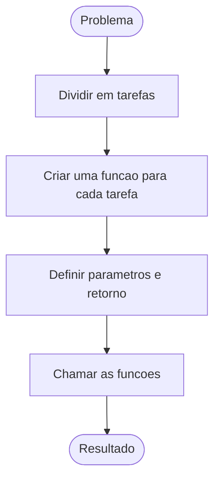

# Raciocínio Lógico Algorítmico: Aula 8
Orientador: Prof. Me Ricardo Carubbi

## Funções e algoritmos clássicos

### Objetivo da aula
Compreender como criar e reutilizar funções em TypeScript, declarando
explicitamente os tipos dos parâmetros e do retorno. Aplicar essa organização
em algoritmos de soma, troca de valores, fatorial, Fibonacci, conversão de base
e geração de números primos.

## 1. Fundamentação teórica
Uma função é um bloco de código criado para executar uma tarefa específica.
Ela ajuda a:

- dividir um problema maior em partes menores;
- evitar a repetição de código;
- dar nomes claros às etapas do algoritmo;
- facilitar testes e correções;
- reutilizar uma solução com valores diferentes.


```mermaid
flowchart TD
A([Problema]) --> B[Dividir em tarefas]
B --> C[Criar uma funcao para cada tarefa]
C --> D[Definir parametros e retorno]
D --> E[Chamar as funcoes]
E --> F([Resultado])
```

Nesta disciplina, usaremos inicialmente a declaração tradicional com
`function`, pois ela deixa explícitos o nome, os parâmetros e o retorno.

## 2. Parâmetros e retorno em TypeScript
Em TypeScript, cada parâmetro deve ter seu tipo indicado após `:`. O tipo do
retorno é escrito depois dos parênteses.

```typescript
function somar(a: number, b: number): number {
  let resultado: number;

  resultado = a + b;
  return resultado;
}
```

Na declaração acima:

- `a: number` e `b: number` são parâmetros numéricos;
- `: number` depois dos parênteses indica o tipo retornado;
- `return` encerra a função e devolve o resultado.

Quando uma função apenas executa uma ação e não devolve um valor, seu retorno
é `void`.

```typescript
function exibirResultado(valor: number): void {
  console.log(valor);
}
```

O tipo `void` não representa uma variável sem tipo. Ele informa que a função
não entrega um resultado por meio de `return`.

## 3. Exemplo básico: soma

```typescript
function somar(a: number, b: number): number {
  return a + b;
}

// Declaracao de variaveis
let entradaNum1: string | null;
let entradaNum2: string | null;
let num1: number;
let num2: number;
let total: number;

// Entrada
entradaNum1 = prompt("Digite o primeiro numero:");
entradaNum2 = prompt("Digite o segundo numero:");

// Processamento
if (entradaNum1 !== null && entradaNum2 !== null) {
  num1 = parseFloat(entradaNum1);
  num2 = parseFloat(entradaNum2);
  total = somar(num1, num2);

  // Saida
  console.log(total);
}
```

A conversão da entrada acontece fora da função. Assim, `somar` recebe números
e realiza somente a tarefa indicada por seu nome.

## 4. Escopo de variáveis
Uma variável declarada dentro de uma função possui escopo local. Ela só pode
ser usada naquele bloco.

```typescript
function mostrarMensagem(nome: string): void {
  let saudacao: string;

  saudacao = "Ola, " + nome;
  console.log(saudacao);
}

// Declaracao de variaveis
let aluno: string | null;

// Entrada
aluno = prompt("Digite o nome do aluno:");

if (aluno !== null) {
  mostrarMensagem(aluno);
  console.log(aluno);
}
```

Nesse exemplo, `saudacao` é local e `aluno` pertence ao programa principal. A
função recebe uma cópia do valor por meio do parâmetro `nome`.

## 5. Reutilização de código
Uma mesma função pode ser chamada várias vezes.

```typescript
function calcularDobro(numero: number): number {
  return numero * 2;
}

console.log(calcularDobro(5));
console.log(calcularDobro(8));
console.log(calcularDobro(12));
```

Uma função também pode possuir mais de um `return`, desde que todos os caminhos
respeitem o tipo declarado.

```typescript
function situacaoAluno(media: number): string {
  if (media >= 7) {
    return "Aprovado";
  }

  if (media >= 5) {
    return "Recuperacao";
  }

  return "Reprovado";
}
```

## 6. Modularização
Cada função deve ter um objetivo bem definido. No exemplo abaixo, uma função
converte a entrada e outra calcula a média.

```typescript
function converterNumero(texto: string): number {
  return parseFloat(texto);
}

function calcularMedia(nota1: number, nota2: number): number {
  return (nota1 + nota2) / 2;
}

// Declaracao de variaveis
let entradaNota1: string | null;
let entradaNota2: string | null;
let nota1: number;
let nota2: number;
let media: number;

// Entrada
entradaNota1 = prompt("Digite a primeira nota:");
entradaNota2 = prompt("Digite a segunda nota:");

if (entradaNota1 !== null && entradaNota2 !== null) {
  nota1 = converterNumero(entradaNota1);
  nota2 = converterNumero(entradaNota2);
  media = calcularMedia(nota1, nota2);
  console.log(media);
}
```

## 7. Troca de valores
A troca de dois valores precisa de uma variável temporária.

```typescript
// Declaracao de variaveis
let entradaA: string | null;
let entradaB: string | null;
let a: number;
let b: number;
let temporaria: number;

// Entrada
entradaA = prompt("Digite o valor de a:");
entradaB = prompt("Digite o valor de b:");

// Processamento
if (entradaA !== null && entradaB !== null) {
  a = parseFloat(entradaA);
  b = parseFloat(entradaB);

  temporaria = a;
  a = b;
  b = temporaria;

  // Saida
  console.log(a);
  console.log(b);
}
```

Não criamos nesta aula uma função que devolva os dois valores, pois estruturas
que armazenam vários elementos serão estudadas a partir da Aula 9.

## 8. Funções escalares para contagem, soma e produto
Quando cada função devolve um único número, seus retornos podem permanecer
simples e explícitos.

```typescript
function calcularContagem(n: number): number {
  let contador: number;
  let i: number;

  contador = 0;

  for (i = 1; i <= n; i++) {
    contador++;
  }

  return contador;
}

function calcularSoma(n: number): number {
  let soma: number;
  let i: number;

  soma = 0;

  for (i = 1; i <= n; i++) {
    soma = soma + i;
  }

  return soma;
}

function calcularProduto(n: number): number {
  let produto: number;
  let i: number;

  produto = 1;

  for (i = 1; i <= n; i++) {
    produto = produto * i;
  }

  return produto;
}
```

## 9. Fatorial
O fatorial de um número inteiro não negativo `n` é o produto dos números de
`1` até `n`. Por definição, o fatorial de zero é `1`.

```typescript
function calcularFatorial(n: number): number {
  let fatorial: number;
  let i: number;

  fatorial = 1;

  for (i = 1; i <= n; i++) {
    fatorial = fatorial * i;
  }

  return fatorial;
}

// Declaracao de variaveis
let entrada: string | null;
let numero: number;

// Entrada
entrada = prompt("Digite um numero:");

if (entrada !== null) {
  numero = parseInt(entrada);
  console.log(calcularFatorial(numero));
}
```

O exemplo `aula8_10.ts`, inspirado no Beecrowd 1153, usa o mesmo padrão de
entrada compatível com os compiladores online adotados na disciplina.

## 10. Sequência de Fibonacci
Na sequência de Fibonacci, cada termo é obtido pela soma dos dois anteriores.

```typescript
function gerarFibonacci(quantidade: number): string {
  let a: number;
  let b: number;
  let proximo: number;
  let i: number;
  let sequencia: string;

  a = 0;
  b = 1;
  sequencia = "";

  for (i = 1; i <= quantidade; i++) {
    sequencia += a;

    if (i < quantidade) {
      sequencia += ", ";
    }

    proximo = a + b;
    a = b;
    b = proximo;
  }

  return sequencia;
}
```

A função devolve uma `string` pronta para exibição. O armazenamento de vários
valores será apresentado na próxima aula.

## 11. Conversão de decimal para binário
Para converter um inteiro decimal positivo em binário:

1. calcule o resto da divisão por `2`;
2. coloque o resto antes dos anteriores;
3. divida o número por `2`, descartando a parte decimal;
4. repita até o número chegar a zero.

```typescript
function decimalParaBinario(numero: number): string {
  let binario: string;
  let resto: number;

  if (numero === 0) {
    return "0";
  }

  binario = "";

  while (numero > 0) {
    resto = numero % 2;
    binario = resto + binario;
    numero = Math.trunc(numero / 2);
  }

  return binario;
}
```

Teste de mesa para `numero = 13`:

| numero | resto | binario |
| --- | --- | --- |
| 13 | 1 | 1 |
| 6 | 0 | 01 |
| 3 | 1 | 101 |
| 1 | 1 | 1101 |

## 12. Geração dos primeiros números primos
Um número primo é maior ou igual a `2` e possui apenas dois divisores
positivos: `1` e ele mesmo.

```typescript
function ehPrimo(numero: number): boolean {
  let divisor: number;

  if (numero < 2) {
    return false;
  }

  for (divisor = 2; divisor < numero; divisor++) {
    if (numero % divisor === 0) {
      return false;
    }
  }

  return true;
}

function gerarNPrimeirosPrimos(quantidade: number): string {
  let encontrados: number;
  let candidato: number;
  let resposta: string;

  encontrados = 0;
  candidato = 2;
  resposta = "";

  while (encontrados < quantidade) {
    if (ehPrimo(candidato)) {
      if (encontrados > 0) {
        resposta += ", ";
      }

      resposta += candidato;
      encontrados++;
    }

    candidato++;
  }

  return resposta;
}
```

Separar `ehPrimo` de `gerarNPrimeirosPrimos` permite testar cada regra de forma
independente.

## 13. Tipos de retorno usados nesta aula

| Retorno | Uso |
| --- | --- |
| `number` | cálculos como soma, dobro e fatorial |
| `string` | mensagens e sequências formatadas |
| `boolean` | respostas lógicas, como verificar se um número é primo |
| `void` | funções que executam uma ação sem devolver valor |

## 14. Erros comuns

- omitir o tipo de um parâmetro;
- converter a mesma entrada repetidamente dentro de uma função;
- declarar `void` em uma função que precisa devolver um resultado;
- esquecer de retornar um valor em algum caminho;
- chamar a função com um argumento de tipo incompatível;
- acessar dentro da função uma variável que deveria ser um parâmetro;
- usar uma estrutura de vários elementos antes de ela ser estudada.

## 15. Padrão de estilo adotado
Para aproximar a progressão da linguagem Java:

- declarar variáveis no início do bloco;
- indicar explicitamente o tipo;
- inicializar depois da declaração;
- separar entrada, processamento e saída;
- usar uma instrução por linha;
- manter blocos delimitados por chaves;
- escrever funções com um objetivo bem definido;
- preferir lógica explícita nas primeiras aulas.

```typescript
function calcularDobro(numero: number): number {
  let dobro: number;

  dobro = numero * 2;
  return dobro;
}
```

## 16. Fechamento
Nesta aula, aprendemos a:

1. declarar tipos nos parâmetros e retornos;
2. usar `void` em funções sem valor de retorno;
3. separar entrada textual de valores numéricos;
4. modularizar problemas com funções pequenas;
5. aplicar funções em algoritmos clássicos;
6. manter as entradas compatíveis com compiladores online.

Na Aula 9, funções poderão receber e devolver vetores tipados.

## Saiba mais
- TypeScript Handbook - Functions: https://www.typescriptlang.org/docs/handbook/2/functions.html
- MDN - Functions: https://developer.mozilla.org/pt-BR/docs/Web/JavaScript/Guide/Functions
- MDN - return: https://developer.mozilla.org/pt-BR/docs/Web/JavaScript/Reference/Statements/return
