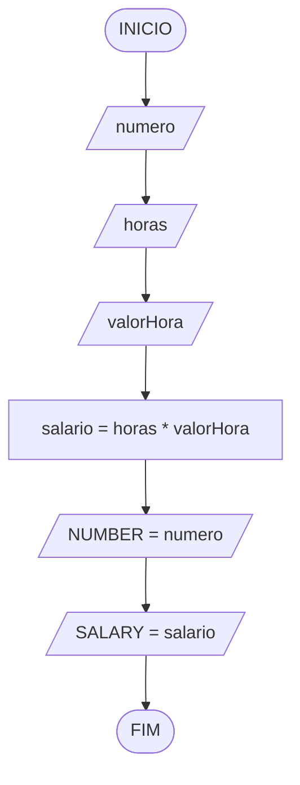

# BEE1008 - Salario

## Fluxograma

```mermaid
flowchart TD
A([INICIO]) --> B[/numero/]
B --> C[/horas/]
C --> D[/valorHora/]
D --> E[salario = horas * valorHora]
E --> F[/NUMBER = numero/]
F --> G[/SALARY = salario/]
G --> H([FIM])
```
