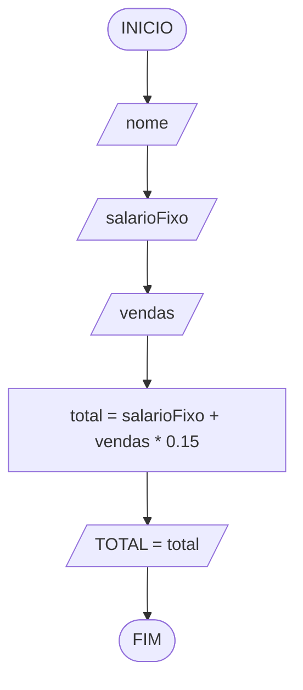

# BEE1009 - Salario com Bonus

## Fluxograma

```mermaid
flowchart TD
A([INICIO]) --> B[/nome/]
B --> C[/salarioFixo/]
C --> D[/vendas/]
D --> E[total = salarioFixo + vendas * 0.15]
E --> F[/TOTAL = total/]
F --> G([FIM])
```
