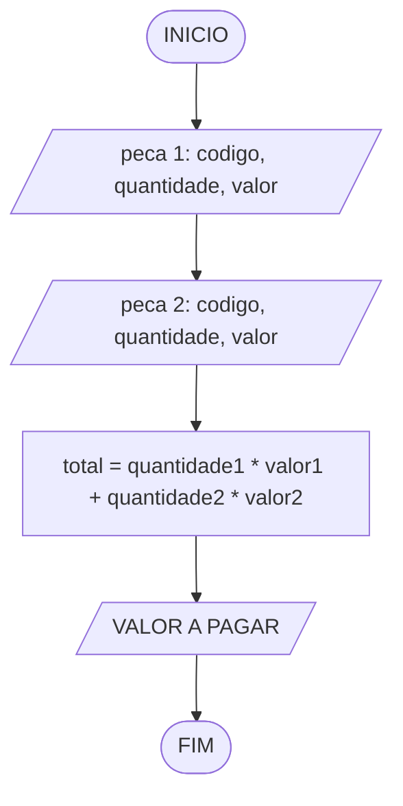

# BEE1010 - Calculo Simples

## Fluxograma

```mermaid
flowchart TD
A([INICIO]) --> B[/"peca 1: codigo, quantidade, valor"/]
B --> C[/"peca 2: codigo, quantidade, valor"/]
C --> D["total = quantidade1 * valor1 + quantidade2 * valor2"]
D --> E[/"VALOR A PAGAR"/]
E --> F([FIM])
```
