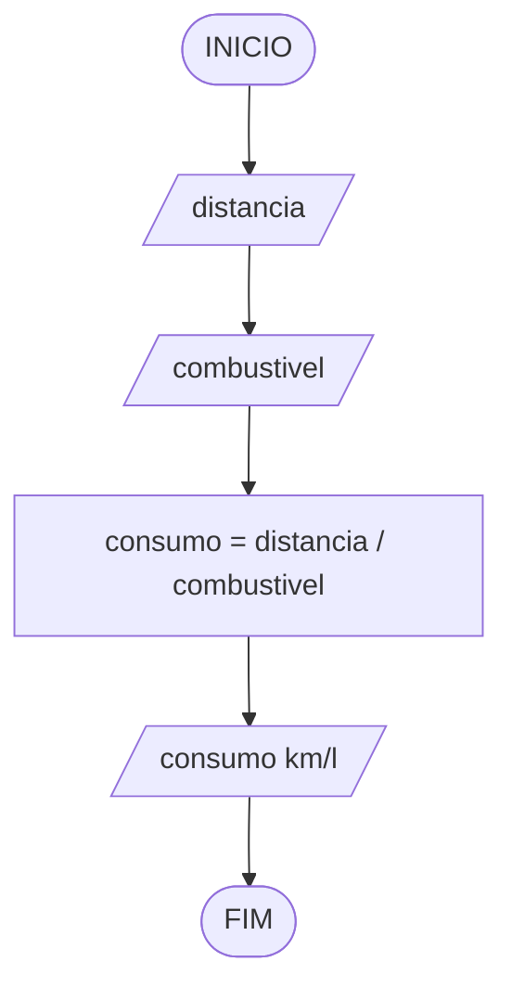

# BEE1014 - Consumo

## Fluxograma

```mermaid
flowchart TD
A([INICIO]) --> B[/"distancia"/]
B --> C[/"combustivel"/]
C --> D["consumo = distancia / combustivel"]
D --> E[/consumo km/l/]
E --> F([FIM])
```
