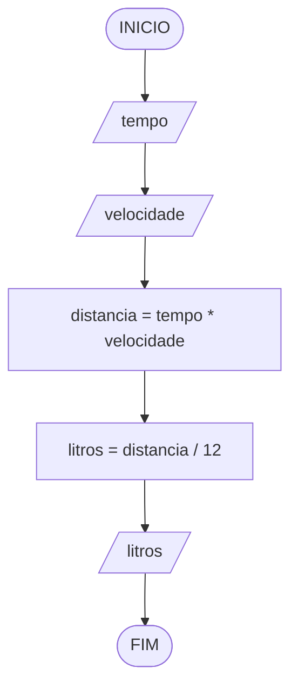

# BEE1017 - Gasto de Combustivel

## Fluxograma

```mermaid
flowchart TD
A([INICIO]) --> B[/"tempo"/]
B --> C[/"velocidade"/]
C --> D["distancia = tempo * velocidade"]
D --> E["litros = distancia / 12"]
E --> F[/"litros"/]
F --> G([FIM])
```
