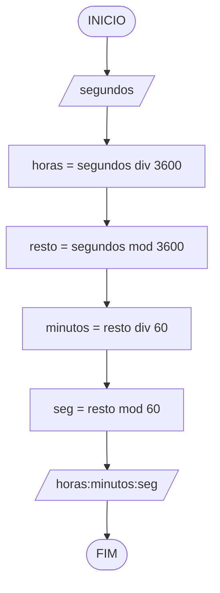

# BEE1019 - Conversao de Tempo

## Fluxograma

```mermaid
flowchart TD
A([INICIO]) --> B[/segundos/]
B --> C[horas = segundos div 3600]
C --> D[resto = segundos mod 3600]
D --> E[minutos = resto div 60]
E --> F[seg = resto mod 60]
F --> G[/horas:minutos:seg/]
G --> H([FIM])
```
