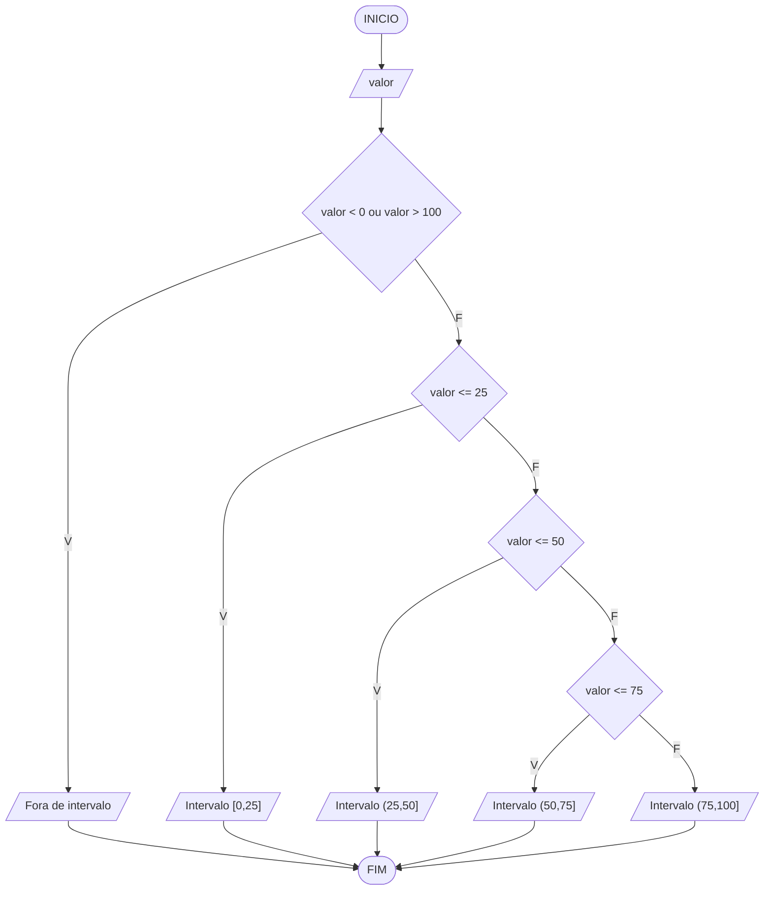

# BEE1037 - Intervalo

## Fluxograma

```mermaid
flowchart TD
A([INICIO]) --> B[/"valor"/]
B --> C{"valor < 0 ou valor > 100"}
C -- V --> D[/"Fora de intervalo"/]
C -- F --> E{"valor <= 25"}
E -- V --> F[/"Intervalo [0,25]"/]
E -- F --> G{"valor <= 50"}
G -- V --> H[/"Intervalo (25,50]"/]
G -- F --> I{"valor <= 75"}
I -- V --> J[/"Intervalo (50,75]"/]
I -- F --> K[/"Intervalo (75,100]"/]
D --> L([FIM])
F --> L
H --> L
J --> L
K --> L
```
