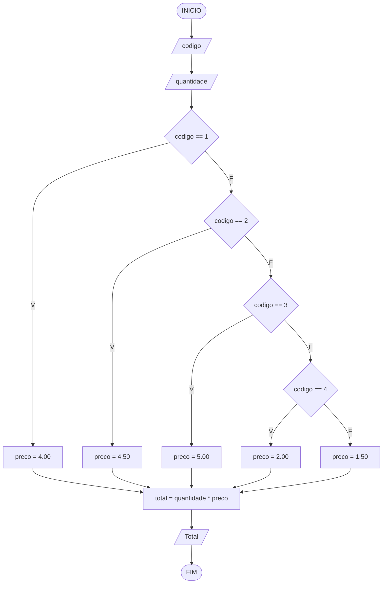

# BEE1038 - Lanche

## Fluxograma

```mermaid
flowchart TD
A([INICIO]) --> B[/"codigo"/]
B --> C[/"quantidade"/]
C --> D{"codigo == 1"}
D -- V --> E["preco = 4.00"]
D -- F --> F{"codigo == 2"}
F -- V --> G["preco = 4.50"]
F -- F --> H{"codigo == 3"}
H -- V --> I["preco = 5.00"]
H -- F --> J{"codigo == 4"}
J -- V --> K["preco = 2.00"]
J -- F --> L["preco = 1.50"]
E --> M["total = quantidade * preco"]
G --> M
I --> M
K --> M
L --> M
M --> N[/"Total"/]
N --> O([FIM])
```
