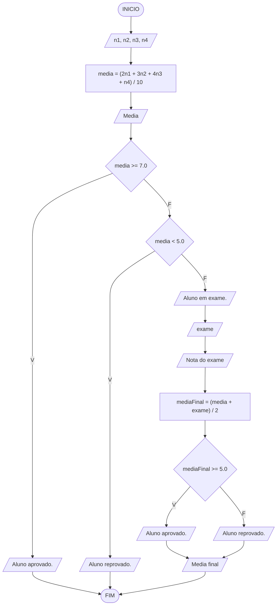

# BEE1040 - Media 3

## Fluxograma

```mermaid
flowchart TD
A([INICIO]) --> B[/"n1, n2, n3, n4"/]
B --> C["media = (2n1 + 3n2 + 4n3 + n4) / 10"]
C --> D[/"Media"/]
D --> E{"media >= 7.0"}
E -- V --> F[/"Aluno aprovado." /]
E -- F --> G{"media < 5.0"}
G -- V --> H[/"Aluno reprovado." /]
G -- F --> I[/"Aluno em exame." /]
I --> J[/"exame"/]
J --> K[/"Nota do exame"/]
K --> L["mediaFinal = (media + exame) / 2"]
L --> M{"mediaFinal >= 5.0"}
M -- V --> N[/"Aluno aprovado." /]
M -- F --> O[/"Aluno reprovado." /]
N --> P[/"Media final"/]
O --> P
F --> Q([FIM])
H --> Q
P --> Q
```
