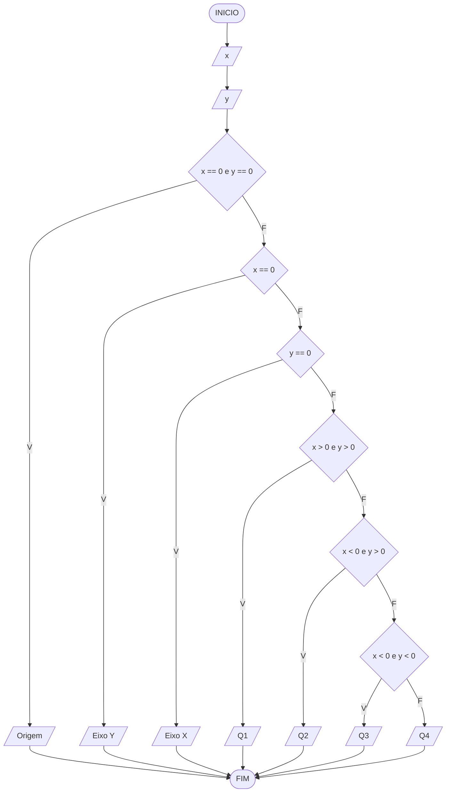

# BEE1041 - Coordenadas de um Ponto

## Fluxograma

```mermaid
flowchart TD
A([INICIO]) --> B[/x/]
B --> C[/y/]
C --> D{x == 0 e y == 0}
D -- V --> E[/Origem/]
D -- F --> F{x == 0}
F -- V --> G[/Eixo Y/]
F -- F --> H{y == 0}
H -- V --> I[/Eixo X/]
H -- F --> J{x > 0 e y > 0}
J -- V --> K[/Q1/]
J -- F --> L{x < 0 e y > 0}
L -- V --> M[/Q2/]
L -- F --> N{x < 0 e y < 0}
N -- V --> O[/Q3/]
N -- F --> P[/Q4/]
E --> Q([FIM])
G --> Q
I --> Q
K --> Q
M --> Q
O --> Q
P --> Q
```
