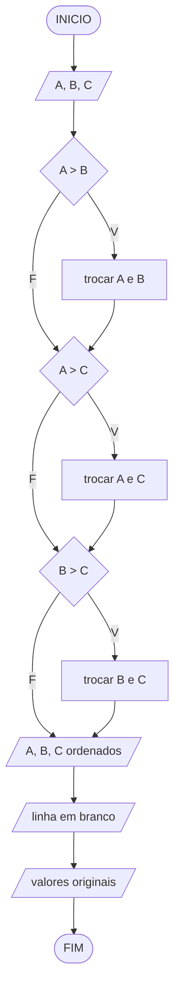

# BEE1042 - Sort Simples

## Fluxograma

```mermaid
flowchart TD
A([INICIO]) --> B[/"A, B, C"/]
B --> C{"A > B"}
C -- V --> D["trocar A e B"]
C -- F --> E{"A > C"}
D --> E
E -- V --> F["trocar A e C"]
E -- F --> G{"B > C"}
F --> G
G -- V --> H["trocar B e C"]
G -- F --> I[/"A, B, C ordenados"/]
H --> I
I --> J[/"linha em branco"/]
J --> K[/"valores originais"/]
K --> L([FIM])
```
