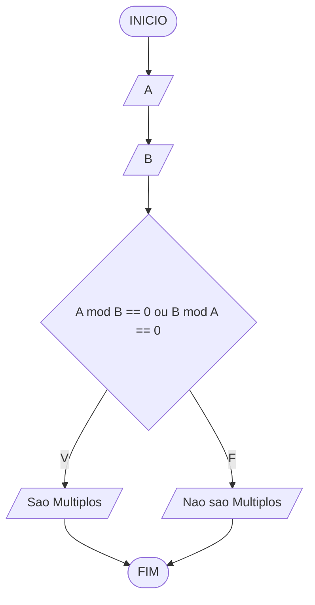

# BEE1044 - Multiplos

## Fluxograma

```mermaid
flowchart TD
A([INICIO]) --> B[/A/]
B --> C[/B/]
C --> D{A mod B == 0 ou B mod A == 0}
D -- V --> E[/Sao Multiplos/]
D -- F --> F[/Nao sao Multiplos/]
E --> G([FIM])
F --> G
```
