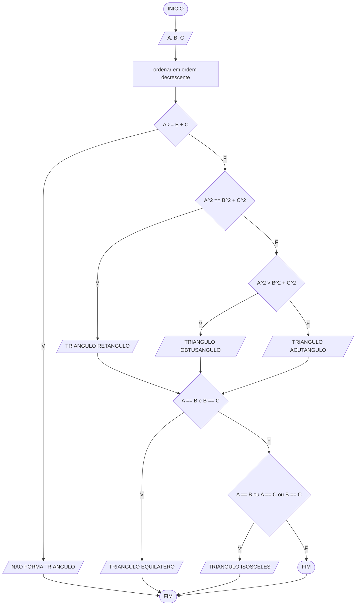

# BEE1045 - Tipos de Triangulo

## Fluxograma

```mermaid
flowchart TD
A([INICIO]) --> B[/A, B, C/]
B --> C[ordenar em ordem decrescente]
C --> D{A >= B + C}
D -- V --> E[/NAO FORMA TRIANGULO/]
D -- F --> F{A^2 == B^2 + C^2}
F -- V --> G[/TRIANGULO RETANGULO/]
F -- F --> H{A^2 > B^2 + C^2}
H -- V --> I[/TRIANGULO OBTUSANGULO/]
H -- F --> J[/TRIANGULO ACUTANGULO/]
G --> K{A == B e B == C}
I --> K
J --> K
K -- V --> L[/TRIANGULO EQUILATERO/]
K -- F --> M{A == B ou A == C ou B == C}
M -- V --> N[/TRIANGULO ISOSCELES/]
M -- F --> O([FIM])
E --> P([FIM])
L --> P
N --> P
O --> P
```
