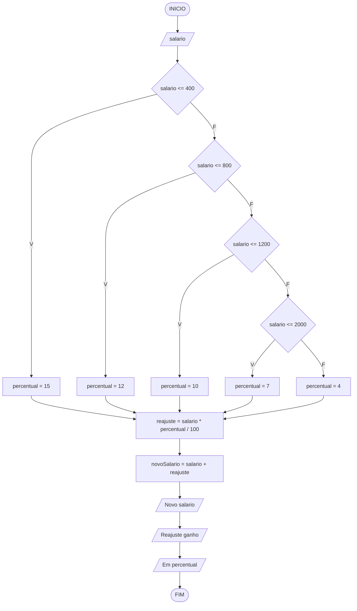

# BEE1048 - Aumento de Salario

## Fluxograma

```mermaid
flowchart TD
A([INICIO]) --> B[/salario/]
B --> C{salario <= 400}
C -- V --> D[percentual = 15]
C -- F --> E{salario <= 800}
E -- V --> F[percentual = 12]
E -- F --> G{salario <= 1200}
G -- V --> H[percentual = 10]
G -- F --> I{salario <= 2000}
I -- V --> J[percentual = 7]
I -- F --> K[percentual = 4]
D --> L[reajuste = salario * percentual / 100]
F --> L
H --> L
J --> L
K --> L
L --> M[novoSalario = salario + reajuste]
M --> N[/Novo salario/]
N --> O[/Reajuste ganho/]
O --> P[/Em percentual/]
P --> Q([FIM])
```
