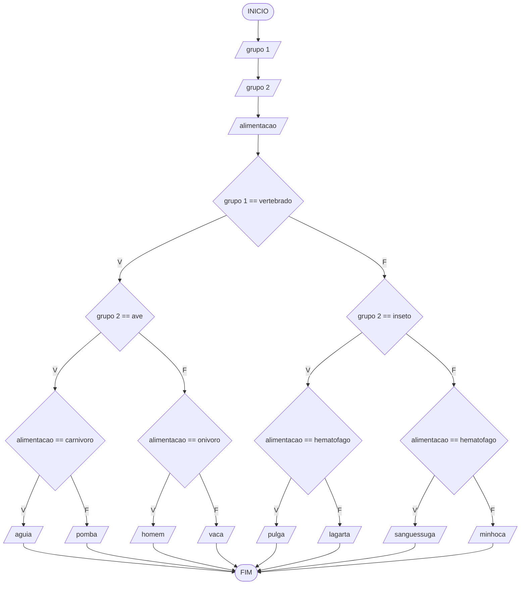

# BEE1049 - Animal

## Fluxograma

```mermaid
flowchart TD
A([INICIO]) --> B[/grupo 1/]
B --> C[/grupo 2/]
C --> D[/alimentacao/]
D --> E{grupo 1 == vertebrado}
E -- V --> F{grupo 2 == ave}
F -- V --> G{alimentacao == carnivoro}
G -- V --> H[/aguia/]
G -- F --> I[/pomba/]
F -- F --> J{alimentacao == onivoro}
J -- V --> K[/homem/]
J -- F --> L[/vaca/]
E -- F --> M{grupo 2 == inseto}
M -- V --> N{alimentacao == hematofago}
N -- V --> O[/pulga/]
N -- F --> P[/lagarta/]
M -- F --> Q{alimentacao == hematofago}
Q -- V --> R[/sanguessuga/]
Q -- F --> S[/minhoca/]
H --> T([FIM])
I --> T
K --> T
L --> T
O --> T
P --> T
R --> T
S --> T
```
