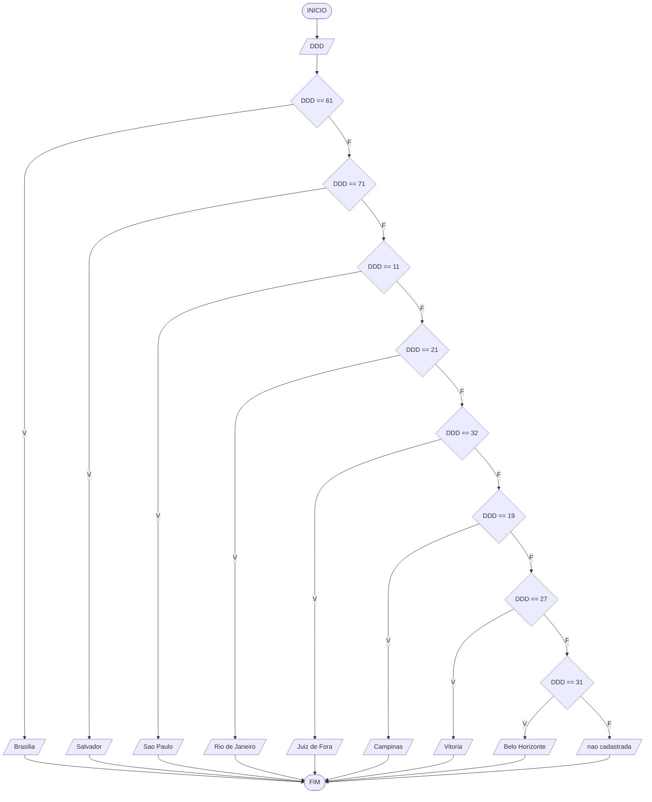

# BEE1050 - DDD

## Fluxograma

```mermaid
flowchart TD
A([INICIO]) --> B[/DDD/]
B --> C{DDD == 61}
C -- V --> D[/Brasilia/]
C -- F --> E{DDD == 71}
E -- V --> F[/Salvador/]
E -- F --> G{DDD == 11}
G -- V --> H[/Sao Paulo/]
G -- F --> I{DDD == 21}
I -- V --> J[/Rio de Janeiro/]
I -- F --> K{DDD == 32}
K -- V --> L[/Juiz de Fora/]
K -- F --> M{DDD == 19}
M -- V --> N[/Campinas/]
M -- F --> O{DDD == 27}
O -- V --> P[/Vitoria/]
O -- F --> Q{DDD == 31}
Q -- V --> R[/Belo Horizonte/]
Q -- F --> S[/nao cadastrada/]
D --> T([FIM])
F --> T
H --> T
J --> T
L --> T
N --> T
P --> T
R --> T
S --> T
```
