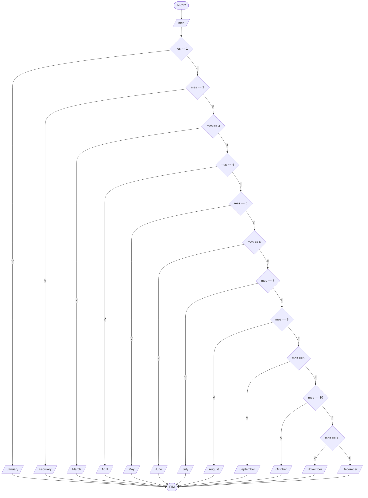

# BEE1052 - Mes

## Fluxograma

```mermaid
flowchart TD
A([INICIO]) --> B[/mes/]
B --> C{mes == 1}
C -- V --> D[/January/]
C -- F --> E{mes == 2}
E -- V --> F[/February/]
E -- F --> G{mes == 3}
G -- V --> H[/March/]
G -- F --> I{mes == 4}
I -- V --> J[/April/]
I -- F --> K{mes == 5}
K -- V --> L[/May/]
K -- F --> M{mes == 6}
M -- V --> N[/June/]
M -- F --> O{mes == 7}
O -- V --> P[/July/]
O -- F --> Q{mes == 8}
Q -- V --> R[/August/]
Q -- F --> S{mes == 9}
S -- V --> T[/September/]
S -- F --> U{mes == 10}
U -- V --> V[/October/]
U -- F --> W{mes == 11}
W -- V --> X[/November/]
W -- F --> Y[/December/]
D --> Z([FIM])
F --> Z
H --> Z
J --> Z
L --> Z
N --> Z
P --> Z
R --> Z
T --> Z
V --> Z
X --> Z
Y --> Z
```
