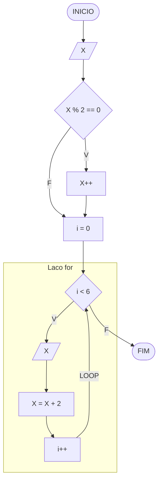

# BEE1070 - Seis Numeros Impares

## Fluxograma



## Diferenca entre `for` e `while` neste fluxograma

Neste problema, o fluxograma do `for` fica muito parecido com o do `while`, porque os dois precisam mostrar:

- a inicializacao do contador
- a verificacao da condicao
- a repeticao do bloco
- o incremento da variavel de controle

Com `while`, isso normalmente aparece separado:

```javascript
i = 0;

while (i < 6) {
    console.log(x);
    x += 2;
    i++;
}
```

Com `for`, essas tres partes ficam concentradas na cabecalho do laco:

```javascript
for (i = 0; i < 6; i++) {
    console.log(x);
    x += 2;
}
```

Ou seja, no fluxograma os dois lacos podem parecer quase iguais. A principal diferenca aparece mais claramente no codigo:

- `while`: a inicializacao e o incremento aparecem fora da condicao do laco
- `for`: inicializacao, condicao e incremento ficam reunidos no proprio laco

Neste exercicio, `for` costuma ser a melhor escolha porque ja sabemos antecipadamente que a repeticao acontecera exatamente 6 vezes.
