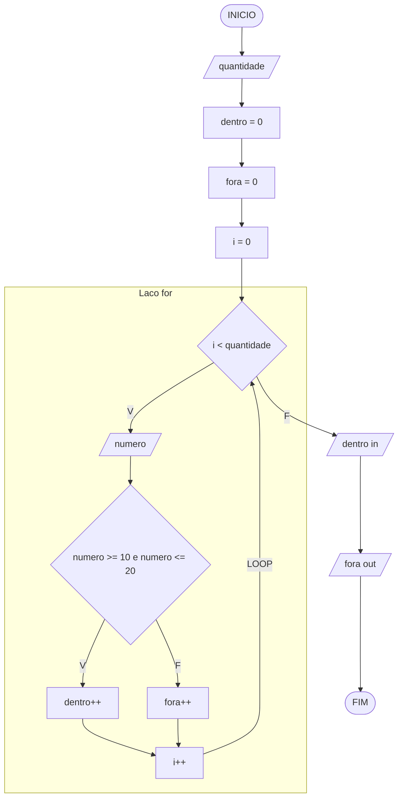

# BEE1072 - Intervalo 2

## Fluxograma

```mermaid
flowchart TD
A([INICIO]) --> B[/quantidade/]
B --> C[dentro = 0]
C --> D[fora = 0]
D --> E[i = 0]
E --> F{i < quantidade}
subgraph SEQ [Laco for]
F -- V --> G[/numero/]
G --> H{numero >= 10 e numero <= 20}
H -- V --> I[dentro++]
H -- F --> J[fora++]
I --> K[i++]
J --> K
K -- LOOP --> F
end
F -- F --> L[/dentro in/]
L --> M[/fora out/]
M --> N([FIM])
```
