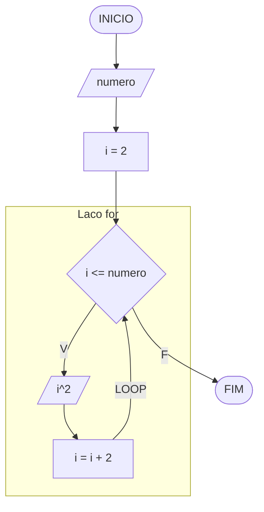

# BEE1073 - Quadrado de Pares

## Fluxograma

```mermaid
flowchart TD
A([INICIO]) --> B[/numero/]
B --> C[i = 2]
C --> D{i <= numero}
subgraph SEQ [Laco for]
D -- V --> E[/i^2/]
E --> F[i = i + 2]
F -- LOOP --> D
end
D -- F --> G([FIM])
```
