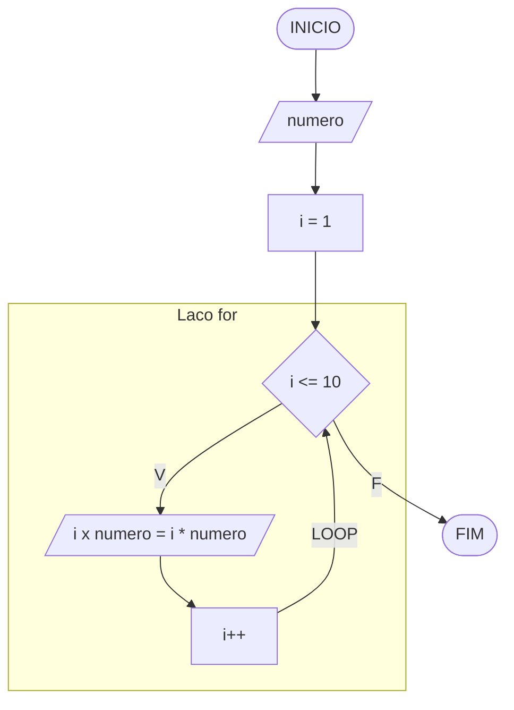

# BEE1078 - Tabuada

## Fluxograma

```mermaid
flowchart TD
A([INICIO]) --> B[/numero/]
B --> C[i = 1]
C --> D{i <= 10}
subgraph SEQ [Laco for]
D -- V --> E[/i x numero = i * numero/]
E --> F[i++]
F -- LOOP --> D
end
D -- F --> G([FIM])
```
