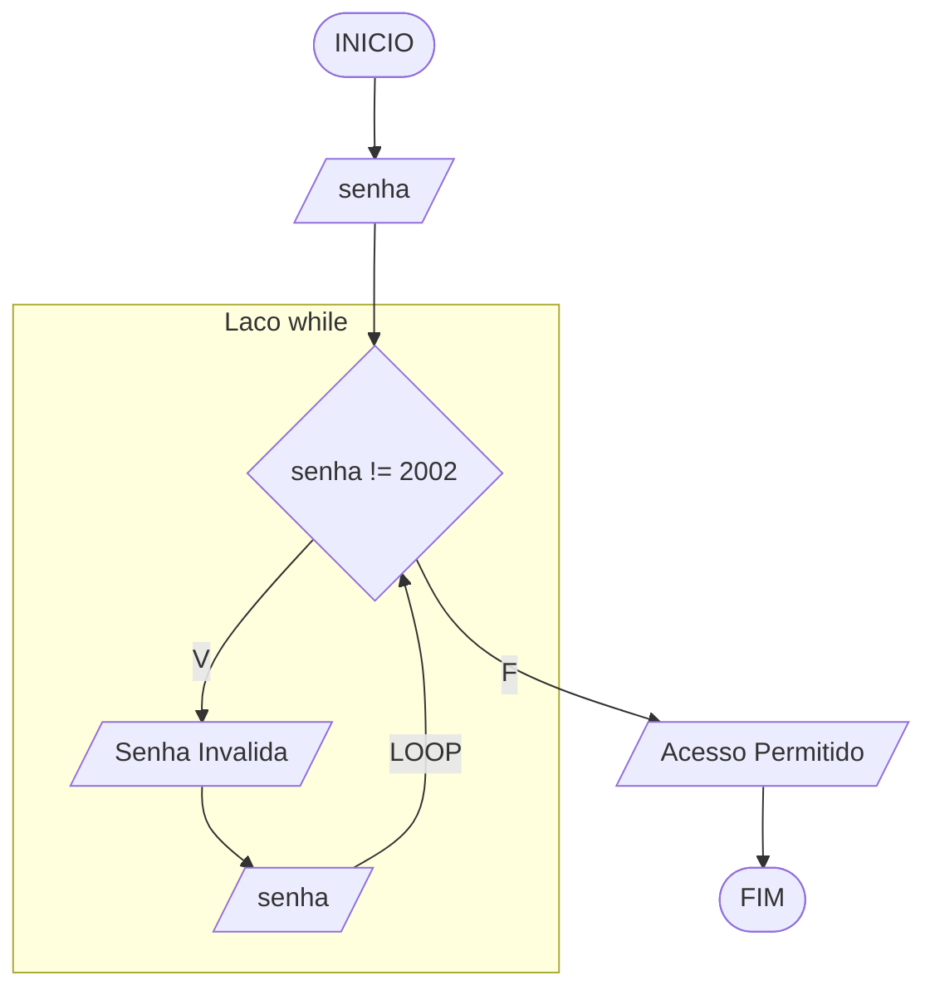

# BEE1114 - Senha Fixa

## Fluxograma

```mermaid
flowchart TD
A([INICIO]) --> B[/"senha"/]
B --> C{"senha != 2002"}
subgraph SEQ [Laco while]
C -- V --> D[/"Senha Invalida"/]
D --> E[/"senha"/]
E -- LOOP --> C
end
C -- F --> F[/"Acesso Permitido"/]
F --> G([FIM])
```
