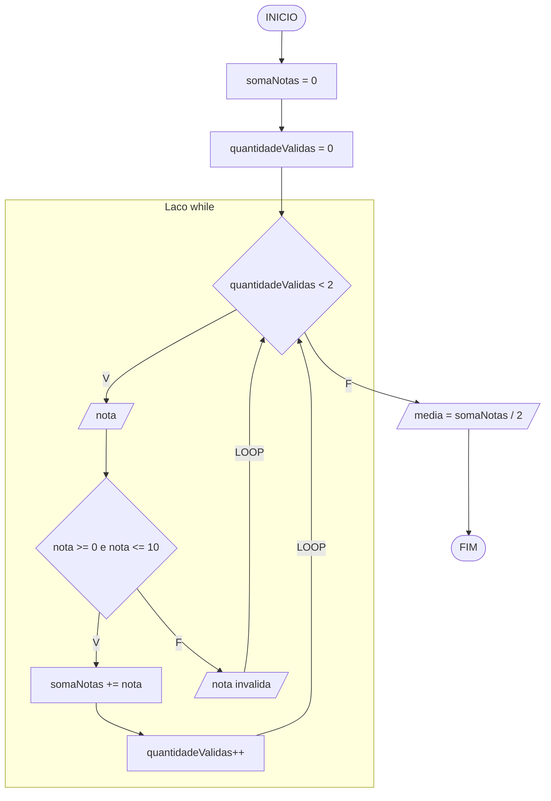

# BEE1117 - Validacao de Nota

## Fluxograma

```mermaid
flowchart TD
A([INICIO]) --> B["somaNotas = 0"]
B --> C["quantidadeValidas = 0"]
C --> D{"quantidadeValidas < 2"}
subgraph SEQ [Laco while]
D -- V --> E[/"nota"/]
E --> F{"nota >= 0 e nota <= 10"}
F -- V --> G["somaNotas += nota"]
G --> H["quantidadeValidas++"]
F -- F --> I[/"nota invalida"/]
H -- LOOP --> D
I -- LOOP --> D
end
D -- F --> J[/"media = somaNotas / 2"/]
J --> K([FIM])
```
