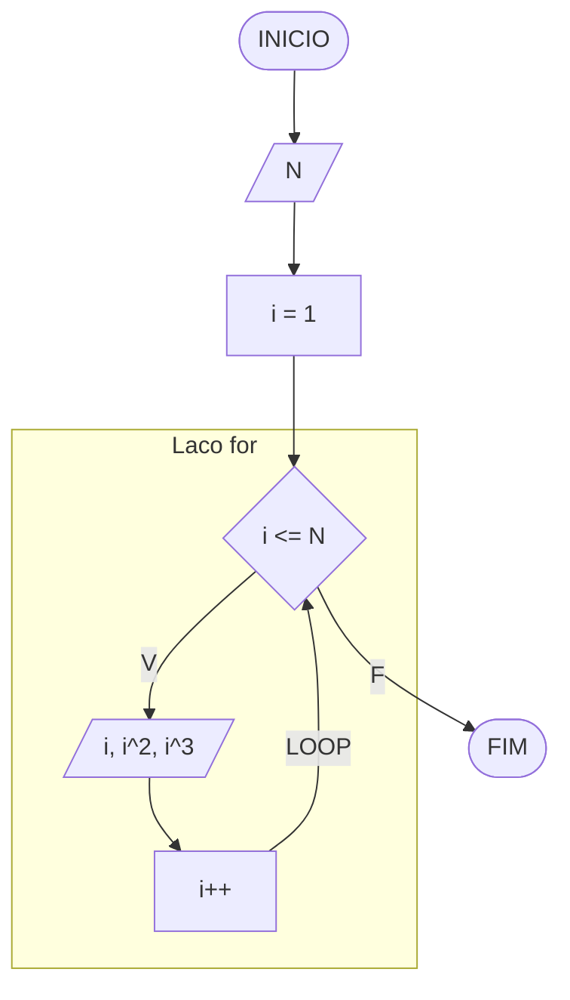

# BEE1143 - Quadrado e ao Cubo

## Fluxograma

```mermaid
flowchart TD
A([INICIO]) --> B[/"N"/]
B --> C["i = 1"]
C --> D{"i <= N"}
subgraph SEQ [Laco for]
D -- V --> E[/"i, i^2, i^3"/]
E --> F["i++"]
F -- LOOP --> D
end
D -- F --> G([FIM])
```
