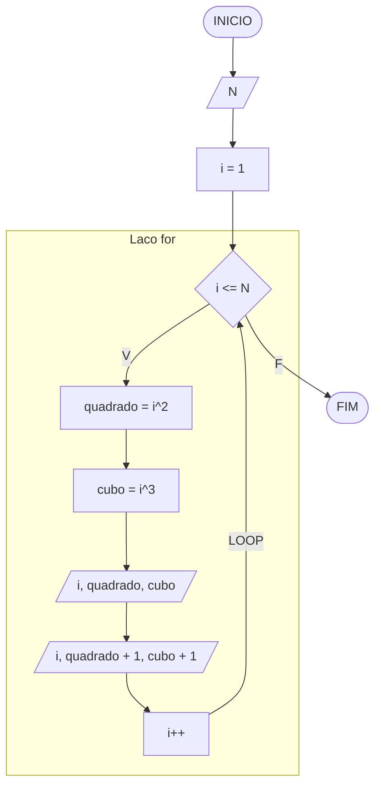

# BEE1144 - Sequencia Logica

## Fluxograma

```mermaid
flowchart TD
A([INICIO]) --> B[/"N"/]
B --> C["i = 1"]
C --> D{"i <= N"}
subgraph SEQ [Laco for]
D -- V --> E["quadrado = i^2"]
E --> F["cubo = i^3"]
F --> G[/"i, quadrado, cubo"/]
G --> H[/"i, quadrado + 1, cubo + 1"/]
H --> I["i++"]
I -- LOOP --> D
end
D -- F --> J([FIM])
```
