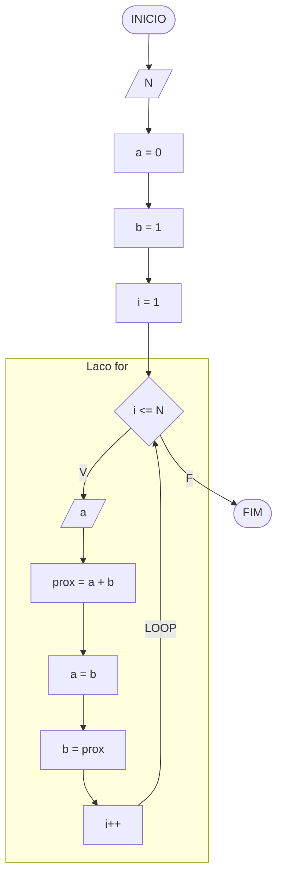

# BEE1151 - Fibonacci Facil

## Fluxograma

```mermaid
flowchart TD
A([INICIO]) --> B[/"N"/]
B --> C["a = 0"]
C --> D["b = 1"]
D --> E["i = 1"]
E --> F{"i <= N"}
subgraph SEQ [Laco for]
F -- V --> G[/"a"/]
G --> H["prox = a + b"]
H --> I["a = b"]
I --> J["b = prox"]
J --> K["i++"]
K -- LOOP --> F
end
F -- F --> L([FIM])
```
