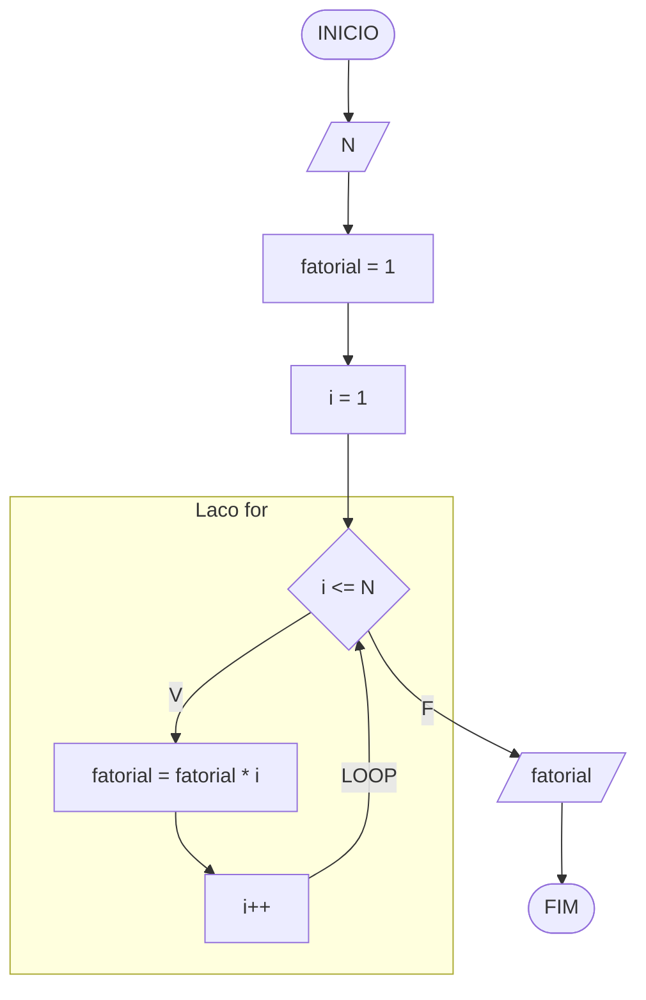

# BEE1153 - Fatorial Simples

## Fluxograma

```mermaid
flowchart TD
A([INICIO]) --> B[/"N"/]
B --> C["fatorial = 1"]
C --> D["i = 1"]
D --> E{"i <= N"}
subgraph SEQ [Laco for]
E -- V --> F["fatorial = fatorial * i"]
F --> G["i++"]
G -- LOOP --> E
end
E -- F --> H[/"fatorial"/]
H --> I([FIM])
```
